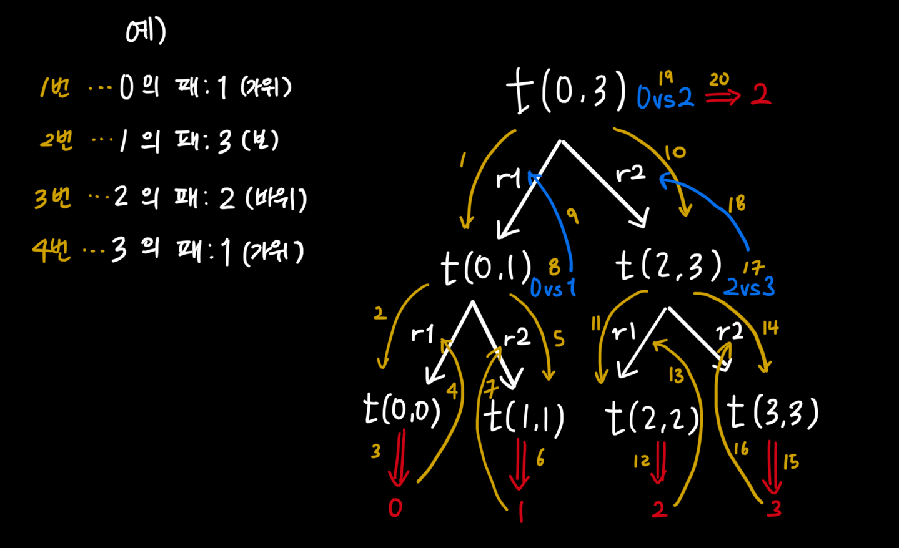
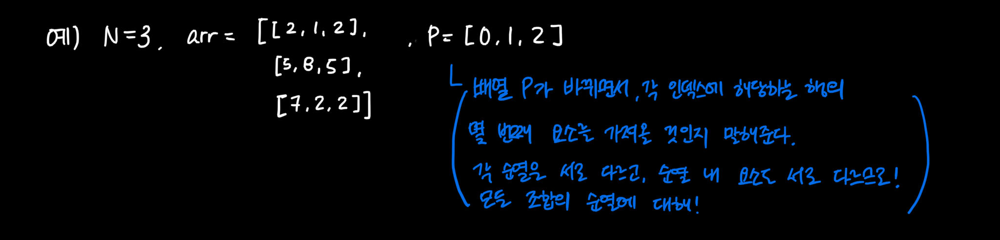
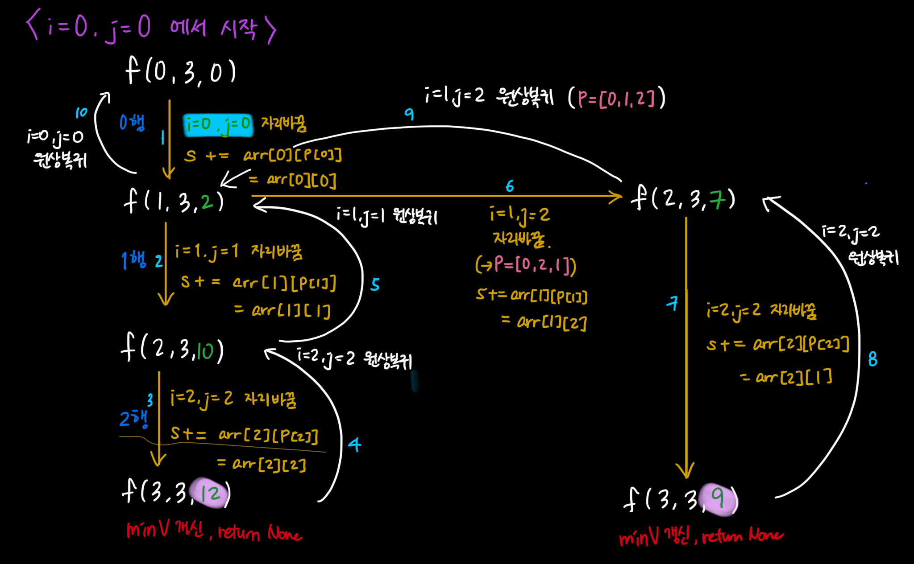
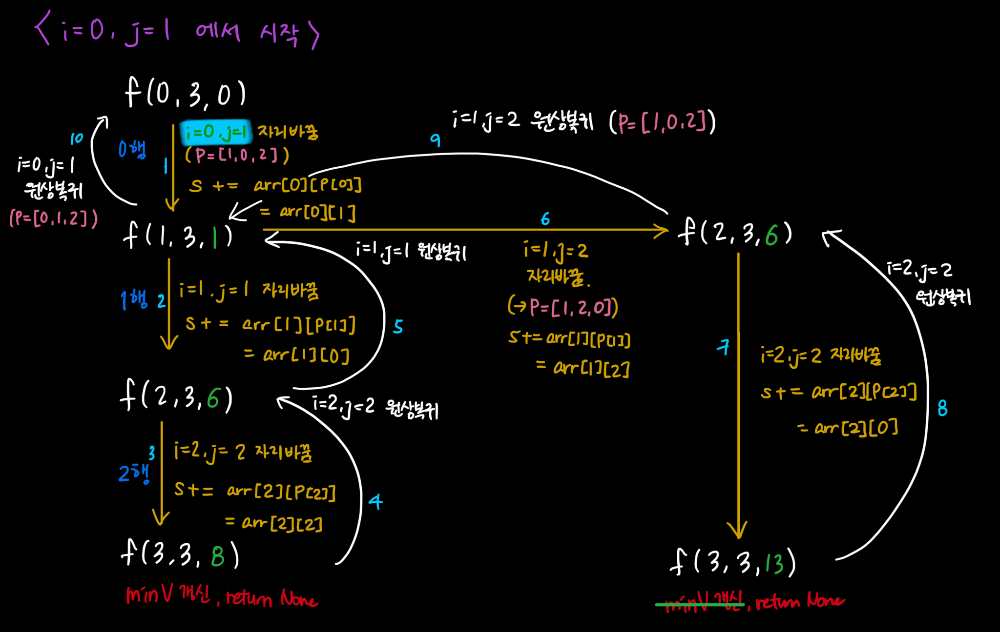
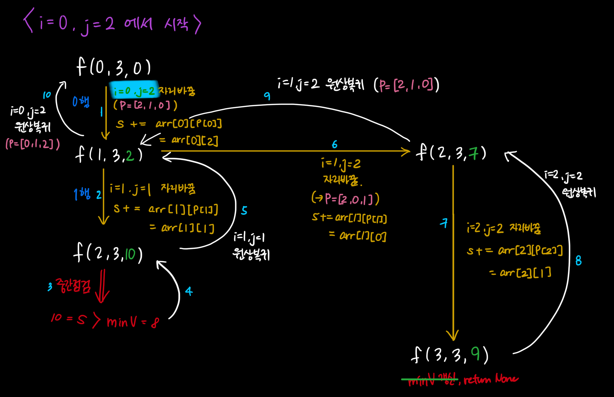

#0824

### 더 공부해야 할 부분

재귀로 문제 해결하기! 작은 문제로 쪼개어 큰 문제를 해결한다는데, 문제를 보면 해결책을 생각해내기 정말 정말 어렵다!!

아래 두 문제도 도움을 받아서 거의 큰 틀을 제공받고 해결한 문제들이라서, **재귀로 DFS** 하는 건 정말정말 많이 연습해야 한다.

재귀로 함수를 호출하면, return값이 주어지거나 base에 닿을 때까지 계속 호출하는 메커니즘이다. 끝에 닿아서 리턴값을 받으면, 해당 리턴값은 또 상위 함수로 돌아간다. <u>함수의 결과값 = return값임에 다시 한 번 유의하자.</u> 상위 함수로 돌아갈 때 이 리턴값이 어떻게 적용되는지 자주 길을 잃곤 했다. 시스템에서 함수 불러낼 때 사용하는 그림처럼 그림 그려보자:

(이렇게!)


# SWEA_10720. 토너먼트 카드게임

## 재귀를 이용한 DFS

```python
def tournament(i, j):
    if i == j:
        return i
    else:
        r1 = tournament(i, (i+j)//2)    # 그룹1
        r2 = tournament((i+j)//2+1, j)  # 그룹2
        if card[r1] == card[r2]:        # 가위바위보로 승자 정하기
            if r1 < r2:
                return r1
            else:
                return r2
        elif (card[r1], card[r2]) in [(1, 3), (2, 1), (3, 2)]:
            return r1
        else:
            return r2

T = int(input())
for t in range(1, T+1):
    N = int(input())
    card = list(map(int, input().split()))
    print(f'#{t} {tournament(0, N-1) + 1}') # 인덱스로 접근했으므로 +1
```

그룹 내 인원이 1이 될 때까지 그룹을 계속 2등분해야 한다. 그러므로, 재귀의 종료 조건은 'i와 j가 같아질 때'로 표현할 수 있다.

각 그룹이 2등분 되면, 계속해서 그룹 속에 r1과 r2가 생겨난다. 종료조건에 닿아 리턴값을 받으면 상위함수로 그 값을 돌려주고, r1과 r2로 분기된 지점에서 각자가 값을 가지고 만나면 가위바위보를 통해 하나로 결정된다. 이 과정이 반복된다.

  

<br/>

# SWEA_10721. 배열 최소합

## 순열 만들기 (모든 원소를 한 번씩 활용)

```python
def f(i, N, s): # P[i]의 값을 결정, s를 통해 요소의 합 중간점검 가능케 함
    global minV
    if i == N:  # 순열 만들기 완료되면,
        if minV > s:	# 최소값 갱신
            minV = s
        return
    else:		# 순열 미완료
        if s >= minV:	# 중간점검 - 끝나기도 전에 최소값 넘어서면, 즉시 중단
            return
        else:
            for j in range(i, N): # P[i] <-> P[j] 자리교환
                P[i], P[j] = P[j], P[i]
                f(i+1, N, s+arr[i][P[i]])
                P[i], P[j] = P[j], P[i]

T = int(input())
for t in range(1, T+1):
    N = int(input())
    arr = [list(map(int, input().split())) for _ in range(N)]
    minV = 90
    P = list(k for k in range(N))
    f(0, N, 0)
    print(f'#{t} {minV}')
```

요소를 모두 한 번씩 사용하여 만들 수 있는 모든 순열을 만들고, 각 순열의 인덱스를 행에 대응, 요소값을 열에 대응시킴으로써, 한 행에서 열을 달리하는 요소를 하나씩 고르는 작업을 할 수 있다. 요소의 값을 갱신하는 s 요소를 넣어 중간점검을 함으로써 고려할 단계를 줄여줄 수 있었다. 

아래 그림 꼼꼼히 다시 살펴보기!!!

순열은 아직도 너무 어렵다!!! 😝









<br/>

# 미로1 설명 들은 내용 - 익힐 것!

```python
# 출발 0, 0 도착 7, 7
# 경로 있음, 경로 없음, 경로가 여러 개
"""
3
8               # 경로 있음
0 0 1 1 1 1 1 1
1 0 0 0 0 0 0 1
1 1 1 0 1 1 1 1
1 1 1 0 1 1 1 1
1 0 0 0 0 0 0 1
1 0 1 1 1 1 1 1
1 0 0 0 0 0 0 0
1 1 1 1 1 1 1 0
8               # 경로 없음
0 0 1 1 1 1 1 1
1 0 0 0 0 0 0 1
1 1 1 0 1 1 1 1
1 1 1 0 1 1 1 1
1 0 0 0 0 0 0 1
1 0 1 1 1 1 1 1
1 0 1 0 0 0 0 0
1 1 1 1 1 1 1 0
8               # 경로 여러 개
0 0 1 1 1 1 1 1
1 0 0 0 0 0 0 1
1 0 1 0 1 1 1 1
1 0 1 0 1 1 1 1
1 0 0 0 0 0 0 0
1 0 1 1 1 1 1 0
1 0 0 0 0 0 0 0
1 1 1 1 1 1 1 0
"""

# <1> 모든 칸을 방문하는 탐색
def f1(i, j, N):
    maze[i][j] = 1  # i, j 방문표시. (진입한 칸을 벽으로 변경)
    for di, dj in [(0, 1), (1, 0), (0, -1), (-1, 0)]:  # 4방향 탐색
        ni, nj = i + di, j + dj
        # 탐색 방향이 통로이면
        if 0 <= ni < N and 0 <= nj < N and maze[ni][nj] == 0:  # and visited[ni][nj]==0
            f1(ni, nj, N)
    return


N = int(input())
maze = [list(map(int, input().split())) for _ in range(N)]
f1(0, 0, N)  # 탐색 시작 (0,0), 미로의 크기 N
print(maze[N - 1][N - 1])


# -------------------------------------------------------------------------------------------


# <2> 출구를 찾으면 중단하는 탐색
def f2(i, j, N):
    if i == N - 1 and j == N - 1:  # 출구에 도착한 경우
        return 1
    else:
        maze[i][j] = 1  # i, j 방문표시. (진입한 칸을 벽으로 변경)
        for di, dj in [(0, 1), (1, 0), (0, -1), (-1, 0)]:  # 4방향 탐색
            ni, nj = i + di, j + dj
            # 탐색 방향이 통로이면
            if 0 <= ni < N and 0 <= nj < N and maze[ni][nj] == 0:  # and visited[ni][nj]==0
                if f2(ni, nj, N):  # 출구를 찾고 리턴하면
                    return 1  # 입구까지 리턴(남겨둔 갈림길을 탐색하지 않음)
        return 0  # 탐색 방향에서 출국를 찾지 못한 경우


N = int(input())
maze = [list(map(int, input().split())) for _ in range(N)]
print(f2(0, 0, N))


# -----------------------------------------------------------------------------------------------


# <3> 경로의 개수를 구하는 탐색
def f3(i, j, N):
    global cnt
    if i == N - 1 and j == N - 1:
        cnt += 1  # 경로에 도착한 횟수
        return
    else:
        maze[i][j] = 1  # 없으면 무한 루프의 위험
        for di, dj in [(0, 1), (1, 0), (0, -1), (-1, 0)]:  # 4방향 탐색
            ni, nj = i + di, j + dj
            # 탐색 방향이 통로이면
            if 0 <= ni < N and 0 <= nj < N and maze[ni][nj] == 0:  # and visited[ni][nj]==0
                f3(ni, nj, N)
        maze[i][j] = 0  # 다른 경로에서의 i, j 진입은 허용


N = int(input())
maze = [list(map(int, input().split())) for _ in range(N)]
cnt = 0
f3(0, 0, N)
print(cnt)


# ------------------------------------------------------------------------------------------------


# <4> 최단 거리
def f4(i, j, N, c):  # c 지나온 칸의 개수, 최단 거리 찾기...모든 경로를 탐색
    global minV
    if i == N - 1 and j == N - 1:
        if minV > c + 1:  # 기존 경로보다 도착지 포함 경로의 길이가 더 짧으면
            minV = c + 1  # C+1 출발,도착을 포함한 경로의 길이
        return
    else:
        maze[i][j] = 2  # 없으면 무한 루프의 위험
        for di, dj in [(0, 1), (1, 0), (0, -1), (-1, 0)]:  # 4방향 탐색
            ni, nj = i + di, j + dj
            # 탐색 방향이 통로이면
            if 0 <= ni < N and 0 <= nj < N and maze[ni][nj] == 0:  # and visited[ni][nj]==0
                f4(ni, nj, N, c + 1)
        maze[i][j] = 0  # 다른 경로에서의 i, j 진입은 허용


N = int(input())
maze = [list(map(int, input().split())) for _ in range(N)]
minV = N * N
f4(0, 0, N, 0)
if minV == N * N:  # 경로가 없는 경우
    print(-1)
else:
    print(minV)
```

* 탐색방향 정하기
    (예) 시계방향: 오, 아래, 왼, 위
1) 종료조건 부분
    (1) 모든 칸을 방문: 도착점에 방문한 기록이 있으면 경로가 존재함 (`f1`)
    
        - 방문기록 남기는 방법
            i) visited라는 이름의, 미로와 똑같이 생긴 배열을 만들어 기록하는 방법 (거리를 따질 때 사용되는 방법)
        
            ii) 통로를 벽으로 바꾸는 방법 (경로의 존재 유무 파악하는 방법. 한 번 방문한 점은 재방문할 필요가 없기 때문)
            	ㄴ 이 경우에는 뒷걸음질 할 때는 벽인지 통로인지 구분하지 않고, 그저 왔던 길을 되돌아가는 식으로 진행한다.
            	ㄴ 재귀 함수에서 지나온 이전 경로를 저장하고 있기 때문에 별도의 stack이 필요하지 않다.
    
    (2) 도착점에 도착하면 탐색을 중단하는 방법 (`f2`)
    
    
    
2. 재귀호출 부분
    (1) `(i, j)`에 방문 표시
    (2) 탐색 방향을 보고, 미로를 벗어나지 않은 채로 나아갈 수 있으면, 간다.

    ​	ㄴ `if-elif`가 아닌, 각각의 `if문`으로 차례로 탐색한다.

    ​	ㄴ 또는, 델타를 이용하여 각 방향을 탐색한다.

---

*끝*

