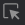
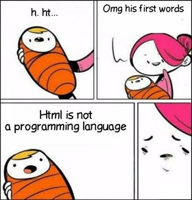

#0802

# [Web] > **HTML**

## 0. Web 🌐

---

### 1. Web을 배우는 이유

**A. 웹 애플리케이션 개발을 학습함으로써, SW 개발 방법과 학습 과정을 익힐 수 있기 때문이다.** 웹은 소프트웨어의 어떤 분야든 간에 가장 기반이 되는 기술이다.

### 2. Web 표준

> 특정 브라우저에 종속되지 않는, 웹의 표준적인 기술 또는 규칙

기존의 웹 표준은 W3C(Worldwide Web Consortium)에서 HTML 표준을 제정했었는데, 시대 흐름을 제때에 따라가지 못하면서 WHATWG(왓위그)에 의해 대체되었다("협력하게 되었다").

WHATWG은 애플, 구글, 마이크로소프트, 모질라 기업이 참가하고 있으며, 이들 기업의 공통점은 각각의 브라우저를 가지고 있다는 점이다 (사파리, 크롬, 엣지, 파이어폭스).

### 3. [Can I use?](https://caniuse.com/)

웹 표준에도 불구하고 각 브라우저마다 표준을 준수하는 정도가 서로 다르다. ("웹 파편화")

따라서, 사용자들은 위 사이트를 통해 어떤 웹 기술이 특정 브라우저에서 지원되는지 확인할 수 있다.

<span style="color:red">빨강: X</span>	<span style="color:green">초록: O</span>	<span style="color:lightgreen">연두: △</span>

### 4. 브라우저의 역할

> 서버에 url을 통해 요청을 보내면, html 문서 따위로 응답을 받는다.
>
> **브라우저는 html 문서를 홈페이지로 바꿔준다.**

### 5. 크롬 개발자 도구 

- 마우스 우클릭 > 검사 > 좌측 상단의 버튼() 클릭하여 화면의 항목 선택
- Ctrl+Shift+I (개발자 도구 펼치기) > Ctrl+Shift+C (항목 선택하기) 통해 화면의 항목 선택

항목을 선택하면 해당 항목을 나타내는 html 문서의 내용을 확인할 수 있다.

여기서 우클릭 > Copy > Copy Selector을 통해 CSS 선택자를 확인할 수 있다.

<br/>


## 1. HTML 📑

---

### 0. HTML 이란?

> Hyper Text Markup Language

​	**웹 컨텐츠의 <u>의미</u>와 <u>구조</u>를 정의하는 언어.**

- Hyper Text: '이전'과 '다음'만 존재하던 기존의 선형적 페이지 구조에서 벗어나, 참조를 통해 한 문서에서 다른 문서로 즉시 접근 가능한, 비선형적 구조의 텍스트(***하이퍼링크*** 텍스트)

- Markup: 텍스트에 역할을 부여하는 것, 문서의 각 부분이 어떤 역할/의미를 가지는지 명명하는 것 (제목을 제목, 본문을 본문이라고 마킹하는 것)

  ㄴ 구조를 잡는 것

  ㄴ Markup Language: 태그 등을 이용해 텍스트의 구조를 명시하는 언어

  ​	(예) HTML, Markdown

  ​	*※주의: HTML은 프로그래밍 언어가 아니다!*

  ​	

  프로그래밍 언어는 <u><저장, 조건, 반복></u>의 세 가지 특성으로 정의할 수 있다.

  이와 달리, HTML의 역할은 데이터를 구조화하여 표현하는 것이다.

(※ 참고: [최초의 웹사이트](http://info.cern.ch/))

### 1. 기본구조

```html
<!DOCTYPE html>			<!--HTML 문서 시작에 꼭 작성! html5로 된 문서임을 표시함-->
<html lang="en">
<head>
    <meta charset="UTF-8">		<!--<meta>: 메타정보-->
    <meta http-equiv="X-UA-Compatible" content="IE=edge">
    <meta name="viewport" content="width=device-width, initial-scale=1.0">
    <title>Document</title>		<!--브라우저 탭 등에 적히는 이름-->
</head>
<body>
    
</body>
</html>
```

(VS Code에서 `html:5`를 탭키로 자동완성하면 위의 기본구조를 바로 얻을 수 있다.)

* html 요소: <html> ~ </html>
  * HTML 문서의 최상위 요소
  * 문서의 root을 뜻함
  * head와 body로 이루어짐
* head 요소: <head> ~ </head>
  - HTML 문서의 메타정보*
  - CSS 선언도 여기에 함
  - <u>브라우저에 나타나지 않음</u>
* body 요소: <body> ~ </body>
  * <u>브라우저 화면에 나타나는 정보</u>

**※ 참고**

<details>
<summary>Open Graph Protocol 📱</summary>
<div markdown="1">
    - HTML 문서의 메타정보를 나타내는 것 <br>
    - 페이스북에서 만들어서, 현재 아주 많은 곳에서 사용되고 있음<br>
    
    </div>
</details>

   <br/>

#### ► DOM(Document Object Model) 트리


- 각 태그를 객체로서 접근할 수 있도록 트리 모양으로 구조화한 것 (for 문서의 구조화된 표현)

- 들여쓰기를 기준으로 각 태그를 객체로 본다 — 객체별로 조작 · 수정 · 삭제가 가능한 구조

- 즉, 웹페이지의 객체 지향적 표현.

- HTML의 들여쓰기는 '2 spaces'를 기준으로 하기로 한다. 

  (사실 들여쓰기가 문서의 기능에 영향을 미치지는 않지만, 가독성과 유지보수의 용이성을 위해 통일된 기준을 갖는 것이 중요하다.)

<br/>

#### ► 요소(element)

- 시작 태그, 종료 태그, 내용

  ```html
  <h1>
      contents
  </h1>
  ```

- 내용이 없는 태그도 있다: br, hr, img, input, link, meta
- 요소들이 중첩될(nested) 수 있다.
- 여닫는 쌍이 맞도록 적는다 — HTML 특성상 오류를 알려주지 않아 디버깅이 힘들므로.

#### ★ Semantic Tags

***의미*** 를 가진 태그.

`<div>` 등 의미론적 요소가 결여된 태그를, 의미가 부여된 여러 종류의 태그로 구분하기 시작했다.

의미를 가지고 의미를 통해 연결된 유기적인 데이터로 구축하고자 하는 발상의 시멘틱 웹 개념으로 연결된다.

→ 단락의 구분과 내용 짐작이 가능해짐으로써 코드 파악이 쉬워짐 (가독성 향상, 유지보수 용이해짐)

→ 시각 장애인의 웹 사용을 도와주는 도구인 스크린 리더의 경우, 시맨틱 태그를 인식하여 말하기의 변화를 줄 수 있다고 한다. 내용 전달에 시맨틱 태그가 더욱 유용하다.

​	▸ [''웹 접근성''이란?](http://www.wa.or.kr/m1/sub1.asp)  💬 (예: [네이버 널리](https://nuli.navercorp.com/))

- `div`: 구조를 잡아주는 용도의 태그 (블럭 요소)

  ---

- `header`: 헤더(머리말)

- `nav`: 내비게이션 바

- `aside`: 사이드 바

- `section`: 문서의 일반적인 구분

- `article`: 문서, 페이지, 사이트 내에서 독립적으로 구분된 영역

- `footer`: 하단 부분

<br/>

#### ► 속성(attribute)

태그 안에 쓰인다.

```html

```

```html
속성명: src
속성값: ../image/my_photo.png
```

- 태그마다 가질 수 있는 속성이 다르다.
- 속성은 여는 태그에 작성한다.
- 규칙
  - '=' 기호의 양쪽에 공백을 두지 않기로 한다.
  - 속성값은 큰따옴표(" ")를 사용해 나타내기로 한다.

<details>
<summary>HTML Global Attribute</summary>
<div markdown="1">
    - 태그와 상관없이 사용이 가능한 속성 <br>
    - id, class, hidden, lang, style, tabindex, title<br>
    </div>
</details>

<br/>

### 2. HTML 문서 구조화

[👉많이 사용되는 태그 알아보기](https://www.advancedwebranking.com/html/ )

- 그룹 컨텐츠

`<p>`: paragraph

`<hr>`: horizontal rule (가로선 생김)

`<ol>, <ul>`: ordered list, unordered list

- 텍스트 관련 요소

`<a>`: 링크 연결

`<b>`와 `<strong>`: 볼드체 (<strong>이 시맨틱 태그)

`<i>`와 `<em>`: 이탤릭체(<em>이 시맨틱 태그)

`<span>`: `<div>`처럼 구조를 잡아주지만, 인라인 요소

`<br>`: line break

``: 이미지

- table

`<tr>, <td>, <th>`: table rows, table data, table height

`<thead>, <tbody>, <tfoot>`: table head, body, foot

`<caption>`

`<colspan>, <rowspan>`: 셀 병합 속성

`<col>, <colgroup>`

`scope 속성`: 테이블의 th 또는 td 등의 셀에게 사용, 컬럼(column)인지 행(row)인지 알려줌.

- **form** ✔

  : 입력 정보를 서버로 보내줌 (`<input>`과 함께 많이 사용됨)

  (예) 로그인 창, 검색 창

  - action 속성: 어디로 보낼지 (必)
  - method 속성: 어떤 http method를 선택할지

- **input** ✔

  : 사용자가 입력할 수 있는 공간

  - type 속성: 기본값은 "text". "password" 쓰면 ****로 마스킹 됨.

    [👉타입 종류 확인하기](https://developer.mozilla.org/ko/docs/Web/HTML/Element/Input)

  - autofocus 속성: 문서 새로고침 시 바로 커서 깜박거리며 있도록 해줌

  - required 속성: 선택이 필수가 되도록

  - checked 속성: 기본값이 체크된 상태가 되도록

  - `<label>`: for 속성과 일치하는 id 값의 요소에서, 라벨만 눌러도 선택되게 해줌
  - `<select>` 태그 + 아래에 각각의 `<option>` 태그: 드랍다운

