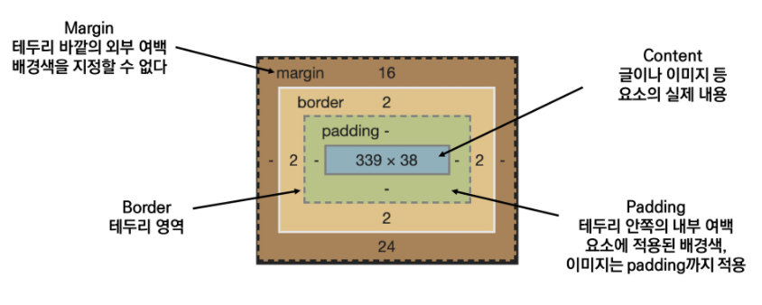
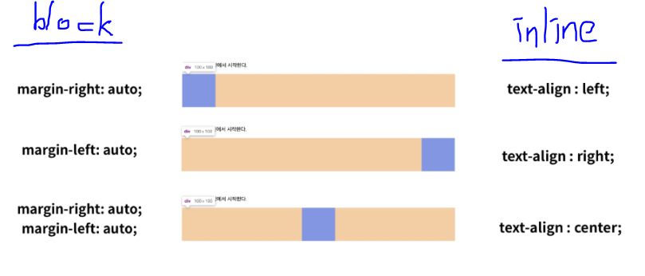

#0803

# [Web] > **CSS**

## 0. CSS란? 💻👁‍🗨

> CSS (Cascading Style Sheets)

> HTML의 레이아웃을 설정하고 스타일을 입히는 등, HTML의 표현을 담당한다.
>
> 단독으로 사용할 수 없다. HTML과는 별개의 언어다.

### 1. CSS의 구문


- 언제나 '*선택자(selectors)*'와 함께 열린다.

- 중괄호({ }) 안에 `속성: 값` 의 쌍을 이루는 형태를 지닌다: *선언(declaration)*

  - 하나의 구문 안에 여러 선언들이 작성될 수 있다.
  - 각 선언문 뒤에는 세미콜론(;)이 붙는다. *(유의)*

- ```css
  p {
      background-color: white;
      font-size: 16px;
  }
  ```

  → 의미: p 태그를 선택해서, 배경색을 white로, 글자 크기는 16px로 하겠다.

<br/>

### 2. CSS 정의 방법

#### 1. 인라인(inline)

html 문서에서, 여는 태그의 `style` 속성으로 작성한다. (한 줄로 작성됨)

```html
<h2 style="color: white; font-size: 16px;">
    This is inline.
</h2>
```

#### 2. 내부참조(embedding): `<style>` ✔

html 문서에서, 메타데이터를 나타내는 `<head>` 태그 안에 `<style>` 태그로 작성한다. (cascading 형태로 작성됨)

```html
<head>
    <style>
        h2 {
            color: white;
            font-size: 16px;
        }
    </style>
</head>
```

#### 3. 외부참조(link file): 별도의 css 파일

스타일만을 저장하는 css 파일을 따로 만들어, html의 링크 태그를 통해 해당 파일을 불러온다.

- 공통 속성이 많을 경우, 모듈화의 장점을 누릴 수 있다.

```css
/*css*/
h2 {
    color: white;
    font-size: 16px;
}
```

```html
<!--html-->
<!--(코드 생략)-->
<head>
    <link rel="stylesheet" href="mystyle.css">
</head>
```

<br/>

### 3. 선택자(Selectors)  (✔중요)

HTML 문서의 특정한 요소에 대해 스타일을 적용하기 위해서는, 반드시 선택자라는 개념이 필요하다!

#### 0. 분류

- 기본 선택자
  - 전체 선택자(*), 요소 선택자(<tag>)
  - 클래스 선택자(.), 아이디 선택자(#), ~~속성 선택자~~
- 결합자(Combinators)
  - 자손 결합자(>), 자식 결합자( )
  - 일반 형제 결합자(~), 인접 형제 결합자(+)

- ~~의사 클래스/요소(pseudo class)~~
  - ~~링크, 동적 의사 클래스~~
  - ~~구조적 의사 클래스, 기타 의사 클래스, 의사 요소, 속성 선택자~~

👉 크롬의 개발자 도구를 활용해 화면 요소들의 selectors를 가져올 수 있다.

'>'로 연결된 선택자의 나열은 자식 태그로 점점 들어가는 경로를 보여준다.

```css
/*전체 선택자*/
* {
    color: red;
}
/*요소 선택자*/
h1 {
    color: red;
}
/*클래스 선택자*/
.section {
    color: red;
}
/*아이디 연산자*/
#someid {
    color: red;
}
```

> - 요소 선택자: HTML 태그를 직접 선택
>
> - 클래스 선택자: 해당 클래스가 적용된 모든 항목을 선택
>
> - id 선택자: 해당 id가 적용된 모든 항목을 선택. id는 unique한 값 (한 문서에 한 번만 사용)

<br/>

#### 1. CSS 적용 우선순위 (cascading order)

'선택자는 범위가 좁을수록 우선순위가 높다.'

1. `!important`: 무조건. 권장되지 않음.
2. inline
3. id 선택자
4. class 선택자
5. 요소 선택자
6. 소스 순서 (나중에 나올수록 우선됨)

👉 참고: `class=""`라고 속성값에 적은 순서는 상관없음!

<br/>

#### 2. CSS 상속

부모 요소의 속성이 모두 자식에게 상속되는 게 <u>아니다!</u>

- 텍스트 관련 요소: 상속 O
- 그 외, box model, position 등 관련 요소: 상속 X

<br/>

#### 3. CSS 단위

##### 1. 크기 단위

- 픽셀(px)

  - 고정적
  - 모든 화면에서 크기가 같다(x): 모니터의 해상도에 따라 달라진다.

- 백분율(%)

  - 가변적인 레이아웃에서 특정 요소가 전체에서 차지하는 비율을 정할 때 사용

- em

  - (바로 위, 부모 요소에 대한) 상속의 영향을 받음
  - 배수 단위로 상대적 사이즈를 가짐
  - '부모에 x배를 곱한다'

- rem

  - (바로 위, 부모 요소에 대한) 상속의 영향을 받지 않음

  - 최상위 요소(html)을 기준으로 배수 단위의 사이즈를 가짐

    즉, 어디에서 써도 상대 배율을 root인 html에 맞춤.

- viewport

  - 우리가 보는 화면 영역 (사용자에게 바로 보이게 되는 웹 컨텐츠의 영역)
  - 주로 스마트폰이나 태블릿 디바이스의 화면을 일컫는 용어로 사용됨
  - 디바이스에 따라 화면 크기가 상이하기 때문에 viewport를 기준으로 상대적 사이즈를 결정
  - vw, vh, vmin, vmax
  - ~~(IE는 지원하지 않음..)~~

##### 2. 색상 단위

- 색상 키워드: 색상을 직접 글자로 입력함 (대소문자 구분하지 않음)
- RGB 색상: 16진수 표기법 또는 함수형 표기법으로 색을 표현 (+투명도)
- HSL 색상: 색상, 채도, 명도를 통해 색을 표현 (+투명도)

```css
/*모든 같은 색상을 나타냄*/
p {  color: black;  }
p {  color: #000;  }
p {  color: #000000;  }
p {  color: rgb(0, 0, 0, 0.5);  }
p {  color: hsl(120, 100%, 0, 0.5);  }
```

##### 3. 문서 표현

텍스트 (변형 서체), 컬러, 배경, 목록, 표

<br/>

### 4. Selectors 심화

#### 결합자(Combinators)

- 자식 결합자: 해당 선택자(selectorA) 바로 아래의 selectorB 요소 (즉, 직계자식만 선택)

  ㄴ 바로 한 레벨 아래의 지정 태그만.

- 자손 결합자: 해당 선택자(selectorA) 아래의 모든 selectorB 요소

```css
/*자식 결합자*/
div > p {
    color: blue;
}
/*자손 결합자*/
div p {
    color: purple;
}
```

- 일반 형제 결합자: 형제 요소, 즉 같은 레벨에 있는 요소 중 뒤에 있는 모든 selectorB 요소

  ㄴ 앞서 나온 것은 적용되지 않음.

- 인접 형제 결합자: 형제요소 중 바로 뒤에 있는 selectorB 요소만

```css
/*일반 형제 결합자*/
p ~ span {
    color: yellow;
}
/*인접 형제 결합자*/
p + span {
    color: orange;
}
```

<br/>

### 5. CSS Box model

> 네모네모 세상~~ 모든 걸 네모로 봐야 한다. ⬜

#### 0. 영역 구분

: content, padding, border, margin



#### 1. 표현 예시

```css
/*상하좌우*/
.margin {
    margin-top: 10px;
    margin-right: 20px;
    margin-bottom: 30px;
    margin-left: 20px;
}
/*shorthand: 상하좌우 모두 균등하게(auto)*/
.margin-1 {
    margin: auto;
}
/*shorthand: 상하/좌우 각각 10px, 20px*/
.margin-1 {
    margin: 10px 20px;
}
/*shorthand: 상/좌우/하 각각 10px, 20px, 30px*/
.margin-1 {
    margin: 10px 20px 30px;
}
/*shorthand: 상/우/하/좌 각각 10px, 20px, 30px, 40px (시계방향)*/
.margin-1 {
    margin: 10px 20px 30px 40px;
}
```

#### 2. box-sizing

일반적으로, 우리는 보여지는 box의 테두리를 기준으로 너비(width)를 생각하지만, CSS에서는 **content**를 기준으로 너비를 정의한다.

따라서, 우리가 이해하기 쉽도록 border를 기본값으로 잡으려면, 따로 선언을 해주어야 한다.

```css
* {
  box-sizing: border-box;
}
```

#### 3. 마진 상쇄(margin collapsing)

> 위 요소의 아래쪽 마진(bottom)과, 아래 요소의 위쪽 마진(top)이 겹쳐져, 두 마진 값의 합이 아니라 큰 마진 값으로 결합되는 현상

→ 일반쪽으로 하나의 요소에 마진을 몰아줌으로써 해소한다.

<br/>

### 6. CSS Display

#### 어떻게 보여질지를 결정!

#### 1. block

해당 줄을 모두 차지함. 즉, 줄바꿈이 일어난다.

- 기본 너비: 100%
- 블럭 요소 안에 인라인 요소가 들어갈 수 있음
- (예) div, h1, form, p, li

#### 2. inline

내용만큼만 차지함. 다음 요소는 줄바꿈 없이 옆에 나타남.

- width, height, margin-top, margin-bottom을 줄 수 없으므로, 상하 여백을 line height로 줄 수 있음

- (예) span, input, a, img

#### 3. inline-block

인라인과 블럭의 특징을 모두 가짐

ㄴ 한 줄에 표시 가능 & width, height, margin 속성도 지정할 수 있음

#### 4. none

해당 요소를 화면에서 표시하지 않음 (차지하는 공간까지 비워짐).

​		*※ 비교: `visibility: hidden`*

​		*화면에 표시되지 않지만, 공간은 여전히 차지하고 있음*

#### 3. 수평 정렬 방법



​						*▸ 방향에 주의하기*

<br/>

### 7. CSS Position

문서 상에서 요소를 배치하는 방법

#### 1. static

- 따로 지정하지 않으면 기본적으로 static 값을 가짐
- 일반적인 요소의 배치 순서에 따름 (좌측 상단부터)
- 부모 요소 내에서 배치되면, 부모 요소의 위치를 기준으로 삼음

좌표 프로퍼티(top, bottom, left, right)를 통해 이동하기:

#### 2. relative

- 과거 자신의 위치를 기준으로 이동함

- 이동한 후에도 여전히 과거의 공간을 차지하고 있음

  ㄴ 레이아웃에 영향 주지 않음. 다른 요소가 들어올 수 없음.

#### 3. absolute

- 아예 이동하여 과거 공간을 차지하지 않으며, <u>static이 아닌</u> 부모를 찾아 떠남

  ㄴ 만약 끝까지 마땅한 부모가 없으면, <body>에 붙음 (문서의 좌측상단 끝)

  ㄴ 이동하고 남은 공간은 다른 요소가 차지하러 올라갈 수 있음

- "붕 뜸"

  ㄴ 붕 뜬 공간에 다른 요소가 들어와서 두 요소가 겹칠 때,  `z-index`로 깊이 조정하여 어느 요소가 위에 위치할지 정할 수 있다.

- (예) 팝업 정보 상자, 제어 메뉴 등

  ㄴ 페이지의 다른 요소의 위치에 간섭하지 않는, 격리된 UI 기능을 만드는 데 활용됨

#### 4. fixed

- 아예 이동하며, 과거 공간을 차지하지 않음.
- viewport를 기준으로 움직임
- (예) 네이버 웹툰 리모컨

*※ fixed vs. sticky* 🎭

- fixed: viewport를 기준으로 하여, 스크롤을 내려도 고정된 위치에서 계속 따라다님
- sticky: 정해진 페이지에서는 정해둔 위치에 있다가, 스크롤을 내려 프레임에 부딪히면 밀려서 움직인다. 특정 페이지를 지나면 나타나지 않게끔 할 수도 있다.

---

### 이미지 사이 공간 없애기

img는 인라인 요소. 즉, 행간, 자간 처럼 약간의 공간을 가지는 글자처럼 취급되어, 이미지 사이에 공간이 생긴다.

→ 해결방법: 부모 요소에 속성 `font-size`를 0으로 둠으로써 공백을 없앨 수 있다.

### VS Code 단축키

- Alt + 클릭: 커서 여러 개
- ! + Tab: 자동완성(emmit)
- Alt + 방향키: 위아래 줄 이동 가능
- Alt + Shift + 방향키: 복사
- Ctrl + D: 같은 단어를 찾음 (D 연속해서 눌러서 여러 개 고를 수 있음) - 한 번에 수정하기

### 참고 사이트

- html-css-js.com
- web.dev/learn/css
- bootstrap

