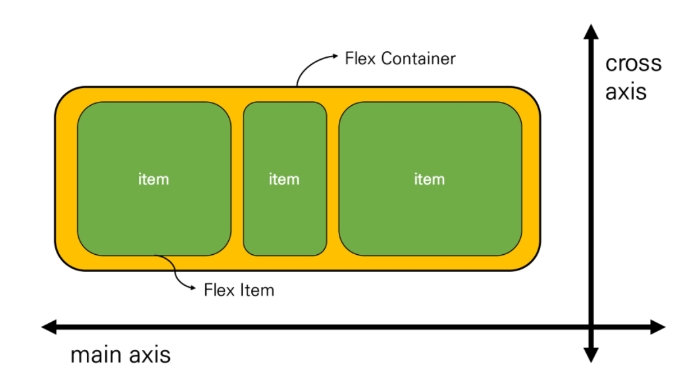

#0804

# CSS Layout 🎨

---

## 0. Display, Position

(지난 글에서 다룸)

## 1. Float

> "둥둥 떠있다~"

[▸출처](https://i2.wp.com/css-tricks.com/wp-content/uploads/2021/02/web-text-wrap.png?w=540&ssl=1)

- 신문에서 많이 볼 수 있는 구조
- 본디 이미지를 놓고 그 주변에 텍스트가 둘러싸게끔 하는 인쇄물 구조를 위해 도입된 것이지만, 이미지 뿐만 아니라 다른 요소에도 적용하여 웹 레이아웃을 만드는 데까지 발전했다.
- <u>텍스트와 인라인 요소들</u>이 float 대상을 감싸는 구조 *(블록 속성의 요소들이 감싸지 않음!)*
- 레이아웃에 영향을 준다.

- 과거에 열 레이아웃을 만들기 위해 사용되었지만, 현재는 다른 도구들에 밀려 이미지를 위한 본래의 역할을 하고 있다. legacy 기술이지만 여전히 사용되고 있다.

### 속성값

- none (기본값)
- left
- right

### Float clear

레이아웃에 영향을 주어 전체 레이아웃이 망가지는 것을 막기 위해, float를 clear하는 작업을 할 수 있다.

→ 떠있는 자리 아래에 투명한 **블럭** 요소를 만들기 (다른 요소들이 빈 자리에 올라오지 못하게!)

​	: *clearfix* 라는 이름을 가진, 가상요소를 생성하는 클래스를 만든다.

```css
.clearfix::after {
    content: "";
    display: block;		/* 기본값은 inline */
    clear: both;
}
```

- `clear` 속성: float 된 성질을 무시하겠다는 속성 

  속성값: 띄워진 방향(left, right). 보통은 both로 사용.

- 부모 요소에 clear을 적용하면, 해당 부모 요소의 내부에 있는 float가 모두 clear("무시")된다.

  - clearfix는 float된 요소의 <u>부모 태그</u>로 작성을 한다.

    (부모 태그에 `class="clearfix"`를 넣어준다.)

※ ['::after'에 대해 더 알아보기](https://developer.mozilla.org/ko/docs/Web/CSS/::after)

<br/>

---

## 2. Flexbox



> - 역할
>
> 1) 공간을 배분
> 2) 정렬
>
> - 단방향(1차원) 레이아웃
> - '요소'와 '축' 기억하기!

### 기억할 사항

- Flex container(부모 요소)가 먼저 선언이 되어야, 내부 요소의 정렬을 시작할 수 있음

- flex의 기본원리는 **부모 요소가 컨트롤한다**는 점이다. 

  ㄴ 고로, 부모 요소에 display 속성을 지정.

- ```css
  /* 많이 쓰임 */
  justify-contents: center;
  align-items: center;
  ```

### ✔ 요소

- Flex Container(부모 요소): 아이템을 포함하고 있는 바깥 요소

  ㄴ `display` 속성을 'flex' 또는 'inline-flex' 로 지정 (블록 or 인라인 블록) — flexbox 시작의 첫 단추!

  ```css
  .flex-container {
      display: flex;
  }
  ```

- Flex Item(자식 요소): 정렬 대상이 되는 요소들

### ✔ 축

- main axis(메인 축): 정하는 방향의 축

  ㄴ 기본값: 좌→우

  ㄴ 메인축은 x축이다 (X)

- cross axis(교차 축): 메인축을 수직으로 지나는 방향의 축

  ㄴ 기본값: 위→아래

<br/>

### 속성

- 배치 방향: **flex-direction**

  ㄴ row (기본값), row-reverse, column, column-reverse

  

- 메인축 방향 정렬: **justify-content**

  ㄴ flex-start / flex-end / center / space-between / space-around / space-evenly

  ㄴ justify는 content만 있는 이유: 다른 건 auto margin으로 해결이 가능하여 불필요하므로. 

  - flex-end: *요소가 뒤로 몰리는 것* , *역순과는 다른 개념 !*

  - space-between: 외부 공백은 없고, 내부 공백 같게
  - space-around: 내부 공백이 외부 공백의 2배 (각 요소마다 양쪽에 일정 크기의 공백이 생기므로)
  - space-evenly: 내부 공백과 외부 공백 같게

  

- 교차축 방향 정렬: 

  - **align-items**

    ㄴ flex-start / flex-end / center / stretch / baseline

    - stretch: 기본값. 교차축 크기만큼 쭈욱 늘어나서 채워짐. 
    - baseline: 요소 내부의 text의 기준선을 서로 맞춤

    

  - **align-self**

    ㄴ auto / flex-start / flex-end / center / baseline / stretch

    ㄴ <u>다른 건 다 container 안에 적지만, self는 아이템들이 개별로 움직이므로 부모요소에 적지 않고 개별요소를 선택해서 쓴다.</u>

    - auto: 기본값
    - stretch: 부모 컨테이너에 맞춰서 자동으로 늘어남

    ```css
    /* 예시 */
    .item_a {
        align-self: flex-start;
        order: 0;
        flex-grow: 1;
    }
    ```

  - **align-content**

    ㄴ flex-start / flex-end / center / stretch / space-between / space-around

- 기타: flex-wrap, flex-flow, flex-grow, order

  - **flex-wrap**

    ㄴ nowrap: 기본값. 요소들을 모두 한 줄에 나타내려고 함. 넘치면 삐져나옴.

    ㄴ wrap: 넘치면 아래 줄로 내려감

    ㄴ wrap-reverse: 넘치면 위의 줄로 올라감

  - **flex-flow**: 'flex-direction'과 'flex-wrap'을 함께 적는 shorthand

    (예) `flex-flow: row wrap;`

  - **order**: 기본값은 0. 작을수록 앞으로 정렬됨.

  - **flex-grow**: 메인축에서 남는 공간을 항목들에 분배하는 방법. *각 요소의 상대적 비율이 아님에 주의!*

    ​				기본값은 0. 음수 불가능.

    

- 여러 줄: content
- 한 줄: items
- 정렬되는 요소 각각: self

<br/>

---

## 3. Bootstrap

### 0. Bootstrap이란?

- 프런트엔드 라이브러리

- 크로스 브라우징

  : 브러우저마다 서로 다른 엔진을 사용하기 때문에 렌더링의 차이로 인해 출력이 달라질 수 있는데, 대부분의 브라우저에서 동등하게 보여줄 수 있도록 처리를 가하는 것.

  크로스 브라우징에서 중요한 건 100% 동일함이 아니라, 최대한 동등하게 보여지게끔 하는 것이다.

  브라우저는 사용자를 위해 최소한의 스타일을 가지고 있는데(user agent stylesheet), 이를 최대한 표준으로 맞추기 위해 다음과 같은 방법이 사용된다:

  - 방법 2가지

    - Normalize ('gentle solution') ✔

      : 표준을 기준으로 일치하지 않는 브라우저를 수정함. 이때, 브라우저를 수정할 수 없는 경우, 표준을 지키는 브라우저라도 수정이 불가한 부분에 맞추도록 함

    - Reset ('aggressive solution')

      : 표준이건 말건, 기본 스타일도 모두 없애고 모두 재설정.

      : 단점 - 너무 많은 선택자가 얽혀있고, 디버깅 시 가독성이 매우 떨어짐.

- 반응형(responsive)

  : 디바이스마다 다른 화면 사이즈로 인해 화면을 달리해야 할 필요가 있다. 이를 하나의 코드로 구현하는 것.

  ㄴ one-source, multi-use

  👉 [에어비앤비 화면을 마구 늘렸다가 줄여보자](https://www.airbnb.co.kr/?_set_bev_on_new_domain=1628078058_YTJiMDk1YTU4ZTI0)

### 1. Bootstrap 사용하기

1. 웹페이지에서 파일을 다운받아 사용하기

2. CDN 기술을 활용하여 다운받지 않고도 사용하기

   - CDN (Content Delivery(Distribution) Network)

     : 분산시스템을 적용하여, 사용자들이 파일을 직접 다운받지 않고도 웹경로로 사용할 수 있게 하는 것

     ㄴ 말단의 유저에게 가까운 서버를 통해 빠르게 데이터를 전달 가능

     ㄴ 외부 서버를 사용하므로 사용자의 서버 부하가 적어짐

     ㄴ head 부분에 작성한다.

     ㄴ (자바스크립트 코드를 함께 쓸 때에, 자바스크립트 코드는 바디의 닫는 태그 바로 앞에 써주기)

### 2. spacing

부트스트랩에 이미 많은 속성들을 클래스로 정의해 두었으니, 우리는 잘 알고 가져와서 사용하면 된다!

👉 [Bootstrap 홈피의 도큐먼트 보기 - Spacing](https://getbootstrap.com/docs/4.0/utilities/spacing/)

이외에도, 다른 사전 정의 기능을 사용하고 싶을 땐 **[Bootstrap 홈페이지](https://getbootstrap.com/docs/4.0/getting-started/introduction/)**를 참고하자. 🌐

<br/>

---

## 4. Bootstrap Grid System

- flexbox로 제작됨

- container 안에 rows라는 클래스,  그 아래에 columns 가 있음

  ㄴ 하나의 row 안에 있는 12개의 column으로 조작

### 기억해야 할 사항

1. <u>12개의 column !</u>

   ㄴ 12는 약수가 많은 숫자, 다양한 종류로 나눠 배열이 가능함

2. <u>6개의 grid breakpoints !</u>

   ㄴ 화면의 크기가 변할 때 화면의 구성이 바뀌는 지점이 최대 6개

### 유의점

- 부모에 row를 선언하고, `col-x`(x는 칼럼의 개수)의 형태로 차지할 칸의 개수를 나타낸다.

  ㄴ row를 선언하면 12칸이 생기므로 합이 12가 되도록 사용함

  ​	ㄴ 12가 넘어가는 수를 포함하는 칸은 아래로 떨어짐

  ㄴ 그냥 `col` 이라고만 쓰면 균등하게 나뉨 — 명확하게 해주는 게 좋음.

  ㄴ 클래스 선언을 보면 백분율로 되어있음을 발견할 수 있음 (반응형 웹): 화면 크기를 따라가도록

- `gutter`: 요소 간에 간격을 떨어뜨릴 수 있는 패딩 값 (`gx-5`, `g-0` 등)

- row의 하위 자식은 오직 column만 가능하다.

- 내용은 column 안에 있어야 한다.

- `nesting`: 그리드 안에 또 그리드를 사용하는 것

- `offset`: offset 만큼의 칸 이후에 시작하겠다는 의미

---

## 참고 사이트

[보라보라 그림: css-tricks.com](https://css-tricks.com/snippets/css/a-guide-to-flexbox/)

[일분코딩](https://studiomeal.com/archives/197)

