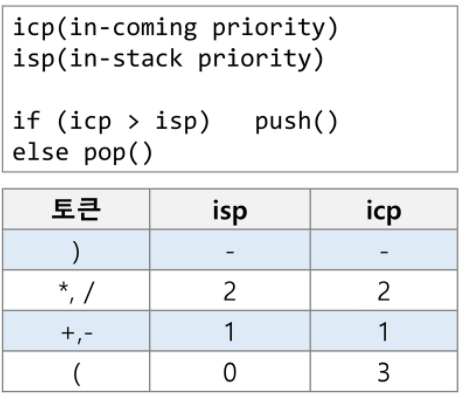
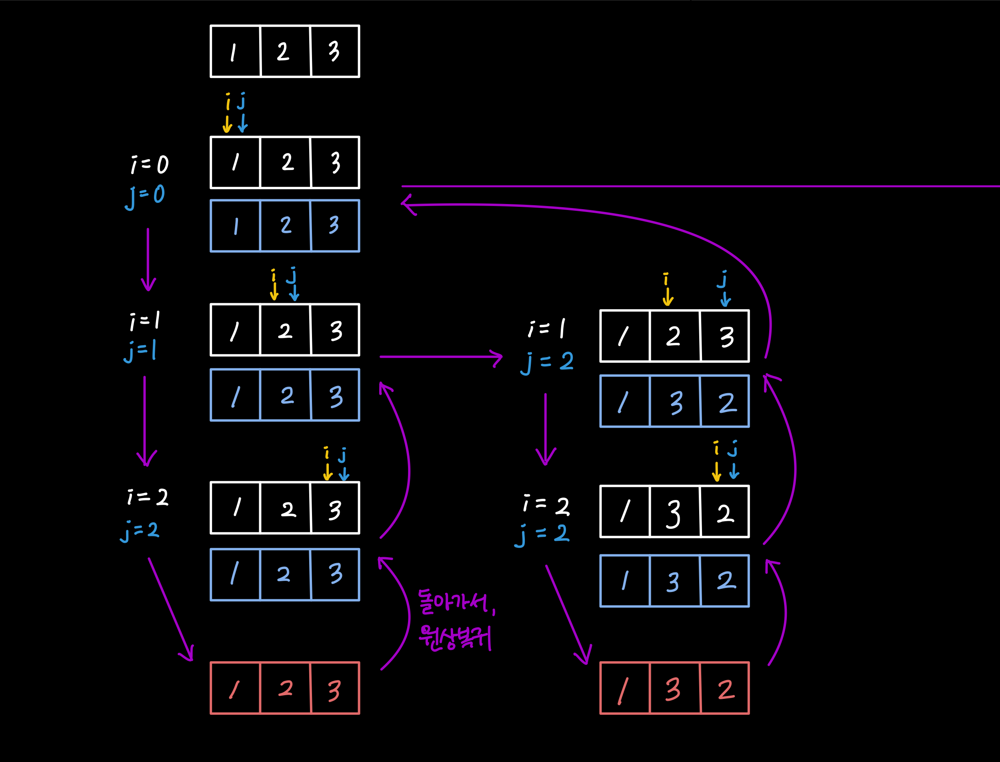
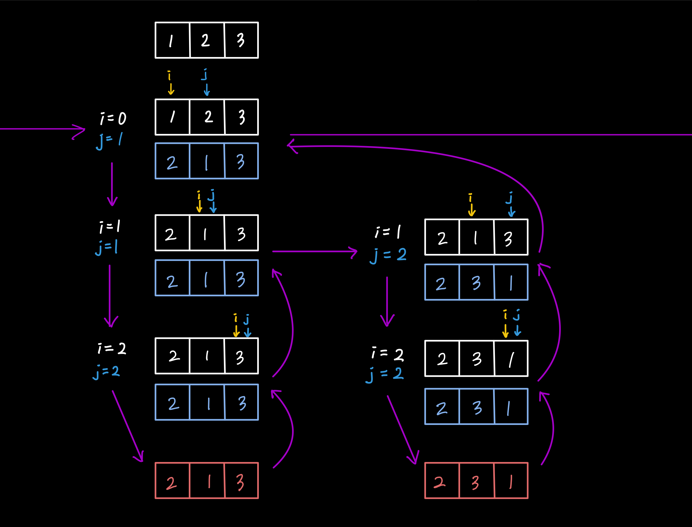
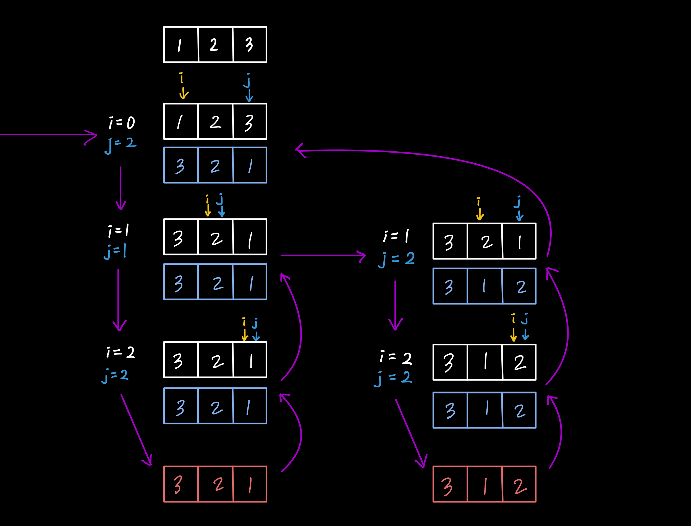

# 스택 2

## 1. 계산기

> 스택을 통해 문자열로 표현된 계산식을 계산할 수 있다!
>
> 1) 중위 표기법을 후위 표기법으로 바꿔 표현한 후,
> 2) 스택을 활용해 계산값을 도출한다.


### 후위 표기법(postfix notation)

피연산자(operand) 사이에 연산자(operator를 표기하는 중위표기법과 달리, 피연산자 뒤에 연산자를 표기하는 방법

(예) 53*

* #### 1) 후위 표기법으로 바꾸는 방법

  문자열을 앞에서 부터 읽어오며, 

  1) 피연산자이면,

     그대로 출력한다.

  2) 연산자이면, 

     (1) 스택이 비어있거나, 스택의 마지막 연산자보다 우선순위가 높으면:

     스택에 추가한다.

     (2) 스택의 마지막 연산자보다 우선순위가 낮거나 같으면:

     더 낮은 우선순위의 연산자가 나오거나, 스택이 빌 때까지 요소를 pop하여 출력한다.

     그리고 해당 연산자를 스택에 추가한다.

     👉 확인해보기: [블로그 글](https://jamanbbo.tistory.com/53)

  * 우선순위 (*숫자가 클수록 높은 것)

    

  3. 문자열이 끝났을 때, 스택에 남은 연산자가 있다면 모두 pop해서 출력해준다.

<br/>

* #### 2) 후위 표기법으로 표현된 수식을 계산하는 방법

  1. 피연산자라면,

     스택에 추가한다.

  2. 연산자라면, 

     연산자에 필요한 만큼의 피연산자를 스택에서 pop하여 (사칙연산은 2개), 먼저 꺼낸 피연산자를 연산자의 우측에 두고, 나중 피연산자를 연산자의 좌측에 두어 계산한 결과를 스택에 추가한다.

  3. 수식이 끝나면, 스택에 마지막으로 남은 값을 pop한다 → 결과값

<br/>

※ 참고: [파이썬의 `eval()` 함수](https://docs.python.org/3/library/functions.html?highlight=eval#eval)

(학습 과정에서는 사용을 지양할 것!)

<br/>

## 2. 백트래킹(Backtracking)

> 어떤 노드의 유망성을 점검하여, 유망하지 않다면 부모 노드로 돌아가 다음 자식 노드로 가는 것
>
> (해답의 가능성이 있으면 유망한 것, 없으면 유망하지 않다.)
>
> - 가지치기(pruning): 유망하지 않은 노드가 포함된 경로는 더 이상 고려하지 않는다.

- 재귀를 이용한 DFS에 대한 이해가 되어 있어야 한다.
- 최적화(optimisation) 문제와 결정(decision) 문제를 해결할 수 있다.
  - 최적화 문제: 최단거리 등
  - 결정 문제: 문제의 조건을 만족하는 해가 존재하는지 여부를 답하는 문제(Y/N)
    - 미로 찾기, n-Queen, Map coloring, 부분집합의 합 등

### (예) 미로 찾기

DFS에서처럼, 현재의 위치 `v`와 갈 위치 `w`를 정하고, `visited`배열을 기록하고, 지나간 경로를 스택에 저장한다.

더 이상 진행할 수 없으면, 경로를 거슬러 다른 방향으로 진행할 수 있는 상태로 되돌아가는 것이 핵심이다.

사방을 순서대로 탐색하여 가능한 새로운 경로를 탐색할 수 있다.

<br/>

### 백트래킹과 DFS의 차이

- 백트래킹은 노드가 유망하지 않으면 해당 경로에 대한 탐색을 중단함으로써, 전체 시도 횟수를 줄인다.

  즉, 불필요한 경로를 조기에 차단함으로써 경우의 수를 줄일 수 있다.

- 다만, 일반적으로 경우의 수가 줄지만, 최악의 경우에는 여전히 지수함수 시간을 요한다.

### 백트래킹 방법

DFS를 실시하고, 중간에 노드의 유망성을 점검하는 조건식을 통해 점검하여, 노드가 유망하지 않으면 부모 노드로 돌아가 다른 경로로 검색을 실시한다.

<br/>

## 3. [관련] 부분집합, 순열

✔ 배열에 재귀로 접근하려면, ① 현재 접근하려는 인덱스, ② 배열의 크기 정보가 필요하다!

※ 참고

- 일반적으로, 재귀에서 인덱스와 크기가 일치할 때(`i==N`)를 조건으로 재귀 종료 조건을 만들면 된다.

- 부분집합

  ```python
  """
  부분집합의 합
  """
  # 1번
  def f(i, N, K): # 합이 K인 부분집합을 출력 — i: 위치, N: 배열 크기, K: 구하고자 하는 합
      if i==N: # 부분집합 생성 완료
          s = 0
          for j in range(N):  # 완성된 부분집합 합 구하기
              if bit[j]==1:
                  s += A[j]
          if s == K: # 합이 찾는 값이면
              print(bit, end= ' ')
              for j in range(N):
                  if bit[j]==1:
                      print(A[j], end =' ')  # 부분 집합 출력
              print()
      else:   # 부분집합 생성 미완료
          # 양쪽을 모두 가봐야 하므로 재귀호출 2개
          bit[i] = 1  # i) 넣거나
          f(i+1, N, K)
          bit[i] = 0  # ii) 말거나
          f(i+1, N, K)
  
  # 2번
  def f2(i, N, K, S, RS): # S: 중간합, RS: 남은 원소들의 합
      if S==K:    # 부분집합의 합이 구하고자 하는 값이면, 완료
          print(bit, end=' ')
          for j in range(N):
              if bit[j] == 1:
                  print(A[j], end=' ')  # 부분 집합 출력
          print()
      elif i==N:  # 합이 K 값이 아닌데 이미 고려할 요소가 동남: 종료
          return
      elif S > K: # 이미 구할 K 값을 넘어버림: 종료
          return
      elif S+RS < K:  # 앞에서 요소를 너무 많이 배제해서, 뒤에 있는 요소를 모두 포함해도 K값이 나오지 않을 때: 종료
          return
      else:   # 계속 부분집합 만들어보기
          bit[i] = 1
          f2(i + 1, N, K, S+A[i], RS-A[i])
          bit[i] = 0
          f2(i + 1, N, K, S, RS-A[i]) # A[i] 포함하지 않아도 고려된 요소이니 RS에서 -A[i] 해줘야 함
  
  A = [1, 2, 3, 4, 5, 6, 7, 8, 9, 10]
  bit = [0]*10
  f(0, 10, 10)
  f2(0, 10, 25, 0, sum(A))
  ```

- 순열

  ```python
  def f(i, N): # P[i]의 값을 결정
      if i == N:  # 순열 만들기 완료
          print(P)
      else:
          for j in range(i, N): # P[i] <-> P[j] 자리교환
              P[i], P[j] = P[j], P[i]
              f(i+1, N)
              P[i], P[j] = P[j], P[i]
          return
  
  P = [1,2,3]
  f(0, 3)
  ```

  - (위 예시에서) i=2인 상태에서 호출된 함수 `f(3, N)`은 결과값을 return하면 i=2인 곳으로 돌아가고, 또 i=1인 곳으로 돌아가는 것이다! (return문이 없을 때는 None 객체를 반환한다는 점)

    for문이 끝나면 해당 함수를 호출한 상위 함수로 돌아가는 것. 즉, 끝나니까 전 단계로 돌아가는 것!!








*끝*

