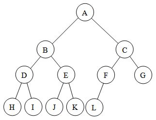

# 트리(Tree)

## 1. 트리


> - 비선형 구조(1:N 관계)의 자료구조
> - 한 개 이상의 노드로 이루어져 있다.
> - 트리는 여러 개의 서브트리(subtree)로 이루어져 있다. (노드 하나짜리도 트리)

### 용어

- 노드(node, 정점): 트리의 원소
- 간선(edge): 노드를 연결하는 선

- 루트(root) 노드: 최상위 노드

  (단, 트리의 시작을 의미하는 것으로, 탐색의 시작을 의미하지는 않는다.)

- 리프(leaf) 노드: 단말 노드

- 부모 노드: (위)
- 자식 노드: 부모 노드에서 간선으로 직접 연결된 정점들 (아래)
- 부모 : 자식 = 1: N

- 형제(sibling) 노드: 같은 부모 노드의 자식 노드들 (부모가 다르면 형제가 아니다!)
- 조상 노드: 루트 노드까지 가는 데에 거치는 모든 정점들 (루트 노드를 포함)
- 자손 노드: 서브 트리에 있는 하위 레벨의 노드들 (자식 포함 그 이하 자손)

- 차수(degree): 자식 노드의 수

  ㄴ 트리의 차수: 트리에 있는 노드의 차수 중 최대 차수를 의미함

- 높이(level): 루트에서 노드에 이르는 간선의 수

  ㄴ 루트는 level 0 (1부터 시작하기도 함)

<br/>

## 2. 이진 트리

> (1:N 관계 대신에,) 모든 노드가 최대 2개의 자식 노드를 갖는 트리 (자식 노드의 수: 0, 1, 2)

- 레벨 i에서 노드의 최대 개수는 **2^i 개** (루트 노드의 레벨이 0일 때)

- 높이가 h인 이진 트리에서: (간선의 개수 h개)

  - 최소 노드 개수: 
    $$
    (h + 1)개
    $$
    
  - 최대 노드 개수: 
    $$
    (2^{h+1} - 1) 개
    $$

### 포화 이진 트리 (Full Binary Tree)


> 모든 노드의 자식 노드가 2개씩인 이진 트리 (꽉 찬 이진 트리)
>
> ㄴ 높이가 h일 때, (2^(h+1) - 1)개의 노드를 가짐

#### 특징:

- root를 늘 1번으로 한다.
- 왼쪽에서 오른쪽으로 차례로 정점 번호를 붙인다.


### 완전 이진 트리  (Complete Binary Tree)



> 포화 이진 트리의 오른쪽 끝에서부터 순차적으로 노드가 비는 트리
>
> - 포화 이진 트리의 규칙대로 정점에 번호를 붙였을 때, n번까지 빈 자리가 없는 이진 트리


### 편향 이진 트리 (Skewed Binary Tree)


> (일반 이진 트리에서) 한 쪽으로 치우쳐진 이진 트리
>
> - 높이 h에 대한 최소의 노드를 가짐
> - 한쪽 방향으로만 자식을 가짐
> - 선형 자료구조와 비교하여 탐색 시간 줄이기의 장점이 없음
> - 참고: 편향 이진 트리가 되지 않도록 구성하는 알고리즘도 있다.


### 순회(traversal)

> 트리 구조에서의 탐색: 트리의 각 노드를 중복되지 않게 전부 방문(visit)하는 것.

- 순회는 어느 노드에서든 시작할 수 있다.
- 순회는 시작 노드를 루트로 가지는 서브 트리 내에서만 이루어지고 끝남 (전체 트리까지 올라가는 게 아님)
- 순회 방법에 따라 순회 결과가 달라질 수 있으므로, 목적에 맞는 순회 방법을 사용해야 한다.

#### 1. 전위 순회(preorder traversal): root - left - right

*현재 방문한 정점을 먼저 처리!*

왼쪽에서 왔으면, 오른쪽으로.

오른쪽에서 왔으면, return.

```python
#pseudocode
def preorder(n):
	if n:					# 정점이 존재하면
        visit(n)			 # 1) 현재 정점 처리
        preorder(left[n])	  # 2) 왼쪽 정점 방문, 처리
        preorder(right[n])	  # 3) 오른쪽 정점 방문, 처리
```


#### 2. 중위 순회(inorder traversal): left - root - right

*현재 방문한 정점 처리를 중간에!*

현재 정점에서, 왼쪽으로 바로 이동.

왼쪽에서 왔으면, 현재 정점 처리.

오른쪽에서 왔으면, return.

```python
#pseudocode
def inorder(n):
    if n:
        inorder(left[n])	# 1) 왼쪽 정점 방문, 처리
        visit(n)		    # 2) 현재 정점 처리
        inorder(right[n])	# 3) 오른쪽 정점 방문, 처리
```


#### 3. 후위 순회(postorder traversal): left - right - root

*현재 방문한 정점 처리를 마지막에!*

현재 정점에서, 왼쪽으로 바로 이동.

왼쪽에서 왔으면, 오른쪽으로 바로 이동.

오른쪽에서 왔으면, 현재 정점 처리

- 특징: 루트 노드가 마지막으로 처리된다.

```python
#pseudocode
def postorder(n):
    if n:
        postorder(left[n])	# 1) 왼쪽 정점 방문, 처리
        postorder(right[n])	# 2) 오른쪽 정점 방문, 처리
        visit(n)		   # 3) 현재 정점 처리
```

#### <코드로 정리>

```python
"""
6
1 2 1 3 2 4 3 5 3 6
"""

def pre_order(n):
    if n:   # 유효한 정점이면
        print(n)    		# 1) 해당 정점 처리
        pre_order(left[n])   # 2) n의 왼쪽 자식으로 이동
        pre_order(right[n])  # 3) n의 오른쪽 자식으로 이동

def in_order(n):
    if n:
        in_order(left[n])
        print(n)
        in_order(right[n])

def post_order(n):
    if n:
        post_order(left[n])
        post_order(right[n])
        print(n)


V = int(input())
edge = list(map(int, input().split()))
E = V - 1  			    # V개의 정점이 있는 트리의 간선 수
left = [0] * (V+1)  	# 부모를 인덱스로 자식 번호 저장
right = [0] * (V+1)
par = [0]*(V+1)     	# 자식을 인덱스로 부모 번호 저장
for i in range(E):
    p, c = edge[i*2], edge[i*2+1]
    if left[p] == 0:    # p의 왼쪽 자식이 없으면
        left[p] = c
    else:               # 왼쪽 자식이 있으면, 오른쪽 자식으로 저장
        right[p] = c
    par[c] = p          # 자식을 인덱스로 부모를 저장
                        # (1) 조상찾기에 사용
                        # (2) root 찾기
                        # ㄴ 포화이진트리의 정점번호 규칙을 따르지 않는 이진트리에 사용하면 됨

pre_order(1)
# print 대신 cnt 하면, 1을 루트로 하는 서브트리의 정점 개수를 셀 수 있다.

# 조상노드 찾기
while par[c]:   # 부모가 있으면
    print(par[c])
    c = par[c]
    
# 루트 노드 찾기: 루트는 par 값이 0 (부모가 없으므로)
root = 1
while par[root]:    # root로 추정한 정점이 부모가 있으면
    root += 1       # 다음 정점을 확인해보자
print(root)
```


<br/>

### 이진트리의 표현 - 배열

- 포화/완전 이진 트리의 저장 방법

  *정점 번호과 포화/완전 이진 트리의 정점 번호 규칙을 따른다면, 해당 저장방법을 사용할 수 있다.*

  ㄴ 루트 번호를 1로 하고, 왼쪽부터 오른쪽으로 순차적으로 번호를 부여한다.

  1) 마지막 번호까지를 인덱스로 갖는 배열을 하나 준비한다.
  2) 배열의 인덱스와 정점 번호가 일치하도록 배열에 값을 저장한다.
     - i 노드의 부모 노드: `i//2 번`
     - i 노드의 왼쪽 자식 노드: `2*i 번`
     - i 노드의 오른쪽 자식 노드: `2*i + 1번`
     - 레벨 n의 시작 번호: `2^n 번`

- 배열을 통한 이진 트리 표현의 단점
  -편향 이진 트리의 경우, 사용하지 않는 공간이 생기므로 메모리 공간 낭비 발생

  -트리의 중간에 새로운 노드를 삽입하거나, 기존 노드를 삭제할 때 배열의 크기를 변경하기 어려움

  (→ 연결리스트로 표현)

<br/>

### 수식 트리 (Expression Binary Tree)


> 수식을 표현하는 이진 트리

- 피연산자: 잎 노드
- 연산자: 그 외 (루트와 가지 노드)

- 전위 순회하면 전위 표기법, 중위 순회하면 중위 표기법, 후위 순회하면 후위 표기법으로 나타낼 수 있다.

<br/>

## 3. 이진탐색 트리

※ 이진 탐색(binary search): "정렬된" 데이터에 대해, 찾고자 하는 키값을 중간값과 비교하여, 결과에 따라 데이터의 반만을 선택함으로써 탐색하는 방법

> 탐색작업을 효율적으로 하기 위한 트리 구조

#### 조건

- key 값:

  왼쪽 서브트리 < 루트 < 오른쪽 서브트리

- → 중위 순회하면 오름차순으로 정렬된 값을 얻을 수 있다.

#### 탐색 연산


루트 노드와 key 값을 비교하여,

- 루트 노드 == key 값: 탐색 중지
- 루트 노드 < key 값: 오른쪽 서브트리 탐색
- 루트 노드 > key 값: 왼쪽 서브트리 탐색

이진탐색 트리는 어느 한쪽만 택해서 이동한다. (위로 돌아가지 않으며, 전체를 탐색하지 않는다.)

꼭 재귀일 필요는 없다. 반복구조로도 가능하다.

#### 삽입 연산


1. 같은 원소가 트리에 있으면 안 됨 - 확인하기
2. 없으면, 해당 자리에 삽입

#### 성능

- 탐색, 삽입, 삭제: O(h)	(h는 트리의 높이)
- 균형적인 이진트리의 경우: O(log n)    (밑이 2인 로그)
- 편향 이진트리의 경우: O(n)

#### 삭제 연산

1. 찾으면, 삭제

2. 삭제 노드에 자식이 있으면, 자식을 삭제 노드의 부모 노드에 연결

   ㄴ 자식이 양쪽에 모두 있으면, 왼쪽 서브트리의 가장 오른쪽 값을 루트로 삼는다.

   (즉, 오른쪽 서브트리를 왼쪽 서브트리의 오른쪽 끝에 붙인다.)


## 4. [참고] 힙(Heap)

> 완전 이진 트리로, 우선순위가 높은 정점을 찾기 위한 자료 구조

#### 조건

완전 이진 트리

#### 종류

- 최대 힙: 큰 숫자에 높은 우선순위 → 루트에 최대값

  <조건> 부모 키 값 > 자식 키 값

- 최소 힙: 작은 숫자에 높은 우선순위 → 루트에 최소값

  <조건> 부모 키 값 < 자식 키 값

#### 삽입 연산


1) 새로운 last 를 만든다 (last 증가).
2) 증가된 last 자리에 삽입한다.
3) 부모 노드와 키 값을 비교하여,
   - 부모 노드가 더 큼: 종료
   - 부모 노드가 더 작음: 부모 노드가 더 커지거나 or 루트에 다다를 때까지, 부모와 키 값 교환

※ 배열

heap이라는 배열을 크기를 정해 만들어두고, last의 초기값은 0으로 둔다.

삽입하려면, last를 1 증가시켜 해당 자리에 값을 삽입한다.

부모 번호를 계산하여, 해당 번호의 값과 삽입한 값을 비교하여,

- 부모 번호의 값이 더 크면: 종료
- 아니면: 부모가 더 커지거나 루트에 다다를 때까지 부모와 키 값 교환

#### 삭제 연산


*루트 노드의 원소만 삭제하는 게 규칙!*

- 조건: 완전 이진 트리 유지
- 방법:
  1. 루트를 삭제하고, last를 루트로 올리고, last를 하나 감소시킴
  2. 자식 노드의 키 값보다 커지거나 or 리프 노드에 다다를 때까지, 자식 노드 중 더 큰 자식과 자리를 바꿈

*끝*


