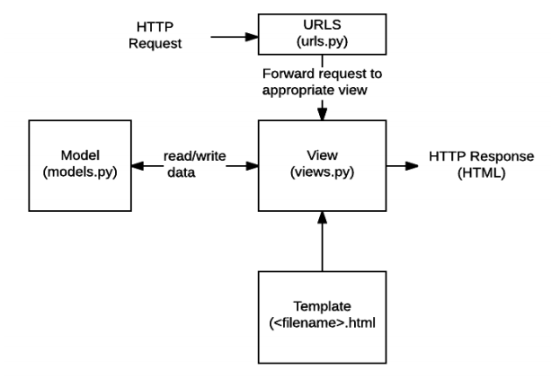
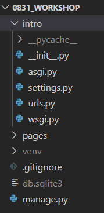
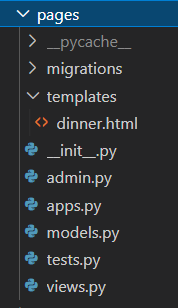
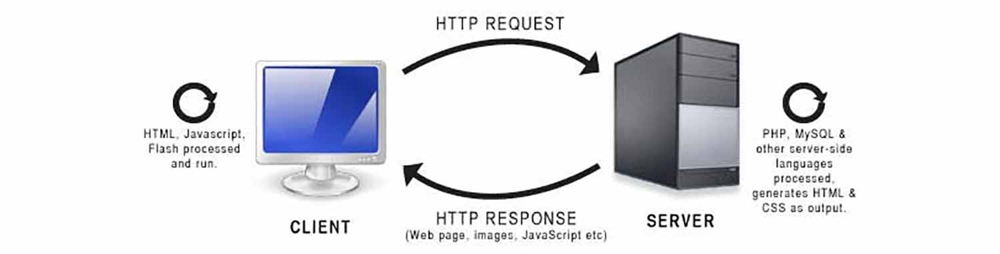
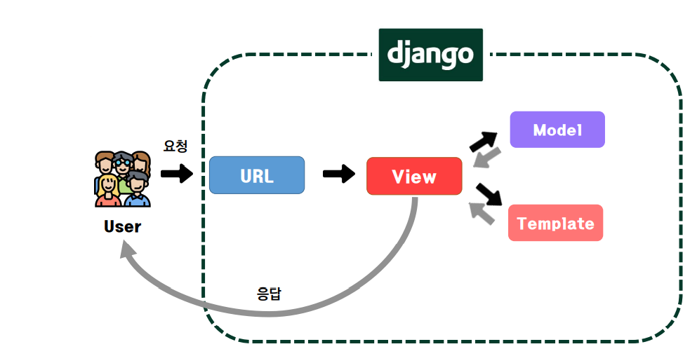

# Django (1)-1

## 1. Django란?

> *"Django is a high-level Python Web framework that encourages rapid development and clean, pragmatic design."*
>
> *"⋯, so you can focus on writing your app without needing to reinvent the wheel."*

<u>**"Django는 웹 프레임워크! 빠른 개발과 실용적 설계를 가능하게 해준다. 기존에 개발된 기능들을 활용하기 때문에, 정해진 순서대로 따라하면 내가 원하는 기능을 구현할 수 있게 해주는 *밀키트* 같은 거구나!"**</u>

- high-level: 인간 친화적 				(↔ low-level: 기계 친화적)

- framework

  > **프레임워크(Framework)**
  >
  > : 프로그래밍에서 특정 운영체제를 위한 응용 프로그램 표준 구조를 구현하는 클래스와 라이브러리의 집합체
  >
  > : 재사용할 수 있는 코드를 프레임워크로 통합함으로써, 표준 코드를 재구현할 필요 없이 같이 사용할 수 있도록 도와준다.
  >
  > : 웹 프레임워크는, 웹 페이지를 개발하는 과정에서 겪는 어려움을 줄이는 것이 주 목적으로 하며, DB 연동, 템플릿 형태의 표준, 세션 관리, 코드 재사용 등의 기능을 포함한다.

  (예) 밀키트

  정해진 순서대로 따라하면, 내가 원하는 걸 얻을 수 있다.

  떡볶이 밀키트를 활용하면 떡볶이 소스를 일일이 만들지 않고, 이미 만들어진 소스를 사용하여 떡볶이를 완성할 수 있다.

  웹 프레임워크는 이렇게 웹 개발을 할 수 있게 해주는 것이다.

  - 프레임워크 =? 라이브러리

    각각 '포크레인'과 '삽'에 비교할 수 있다.

    프레임워크는, 주도권을 사용자에게 넘기지 않고 갖고 있다. 정해진 순서대로 비워진 칸을 사용자가 채우면 동작할 수 있게끔 만들어진 것으로, 커스터마이징이 거의 불가능하다.

    반대로, 라이브러리는 주도권이 사용자에게 있어 사용자가 원하는 대로 커스터마이징 하여 도구를 사용할 수 있다. 즉, 사용자의 재량이 훨씬 크다.

  **그 중에서도 Django는⋯**

  - 검증된 파이썬 언어 기반의 웹 프레임워크
  - 대규모 서비스에도 안정적이며, Spotify, Instagram, Dropbox, Delivery Hero 등의 서비스 구현에 사용되었다.

  <br/>

  - Framework Architecture

    ~~(쉽게 말하자면, 노하우와 비슷한 것. 디자인 패턴은 방법론이라고 볼 수 있다.)~~

    **MVC 디자인 패턴 (model-view-controller)**

    > - 소프트웨어 공학에서 사용되는 design pattern의 일종
    > - 사용자 인터페이스와 프로그램 로직을 분리하여, 애플리케이션의 시각적 요소 또는 이면에서 실행되는 부분을 서로에 영향을 끼치지 않고 쉽게 고칠 수 있다.
    > - model: 데이터가 모델에 들어있고, 모델은 DB에 들어있다.
    > - view: 보여지는 부분, 레이아웃
    > - controller: 제어하는 부분

    **→ Django는 <u>MTV 패턴</u>을 사용한다.**

    - Model → MVC의 model에 대응

      : 데이터 구조를 정의, DB 기록을 관리

    - Template → MVC의 view에 대응

      : 파일의 구조나 레이아웃을 정의. 실제 내용을 보여주는 데 사용(presentation)

    - View → MVC의 controller에 대응

      : 요청 수신 & 응답 반환. model을 통해 필요한 데이터에 접근. template에 응답의 서식 설정을 맡김.

    - 흐름:

    

    > (1) 요청(Request): 사이트 접속 (주소 입력 + 엔터)
    >
    > (2) URL: "집배원 같은 역할". 주소를 통해 어디로 가야하는지를 보고, 뷰의 특정 함수로 보냄
    >
    > (3) View: Model 또는 Template으로 보냄
    >
    > (4) 응답(Response): HTML을 반환

    

## 2. Django 시작하기

```bash
# 가상환경 생성, 활성화
$ python -m venv venv
$ source venv/Scripts/activate

# django 설치
$ pip install django

# django 설치 확인
$ pip list

# (해당 폴더에) project 생성
$ django-admin startproject projectname .

# django 서버 실행 (Ctrl + C 로 종료)
# local host 주소로 들어가서 로켓 나오면 성공
$ python manage.py runserver

# 가상환경 비활성화
$ deactivate
```

### Project와 Application

- **Project**

  - Application의 집합

- **Application**

  - 하나의 역할 및 기능 단위로 작성된다.
  - 실제 요청의 처리, 페이지 보여주기 등의 역할을 담당한다.

  

### project 구조



- `__init__.py`: 본 디렉토리를 패키지로 인식하도록 해줌. (호환성 위해)

- `asgi.py`: django 애플리케이션이 비동기식 웹 서버와 연결 및 소통하는 것을 도움

  (*비동기식: 한 번에 하나의 일을 끝까지 한 후 다음 일을 수행하는 동기식 웹과 대비되는 개념으로, 여러 가지 일을 조금씩 할 수 있음. 채팅 서비스 등에서 활용되는 방식임.)

- `settings.py`: 설정

  - LANGUAGE_CODE: 언어 설정 (한국어는 'ko-kr')
  - TIME_ZONE: 시간대 설정 (한국은 'Asia/Seoul')

- `urls.py`: 사이트의 url과 적절한 views의 연결 지정 ("집배원 역할")

- `wsgi.py`: django 애플리케이션이 웹서버와 연결 및 소통하는 것을 도움 - 배포 시에 사용

- `manage.py`: 커맨드라인 유틸리티로, 명령어를 쓸 수 있게끔 하는 파일.

  ```bash
  $ python manage.py <command> [options]
  ```

  

### application 구조



- `admin.py`: 관리자 페이지 설정
- `apps.py`: 앱에 관련된 설정
- `models.py`: Model을 정의 - 데이터
- `tests.py`: TDD(test-driven development)를 위한 테스트 코드를 작성
- `views.py`: view 함수들을 정의

※ Template(`.html`)은 수동으로 만들어야 한다.


### Application  생성

```bash
# application 생성
$ python manage.py startapp appnames
```

★<u>*반드시 **생성 후**에 프로젝트 폴더의 `settings.py`의 `INSTALLED_APPS`에 앱 이름을 **등록**해야 한다!!!*</u>

- Django에서는 APPS을 사용할 때 위에서 아래로 사용하기 때문에, 앱 이름을 작성하는 순서가 중요하다.

  → (일반적으로) '만든 앱 - 외부 라이브러리 - 기본 앱' 순으로 작성한다.

  

## 3. 요청(request)과 응답(response)

- 서버-클라이언트 구조

  - 서버(server): 제공자. 요청을 받고, 응답을 줌
  - 클라이언트: 제공받는 자. 요청을 보내어 응답을 받음. (예: 휴대폰 앱, 브라우저, 프로그램 등)

  

  

  ***☆ URL - View - Template 순서***

  ### urls.py

  : HTTP 요청을 알맞은 view로 전달

  ```python
  from django.contrib import admin
  from django.urls import path
  from articles import views			# from 프로젝트 import views
  
  urlpatterns = [
  	path('index/', views.index),	# path('url', views.함수명)
  	path('admin/', admin.site.urls),
  ]
  ```

  ⇢ 해당 url을 가진 주소가 들어오면, view의 해당 함수로 전달한다.

  <br/>

  ### views.py

  : HTTP 요청을 받아 HTTP 응답을 반환하는 함수들

  ```python
  from django.shortcuts import render
  
  def index(request):
      return render(request, 'index.html')	# 요청 전달, 적절한 template으로 연결
  ```

  ⇢ 요청을 인자로 받아, 1) Model을 통해 필요한 데이터에 접근하고, 2) Template에게 HTTP 응답 서식을 맡긴다.

  <br/>

  ### templates 폴더

  : 파일의 구조나 레이아웃을 정의한 HTML 파일

  : template 파일의 기본 경로는 <uy>application 폴더 안의 `templates` 폴더</u>이다.

  ```html
  <!--articles/templates/index.html-->
  <h1>안녕하세요!</h1>
  ```

  

