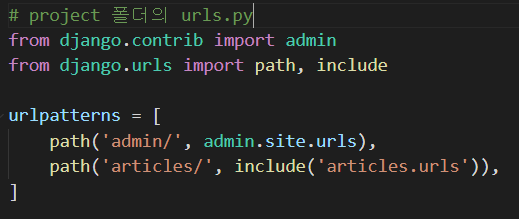
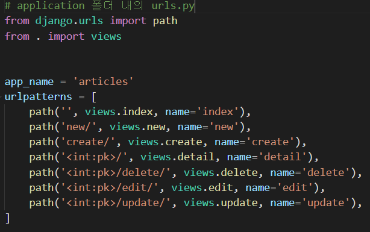
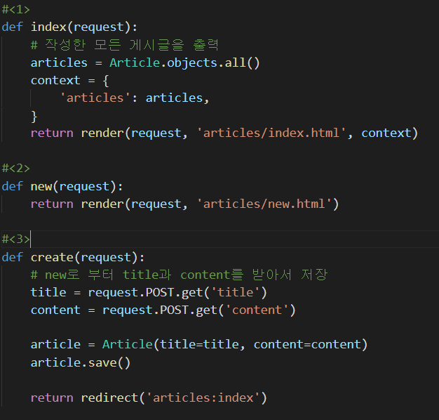
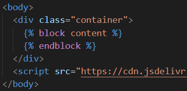
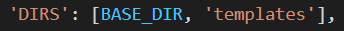
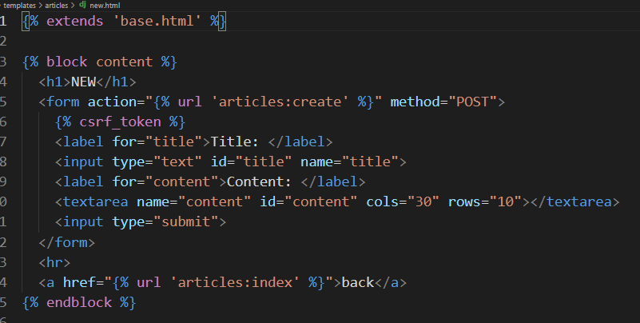
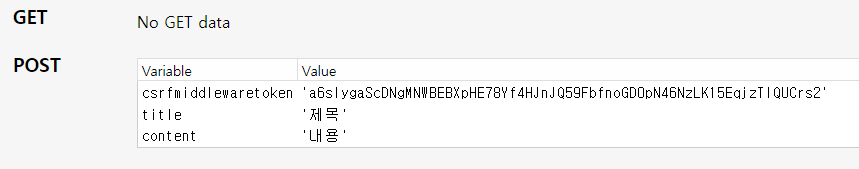

# Django (1)-2

## 4. Template

### 웹 페이지

- 정적 웹 페이지 (Static web page)

  : 데이터가 변화에도 화면 상 변화가 없는, 항상 같은 페이지

  : 미리 저장되어 있음

  : (주로) HTML, CSS, JavaScript

- 동적 웹 페이지 (Dynamic web page)

  : 데이터가 변화하며 화면이 연동되어 변하는 페이지

  : 사용자의 요청에 의해 만들어짐

  : 서버 사이드 프로그래밍 언어(Python, Java, C++ 등)가 사용됨

### Django Template

> 데이터 표현을 제어하는 도구, 표현에 관련된 로직

**⇒ Django template language (DTL)**

- Django template에서 사용하는 built-in template system

- 조건, 반복 등의 기능을 제공한다.

- 단순히 파이썬이 HTML이 포함된 것이 아니라, presentation을 위한 것

- 파이썬 코드로 실행되는 것이 아니다.

  #### DTL Syntax

  - 변수(variable)

    ```django
    {{ variable }}
    ```

    - `views.py`의 함수에서 정의한 변수를, render()를 통해 template에서 사용한다.

    - 변수의 속성에 접근하려면 `.`을 붙여 더 깊이 들어갈 수 있다.

    - ```python
      context = {
          'title': title,
          'content': content,
      }
      ```
  
      위와 같이, 변수들을 dictionary 형식으로 작성하여 render()의 세 번째 인자로 넘겨줄 수 있다. (주로 context라는 꾸러미에 담아서 넘긴다.)
  
      template에서는 변수들을 key로 접근하여 사용한다.
  
  - 필터(filters)
  
    ```django
    {{ variable|filter }}
    ```
  
    - 변수에 함수를 적용하거나 수정할 때 사용한다.
  
    - 예) `{{ sentence|title }}`: sentence를 타이틀 형식으로 바꿔줌,
  
      ​	 `{{ name|upper }}`: name의 각 글자를 대문자로 바꿔줌, 
  
      ​	`{{ word|length }}`: word의 길이를 반환
  
  - 태그(tags)
  
    ```django
    
    ```
  
    - 반복 또는 제어문을 만들 때 등
    - 일부 태그는 시작과 종료 태그가 필요하다.
    - 예) for 태그, if-else 태그, block 태그 등
  
  - 주석(comments)
  
    ```django
    <!--한 줄 주석-->
    {# #}
    <!--여러 줄 주석-->
    
      주석
      주석
    
    ```
  
    

가상환경을 설정하고, 프로젝트를 만들고, 앱을 만든 이후부터, 다음과 같은 흐름에 맞추어 코드를 작성한다:

## urls.py ⇢ views.py ⇢ templates

* urls.py

  (1) 프로젝트 폴더의 `urls.py` 폴더에 `from django.urls import include`를 하고, 

  애플리케이션에 종속된 경로들을 모두 앱 폴더 내의 새로운 `urls.py`로 넣을 수 있다.

  (2) 각 url에 `name`을 지정해줌으로써, 이후 url을 하드코딩하지 않고 간단하게 불러올 수 있다.

  (3) `app_name`을 지정하여 `settings.py`내의 앱 순서에 따라 url을 헷갈리는 일을 방지하고 정확한 url을 지정할 수 있다. (`app_name:url` 꼴로 사용함)

  * 함수 include()를 만나면, url의 일치하는 부분을 잘라내고, 남은 부분을 후속 처리를 위해 include 된 URLconf로 전달한다.

  

  

- views.py

  1) models에서 어떤 데이터를 가져올지, 2. 어떤 템플릿으로 돌릴지, 3. 어떤 곳으로 redirect 할지 함수를 적는다.

  (1) models의 클래스를 참조하기 위해서는 `from .models import Article` 따위로 적어주어야 한다.

  (2) render()에 request와 template을 넘겨줌으로써 해당 요청에 특정 템플릿 서식을 지정할 수 있다.

  (3) 다른 url로 이동시키기 위해서는 redirect()를 사용할 수 있다.

  

- templates

  앱 내의 `templates` 폴더 아래에, 앱 이름의 폴더를 하나 더 생성하고 그 속에 `html 파일`들을 넣어서 템플릿을 관리할 수 있다.

  - 템플릿 상속 (Template inheritance)

    템플릿에 공통적으로 적용되는 공통 서식을 따로 만들어두려면 앱과 프로젝트 폴더와 같은 레벨에 `templates 폴더`를 만들고, 그 안에 `base.html`을 만들 수 있다. 이 서식을 적용하려면 각 템플릿 파일 안에 

  ```django
  
  ```

  를 작성하면  된다.

  (1) base.html

  내부에 `block 태그`를 만들어 변경될 부분을 지정할 수 있다.

  

  (2) dir

  `settings.py`의 `TEMPLATES`의 'DIRS'가 새로운 templates 폴더를 가리킬 수 있도록 바꿔준다.

  

  (3) templates

  `block 태그` 안에 내용을 작성하면 된다.

  

<br/>

## 5. HTML Form

- form

  > 웹에서 사용자 정보를 입력하는 여러 방식을 제공하고, 사용자로부터 할당된 데이터를 서버로 전송한다.

  - 핵심 속성 2가지
    - action: 데이터를 보낼 곳
    - method: 데이터를 보낼 방법 (GET, POST, ⋯)

- input

  > 데이터를 입력받을 때 사용

   - 핵심 속성
     	- name: GET/POST 방식으로 파라미터를 서버에 전달할 때 `?key=value&key=value` 형태로 전달되는데, 여기서 key로 사용될 수 있게 해준다.

- label

  > 캡션을 달아준다. (label의 `for` 속성값과 input의 `id` 속성값이 같거나, 이제는 그냥 label 태그로 input을 감싸도 됨.)

  - 화면 리더기 등 보조 기구에서 입력할 텍스트가 뭔지 알려준다.
  - label을 클릭하여 input에 focus를 줄 수 있다.

### HTTP request method

> GET, POST, PUT, DELETE, ⋯

- **GET**

  서버로부터 정보를 **조회**할 때

  → 조회할 때만 사용해야 한다!!!

#### Throw & Catch

: 사용자가 정보를 입력하면(Throw), 받는 것(Catch)!

- throw

  ```python
  # urls.py
  urlpatterns = [
  	...,
  	path('throw/', views.throw),
  ]
  
  # views.py
  def throw(request):
      return render(request, 'throw.html')
  ```

  ```django
  <!--throw.html-->
  
  
  
    <h1>Throw</h1>
    <form action="#" method="#">
        <label for="message">Throw</label>
        <input type="text" id="message" name="message">
        <input type="submit">    
    </form>
  
  ```

- catch

  ```python
  # urls.py
  urlpatterns = [
      ...,
      path('catch/', views.catch),
  ]
  
  # views.py
  def catch(request):
      message = request.GET.get('message')
      context = {
          'message': message,
      }
      return render(request, 'catch.html', context)
  ```

  * 아래와 같이, 데이터가 딕셔너리 형태로 제공되므로, `메서드명.get('key')`로 접근한다.

  

  <br/>

## 6. URL

***Variable Routing***

> url의 일부를 변수로 지정하여 view 함수의 인자로 넘기는 것
>
> → 변수 값에 따라, 하나의 path()에 여러 페이지를 연결할 수 있다.
>
> - 종류
>   - str (기본값)
>   - int
>   - slug: ASCII 문자 또는 숫자, 하이픈 및 밑줄 문자로 구성된 모든 슬러그 문자열

```python
# urls.py
urlpatterns = [
    ...,
    path('hello/<str:name>/', views.hello),
]

# views.py
def hello(request, name):
    context = {
        'name': name,
    }
    return render(request, 'hello.html', context)
```

```django
<!--hello.html-->



  <h1>만나서 반갑습니다, {{ name }} 님!</h1>

```

### *url template tag*

```django

```

주어진 url 패턴 이름 (urls.py에서 path의 name 속성) 및 선택적 매개변수와 일치하는 절대경로 주소를 반환한다.

템플릿에 url을 하드코딩하는 것을 줄일 수 있다.

<br/>

## 7. Namespace

기본 앱 폴더 내 `templates` 폴더 아래에, 앱 이름의 하위 폴더를 생성함으로써 앱 간에 이름공간을 구분할 수 있다.

👉 urls.py에 `app_name` 작성

👉 url template tag에 그냥 name 속성만 적는 것이 아니라, `app_name:name` 형식으로 적어주면 정확하게 이름공간을 구분하여 경로를 지정해줄 수 있다.


*끝*
