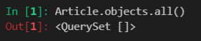
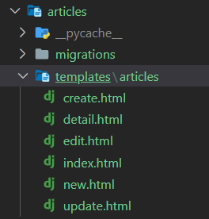

# 🚗 Django 단계

## 가상환경 생성 ~ 프로젝트 및 앱 생성

```bash
# [1] 가상환경
$ python -m venv venv
$ source venv/Scripts/activate

# [2] django 설치
# (1)
$ pip install django
$ pip freeze > requirements.txt			# 설치 프로그램 목록 생성
$ pip list							  # 확인
# (2)
$ pip install -r requirements.txt


# [3] 프로젝트 생성
$ djago-admin startproject pjtname .	# 주로 config

# [4] 앱 생성
$ python manage.py startapp appname

# [5] 로켓 확인 (서버 가동)
$ python manage.py runserver

# [*] 추가 단계: .gitignore 파일 만들기
# gitignore.io 로 접속하여 .gitignore 파일을 만들어 저장한다.
```

### 1. `settings.py` 추가 설정

- '[4] 앱 생성' 이후, `INSTALLED_APPS`에 생성된 앱을 등록해준다. **(중요⭐)**
- `LANGUAGE`를 'ko-kr' 로 설정한다.
- `TIME_ZONE`을 'Asia/Seoul' 로 설정한다.

```python
INSTALLED_APPS = [
    'articles',
    ...
]

LANGUAGE = 'ko-kr'

TIME_ZONE = 'Asia/Seoul'
```

---

## `templates` 폴더 생성

#### 1. 기본 템플릿

기본 템플릿 양식을 생성하여 활용할 수 있도록, 앱과 프로젝트 레벨에 `templates` 폴더를 추가로 생성하고, 안에 `base.html` 파일을 만들어준다.

- `! + Tab키`로 html의 boilerplate를 만들고,

- bootstrap CDN을 가져온다 (CSS와 Js).

- `<body>` 부분을 다음과 같이 맞춰준다:

  ```django
  <body>
      <div class="container">
          
          
      </div>
  </body>
  ```

- 프로젝트 폴더의 `settings.py`에서 템플릿 디렉토리를 해당 폴더로 수정해준다. (잊지 마✔)

  ```python
  TEMPLATES = [
      {
          ...,
          'DIRS': [BASE_DIR / 'templates'],
          ...
      }
  ]
  ```

  

#### 2. 앱 템플릿

- 앱 내에 `templates` 폴더를 생성하고, 하위 폴더로 앱 이름의 폴더를 하나 더 만든다.

  앞으로는 해당 폴더 내에 html 파일의 템플릿을 저장한다.

  이후의 템플릿 html 파일은 `extends` 태그를 활용하여, 만들어둔 `base.html`을 가져와서 활용한다.

  ```django
  
  
  
  <!--template 내용-->
  
  ```

---

## `models.py`에 데이터 관리하는 class 생성하기

```python
from django.db import models

# Create your models here.
class Article(models.Model):
    # id
    title = models.CharField(max_length=20)
    content = models.TextField()
    created_at = models.DateTimeField(auto_now_add=True)
    updated_at = models.DateTimeField(auto_now=True)

    def __str__(self):
        return f'{self.id}번 글 - {self.title} / {self.content}'
```

- Model은 class로 정의된다. 

  - Django의 `models.Model` 클래스를 기본으로 상속받는다.
  - `.`을 통해 인스턴스에서 클래스 변수에 접근할 수 있다.

- 기본 키(PK) 필드(id)는 Django에 의해 자동으로 생성된다.

- 그 외 필드를 정의해준다.

  ㄴ 각 필드의 필수인자에 유의하기 👉 [django documentation](https://docs.djangoproject.com/en/3.2/ref/models/fields/)

- `__str__` 함수는 데이터 저장 시 보여지는 출력값을 지정하기 위해 사용된다.

  지정하지 않으면, `<appname: appname object (pk)>` 형태로 출력된다.

---

## 3단계로 웹 페이지 생성하기

## : <u> urls.py 	→ 	views.py	→ 	templates</u>

### 1. `urls.py`

#### 1. 프로젝트의 `urls.py`를, 특정한 앱으로 경로를 전달하는 관문으로 만든다.

- `include` 모듈을 추가하여, 특정 앱의 경로를 포함하고 있는 url을 1차적으로 분류하여, 해당하는 앱의 `urls.py` 로 통하도록 해준다.

```python
from django.contrib import admin
from django.urls import path, include	# include 추가

urlpatterns = [
    path('admin/', admin.site.urls),
    path('articles/', include('articles.urls')),
    # 기본 주소 뒤 articles/가 붙으면, 
    # articles 앱의 urls.py로 향하여 나머지 경로를 살펴보게 한다.
]
```


#### 2. 앱 폴더에 새 `urls.py`를 생성하고, 세부 경로를 저장한다.

```python
from django.urls import path
from . import views				# 현재 폴더에서 views.py 가져온다.

app_name = 'articles'			# app_name
urlpatterns = [
    path('', views.index, name='index'),
    path('new/', views.new, name='new'),
    path('create/', views.create, name='create'),
    path('<int:pk>/', views.detail, name='detail'), 
    path('<int:pk>/delete/', views.delete, name='delete'),   # DELETE
    path('<int:pk>/edit/', views.edit, name='edit'),
    path('<int:pk>/update/', views.update, name='update'),      # UPDATE
]
```

- ```python
  from . import views
  ```

  현재 폴더에서 views.py를 가져온다.

- ```python
  app_name = 'articles'
  urlpatterns = [
      path('', views.index, name='index'),
      ...
  ]
  ```

  (1) `app_name`과 path의 `name`을 설정하고 이후에 url을 작성할 때 적어줌으로써, url을 하드코딩하지 않고 간단하게 표현할 수 있으며, 앱이 여러 개일 때 경로가 섞이는 것을 방지하는 역할을 한다.

  ​	(예) ``

  (2) articles 앱으로 들어온 경로의 나머지 부분이 `''` 와 같으면 (본 경우에는, 기본 경로), `views.py`의 index 함수로 이동하여 실행한다. 

- ```python
  path('<int:pk>/', views.detail, name='detail'),
  ```

  ***Variable Routing***

  > url에 변수를 포함시킴으로써, 하나의 path로 여러 경로를 가리킬 수 있게 해준다. 
  >
  > 변수에 따라 가리키는 경로가 달라진다.

  (예) 위의 경우, `http://127.0.0.1:8000/articles/1`의 주소가 전달되었다면,  pk(기본 키)가 1인 경우를 가리키며, 여기서는 여러 게시글 중에서도 1번 게시글의 상세 페이지를 가리키는 함수로 연결된다.

### 2. `views.py`

특정 url을 통해 웹 사이트에 접속하면 어떤 데이터를 어떤 형식으로 내보낼지를 결정하는 함수들이 작동한다. `views.py`에 그런 함수들이 모여있다. View는 Model 그리고 Template과 연결되어 이를 어떻게 처리할지 결정한다.

```python
from django.shortcuts import render, redirect
from .models import Article

# Create your views here.
#READ
def index(request):
    articles = Article.objects.all()[::-1]  # 순서 반대로 (파이썬)
    # articles = Article.objects.order_by('-id') # 순서 반대로 (ORM)
    context = {
        'articles': articles,
    }
    return render(request, 'articles/index.html', context)

def new(request):
    return render(request, 'articles/new.html')

def create(request):
    title = request.POST.get('title')
    content = request.POST.get('content')
    
    article = Article(title=title, content=content)
    article.save()
    # return render(request, 'articles/create.html') # create.html 페이지 나옴
    return redirect('articles:detail', article.pk)  # detail 페이지로 redirect

def detail(request, pk):
    # url에서 pk 받아오고, 해당 pk에 해당하는 거 찾아오기
    article = Article.objects.get(pk=pk) 
    context = {
        'article': article,
    }
    return render(request, 'articles/detail.html', context)

def delete(request, pk):
    article = Article.objects.get(pk=pk)
    if request.method == 'POST':
        article.delete()
        return redirect('articles:index')
    else:
        return redirect('articles:detail', article.pk)  # 주소창에 치면 GET방식 -> 삭제 X

def edit(request, pk):
    article = Article.objects.get(pk=pk)
    context = {
        'article': article, # 수정할 게시글 보여주기
    }
    return render(request, 'articles/edit.html', context)

def update(request, pk):
    article = Article.objects.get(pk=pk)
    # 사용자가 edit에서 입력한 값으로 수정하는 것
    article.title = request.POST.get('title')
    article.content = request.POST.get('content')
    article.save()
    return redirect('articles:detail', article.pk)  # 수정된 글의 상세 페이지로 이동
```

- model 가져오기

  ```python
  from .models import Article
  ```

  함수 내에서 모델을 사용하기 위해 필요하다.

- render

  ```python
  def index(request):
      articles = Article.objects.all()[::-1]
      context = {
          'articles': articles,
      }
      return render(request, 'articles/index.html', context)
  ```

  

  (1) `urls.py`에서 `path('', views.index, name='index')`를 통해 온 경로는 위 함수를 거치게 된다.

  함수는 요청을 인자로 받아, `render()`을 통해 응답을 돌려줄 수 있다.

  (2) 요청과 템플릿(`'articles/index.html'`)은 필수인자이며, 템플릿에서 활용할 인자를 `context`라는 꾸러미로 묶어 전달할 수 있다.

  (3) 위 함수에서는 `Article` 클래스의 모든 객체를 가져오는 메서드를 활용하여 해당 QuerySet 객체를 변수 `articles` 에 저장하고 있다.

  이를 템플릿에서 활용하기 위해 context를 구성하며, context는 {'key': value} 라는 딕셔너리 형태로 만들어진다. 템플릿에서 key 값으로 해당 변수에 접근할 수 있다.

- redirect

  ```python
  from django.shortcuts import render, redirect
  
  def update(request, pk):
      article = Article.objects.get(pk=pk)
      # 사용자가 edit에서 입력한 값으로 수정하는 것
      article.title = request.POST.get('title')
      article.content = request.POST.get('content')
      article.save()
      return redirect('articles:detail', article.pk)
  ```

  - `redirect` 모듈 추가해주기

  - (1) `redirect`는 지정한 url로 이동시켜준다.

    (2) `article` 변수는 기본 키 값이 인자로 전달받은 값이 데이터 하나를 저장한 변수다. 데이터를 `get()`으로 가져올 때는 해당하는 값이 하나여야 하기 때문에 기본 키 값으로 판단하는 게 일반적이다.

    (3) 사용자가 입력값을 `<input>`에 입력하게 되면, 딕셔너리 형태로 전달이 된다. 이때, 해당 html 파일에서 데이터를 전달하는 방식(GET, POST)에 따라 GET 또는 POST에 데이터 값이 들어있다. 따라서, get() 함수에 key 값을 전달하여 원하는 데이터를 추출할 수 있다.

    여기서 전달되는 key 값은 데이터가 입력된 `<input>`의 `name` 속성값에 따른 것이다.

    (4) 데이터를 전달받은 후, 반드시 save를 해줘야 데이터베이스에 저장이 된다!

    (5) 위의 함수는 입력값으로 전달받은 데이터를 전달받은 기본키와 일치하는 데이터에 저장하고, 데이터의 기본키 값과 함께 url을 이동시켜준다.

### 3. 템플릿 파일(html)

위에서 언급한 바와 같이, 하위 폴더를 추가해서 템플릿 파일을 저장한다.



- 기본 양식

  ```django
  
  
  
  <!--template 내용-->
  
  ```

- 유의점

  - `form`

    - 핵심 속성 2개를 정의해준다:

      - action: 어디로 보낼지

        url 태그를 사용하여 미리 지정한 이름으로 url을 구성하여 작성할 수 있다.

      - method: 어떻게 보낼지

        - GET: DB에 변화를 야기하지 않는 경우 (단순 조회)
        - POST: DB에 변화를 가져오는 경우 (수정, 삭제 등)

    - `csrf_token`을 넣어준다. (잊지 마✔)

      ㄴ django로 하여금 해당 행위를 신뢰할 수 있도록 해줌. 넣지 않으면 작동하지 않는다.

  - ``

    - 해당 문자열 안에 url을 작성할 때는 `articles:index`의 꼴로 적어준다.

    - 이동할 경로의 함수가 추가 인자를 요구하는 경우 (예: pk), 문자열 뒤에 더하여 작성해준다.

      ```django
      
      ```

---

## Admin 페이지 만들기

### 0. 기본 테이블 생성 확인

기본 테이블이 생성한 상태에서 관리자 계정을 생성할 수 있다.

### 1. 관리자 계정 만들기

```bash
$ python manage.py createsuperuser
```

- 계정 생성 후, `/admin`으로 가서 관리자 페이지에 로그인할 수 있다.

### 2. `admin.py`에 DB 등록하기

```python
rom django.contrib import admin
from .models import Article

# Register your models here.
# 사용자 입력만 보이는데, 생성시간, 수정시간도 보고 싶어
class ArticleAdmin(admin.ModelAdmin):   
    list_display = ('id', 'title', 'content', 'created_at', 'updated_at')
    # Article 모델에서 작성한 거 가져옴

admin.site.register(Article, ArticleAdmin)
```

- `admin.py`는 관리자 사이트에 객체가 관리자 인터페이스를 가지고 있음을 알려준다.

  `from .models import Article`을 통해 Article 객체를 이에 추가해준다.

  ```python
  admin.site.register(Article)
  ```

- `list_display`는 models.py에서 정의한 각 필드의 값들을 admin 페이지에 출력하도록 해준다.

  테이블 형태로 나오게 된다.

---

## 내가 느낀, 가장 중요한 점

1. 정신차리고 내가 뭐하는지 파악하면서 코드 작성하기.

   어떤 부분을 채워야 하는지 생각하고 체크하면서, 놓치지 않도록 집중하여 빠르게 채워넣기.

   중간에 시간이 비면 잊어버리기 일쑤다.

2. 단계에 충실하자.

   단계대로만 따라해도 반은 한다.

3. 왔다갔다 하느라 정신 없을텐데, 정신 잡기.

## 활용하면 좋을 팁!

- Alt + Shift + 방향키: 지정한 줄의 코드를 아래로 복사 가능

- Ctrl + Alt + 클릭: 커서 여러 개 생성하여 한 번에 여러 번 입력 가능

- (Bootstrap 사용할 때,) `h1.fw-bold` 와 같이 단축하여 태그와 클래스를 한 번에 작성할 수 있다. 

  ㄴ 클래스를 정확하게 알아야 사용이 가능하다. 모르면 [bootstrap docs](https://getbootstrap.com/docs/5.1/getting-started/introduction/)를 참고하자.