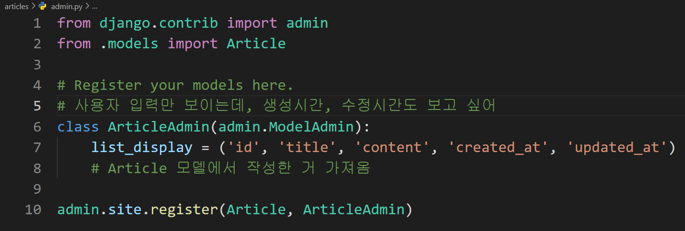

# Django 02

## 1. Model

### Model

> 단일한 데이터에 대한 정보를 가진 것으로, 사용자가 저장하는 데이터의 필드와 동작들을 포함한다.

- database와는 다름

  DB는 따로 있고, DB를 *구조화* 하고 *조작* 하는 게 model!

- Django: model을 통해 데이터에 접속하고, 데이터를 관리한다.

- 각각의 model은 하나의 DB 테이블에 매핑된다.

### 쿼리(Query)

> 데이터를 조회하기 위한 명령어
>
> "쿼리를 날린다" ⇒ DB를 조작한다.

### 스키마(Schema)

> DB의 전체 구조 (자료의 구조, 표현방법, 관계 등을 정의)

### 테이블(Table) (또는 릴레이션)

- 데이터베이스는 여러 개의 테이블로 이루어져 있다.

데이터베이스에서는,

- 열(column): <u>필드(field)</u>, 속성(attribute)

  ⇢ 데이터 형식을 지정

- 행(row): <u>레코드(record)</u>, 튜플(tuple)

  ⇢ 실제 작성되는 개별 데이터

- 기본키(PK): 각 레코드의 고유한 값

  ㄴ DB 원칙 중 하나로, 반드시 설정되어야 한다.

  ㄴ model 끼리의 관계 설정 시에도 주요하게 활용된다.

<br/>

## 2. ORM

> ***파이썬 문법을 사용하는 Django로써 DB를 조작할 수 있게 해주는 것!***
>
> - Object-Relational-Mapping
>
> - DB는 SQL언어, Django는 Python 언어를 사용한다.
>
>   내장 Django ORM은 이 둘이 소통할 수 있게 해주는 통역사이다.

- 장점
  - SQL을 몰라도 DB 조작을 할 수 있게 해준다.
  - 객체 지향적 접근으로 높은 생산성 달성
- 단점
  - ORM 만으로는 완전한 서비스를 구현하기 어려운 경우가 있다.
  - ORM을 통해 전달되므로 SQL을 직접 사용하는 것보다 속도 면에서 느리다.

그럼에도 사용하는 것은, 현재 웹 프레임워크에서 웹 개발의 속도를 높이는 것, 즉 생산성이 중시되기 때문이다.

- 예) `models.py`에 클래스 작성

  ```python
  class Article(models.Model):
      title = models.CharField(max_length=10)
      content = models.TextField()
      created_at = models.DateTimeField(auto_now_add = True)
      updated_at = models.DateTimeField(auto_now = True)
  ```

  - `Article` 클래스는 Django의 models 내의 Model 클래스를 상속받고 있다.

  - 클래스 변수: 필드

    ㄴ 2개만 정의되어 있지만, 기본키 필드가 기본적으로 적용되므로 최종 필드는 총 3개가 된다.

    ㄴ 필드에는 데이터 타입이 작성되며, 메서드로서 작성된다.
  
  - 즉, 클래스 자체가 하나의 스키마이다.

※ 참고: [Django model field](https://docs.djangoproject.com/en/3.2/ref/models/fields/)

- `CharField(max_length=None, **options)`

  : 비교적 짧은 길이의 문자열을 지정할 때 사용하며, `max_length`가 필수 인자이다.

-  `TextField(**options)`

  : 보다 긴 문자열을 지정할 때 사용한다.

  (max_length를 작성할 수 있지만, 기능적으로 동작하지는 않는다.)`
  
- `DateTimeField(auto_now=False, auto_now_add=False, **options)`

  : 파이썬의 `datetime.datetime`을 사용하여 날짜와 시간을 표시해준다.

  - auto_now: 최종 수정 일자. save 할 때마다 경신.
  - auto_now_add: 최초 생성 일자. 최초 insert 시에만.

<br/>

## 3. Migrations

***"Django가 model에 생긴 변화를 DB에 반영하는 방법"***

> **3단계**
>
> models.py에 변경사항 생기면 → 설계도 만들고 → 반영하기

4가지 명령어:

### (1) makemigrations

: 설계도 제작

ㄴ 설계도가 ORM에 의해 SQL 언어로 해석되어 DB에 전달된다.

↓

### (2) migrate

: 설계도 적용. 동기화 과정.

(`appname_classname` 형식으로 테이블이 만들어진다.)

### (3) sqlmigrate, showmigrations

- sqlmigrate: 설계도에 대한 SQL 구문을 확인. ORM이 파이썬으로 작성된 설계도를 어떻게 해석할 지 미리 볼 수 있다.

  ```bash
  $ python manage.py sqlmigrate appname 0001
  ```

- showmigrations: 설계도가 반영되었는지 상태 확인 (`[X]` 면 체크된 것)

<br/>

## 4. Database API

> DB를 조작하기 위한 도구

- 파이썬 문법을 사용한다 (클래스, 인스턴스, ⋯)

- 구문 형태

  ```python
  # 클래스명.Manager.QuerySet API
  Article.objects.all()
  ```

  - Manager

    QuerySet API를 가지고 있는 것

    → 기본적으로 모든 django 모델 클래스에 ***objects*** 라는 매니저를 쓰면 된다.

  - QuerySet

    데이터베이스로부터 전달받은 객체 목록

    0개든, 1개든, 그 이상이든, `QuerySet`이라는 객체로 반환된다.

    데이터베이스에 어떤 동작을 할 지 정의한다 (조회, 필터, 정렬 등).

- 즉, 사용자가 Django를 통해 DB API로 DB에 데이터를 요청하면, DB는 QuerySet이라는 객체로 만들어 준다. QuerySet의 타입은 QuerySet이지만, 대괄호로 감싸져 있어서 리스트처럼 사용할 수 있다.

<br/>

## 5. CRUD

**C**reate, **R**ead, **U**pdate, **D**elete

> 컴퓨터 소프트웨어의 기본적인 데이터 처리 기능 4가지를 묶어 이르는 말

### CREATE

- 1번째 방법

  ```python
  article = Article()				# 인스턴스 생성
  article.title = 'first'	 		# 인스턴스 변수 생성
  article.content = 'django!'
  article.save()				    # 인스턴스 저장

- 2번째 방법(✔)

  ```python
  article = Article(title='second', content='django!!')	# 인스턴스, 변수 생성
  article.save()
  ```

  👉 데이터베이스에 반영하기 전에 유효성 검사 등을 시행하기 위해 2번 방법을 사용할 것.

- 3번째 방법

  ```python
  Article.objects.create(title='third', content='django!!!')
  # 인스턴스를 따로 생성하지 않고, 바로 QuerySet 메서드를 이용하여 저장
  ```

  

### READ

```python
Article.objects.all()		# 전체 객체 조회
Article.objects.get(pk=1)	# 하나의 객체 조회
Article.objects.filter(title='first')	# 조회 조건을 걺
```

- `all()`은 현재 QuerySet의 복사본을 반환한다.

- `get()`은 객체가 없거나, 2개 이상이면 예외를 발생시킨다. 즉, 유일한 하나일때만 사용해야 한다.

  고로, 유일성을 보장할 수 있는 기본키로 조회를 이용한다. 

- `filter()`은 매개변수와 일치하는 객체를 포함하는 새로운 QuerySet을 반환한다.

  없으면, 빈 QuerySet을 반환한다.


### UPDATE

1. 무엇을 수정할지 결정한다.
2. 수정할 객체를 가져와서 조회한다 (변수에 저장하여 조회).
3. 인스턴스 변수에 새로운 값을 할당하면 된다.
4. 저장하기


### DELETE

1. 삭제하고자 하는 객체를 조회, 저장함

2. delete() 메서드

   → 반환값이 있다: 삭제된 객체


### CSRF(Cross-site request forgery): 사이트 간 요청 위조

> <u>사용자가 자신의 의지와 무관하게</u> 공격자가 의도한 행동을 하여 특정 웹페이지를 보안에 취약하게 하거나 수정, 삭제 등의 작업을 하도록 만드는 공격 방법

- Django에서는 CSRF를 방지하기 위해 난수 값을 부여하는 template tag와 middleware를 제공한다.

  ``

<br/>

## 6. Admin Site



