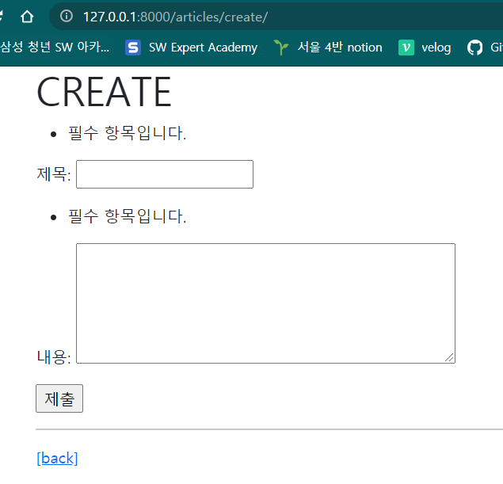
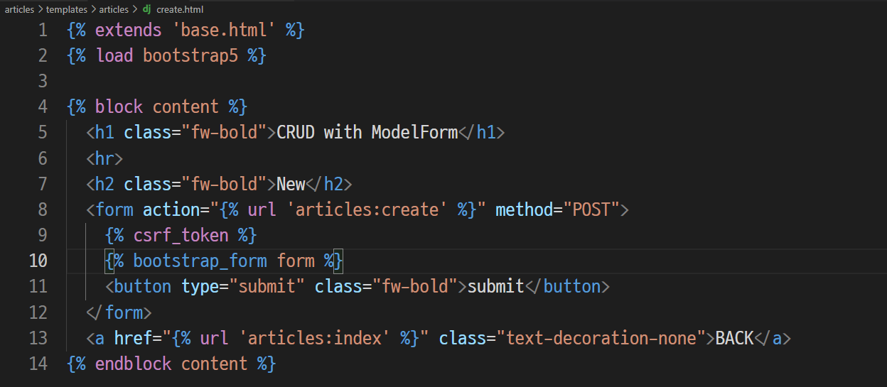
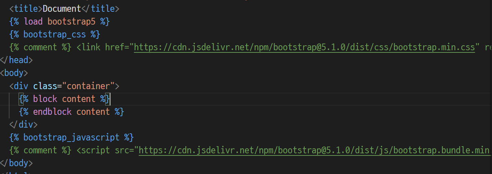
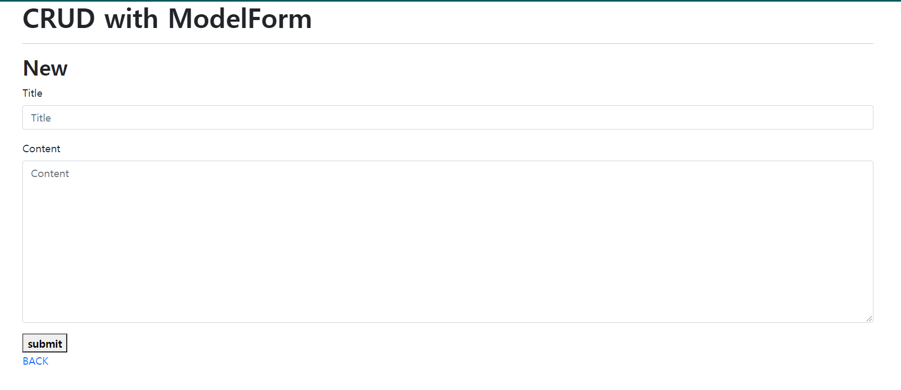

# Django Form

## 1. Form Class

### Form 클래스를 사용하는 이유

입력값을 받는 방식:

- 기존: HTML form을 사용 - input tag

- 👉 Django의 Form class를 이용하면,

  - i) 입력받은 데이터의 유효성 검증
  - ii) 입력된 데이터를 검증 결과와 함께 표시
  - iii) 유효한 데이터에 대해 동작 수행

  등의 복잡한 작업을 올바르고 쉽게 할 수 있다.

  &  중복 코드를 줄여준다.

- 쉬워지는 작업:

  (1) rendering을 위한 데이터 준비 및 재구성

  ⇢ 데이터를 일일이 구분하지 않고 통째로 전달 가능

  (2) 데이터에 대한 HTML forms 생성 

  ⇢ `forms.py`에 form class 정의하거나, ModelForm으로 모델을 기반으로 한 폼을 바로 만들도록 하여 바로 생성 가능

  (3) 클라이언트로부터 받은 데이터 수신 및 처리

<br/>

### Form 클래스를 선언하는 방법

앱 안에 `forms.py` 파일을 생성한 후,

```python
from django import forms

class ArticleForm(forms.Form):
    title = forms.CharField(max_length=10)
    content = forms.CharField()
```

- forms 모듈의 Form 클래스를 상속받는다.

- 모델의 field와 폼의 field는 비슷해 보이지만, <u>서로 다르다!!</u>

  ㄴ 그래서, model field에서 CharField는 `max_length`를 필수 인자로 가졌지만, form field에서는 아니다.

  ㄴ form field에는 TextField가 존재하지 않는다. ~~(⇢ widget으로 해결)~~

  👉 *참고: [Django Form Fields](https://docs.djangoproject.com/en/3.2/ref/forms/fields/#charfield)*

<br/>

### Form 클래스 사용하기

이어, 위에서 선언한 Form 클래스를 어떻게 사용하는지 살펴보자.

`views.py` 파일의 new 함수를 예로 들면,

```python
# views.py
from .forms import ArticleForm

def new(request):
    form = ArticleForm()
    context = {
        'form': form,
    }
    return render(request, 'articles/new.html', context)
```

- forms 파일에서 `ArticleForm` 클래스를 가져온다.

- `form`이라는 이름의 ArticleForm 인스턴스를 선언해준다.

- form을 context 꾸러미에 담아 new.html로 넘기면:

  ```html
  <!--new.html-->
  ...
  <form action="" method="POST">
      
      {{ form.as_p }}
      <input type="submit">
  </form>
  ```

  - action과 method를 지정한 `form` 태그 내에, `{{ form }}`의 형태로 간단하게 삽입될 수 있다.

  - Form 클래스의 인스턴스를 선언해 사용하면, 클래스 변수 정보에 따라 자동으로 form을 만들어준다. 서버로 데이터를 보낼 때 사용되는 `name` 속성도 클래스 변수값에 따라서 자동으로 설정해준다.

  - **Form rendering options**

    : label 태그와 input 태그 쌍에 대한 3가지의 출력 옵션

    (1) `as_p()`

    `<p>`태그로 감싸짐 (⇢ 블럭 요소가 됨)

    (2) `as_ul()`

    `<li>` 태그로 감싸짐. (바깥쪽 `<ul>` 태그는 직접 작성해야 한다.)

    (3) `as_table()`

    `<tr>` 태그로 감싸짐. (바깥쪽 `<table>` 태그는 직접 작성해야 한다.)

<br/>

### Django의 HTML input 요소 표현 방법 2가지:

1. Form fields

   > input의 유효성 검사를 처리.

2. **Widgets**

   > 웹 페이지의 HTML input 요소를 렌더링. GET/POST 딕셔너리에서 데이터 추출.
   >
   > (유효성 검사 X. 단순히 input의 표현을 바꿀 뿐이다.)
   >
   > 눈에 보이는 형태에 관한 것.

   *※ 위젯은 반드시 <u>form field에 할당</u>되어 사용된다!!*

   (예 1) `<textarea>` 태그 설정하기

   ```python
   from django import forms
   
   class ArticleForm(forms.Form):
       title = forms.CharField(max_length=10)
       content = forms.CharField(widget=forms.Textarea)
   ```

   - Form field에는 TextField가 없어서, CharField를 설정한 후, 위젯으로 textarea를 설정해줄 수 있다.

     이렇게 설정하면, content 필드가 `<textarea>` 태그로 감싸진다.

   👉 *참고자료: [Django Widgets](https://docs.djangoproject.com/en/3.2/ref/forms/widgets/)*

   (예 2)  드롭다운 선택지 만들기

   ```python
   from django import forms
   
   class ArticleForm(forms.Form):
       FRUIT_A = 'app',
       FRUIT_B = 'bnn',
       FRUIT_C = 'chr',
       FRUIT_D = 'dur',
       FRUIT_E = 'eld'
       FRUITS_CHOICES = [
           (FRUIT_A, '사과'),
           (FRUIT_B, '바나나'),
           (FRUIT_C, '체리'),
           (FRUIT_D, '두리안'),
           (FRUIT_E, '엘더베리'),
       ]
       
       fruit = forms.ChoiceField(choices=FRUITS_CHOICES, widget=forms.Select)
       
   ```

   - 기존: `<select>` 태그 아래에 `<option>` 태그로 선택지를 만들었다.

   - 👉 Form field의 ChoiceField를 사용한다.

     - `choices`: 튜플로 구성된 리스트가 들어간다. 
       - 튜플의 첫 번째 값은 value 값(변수가 가리키는 값)이며 대문자로 작성한다 — Django가 사용할 값.
       - 튜플의 두 번째 값은 사용자에게 보여질(출력될) 값이다.
     - 사용자가 드롭다운 리스트에서 값을 선택함으로써 입력값을 주고, 데이터는 `{'key': value}` 형태로 넘어간다.

   - 👉 *참고자료: [Django Widgets - Select](https://docs.djangoproject.com/en/3.2/ref/forms/widgets/#select)*

     ​					*[Django Form Fields - ChoiceField](https://docs.djangoproject.com/en/3.2/ref/forms/fields/#choicefield)*

<br/>

## 2. ModelForm ⭐

- `ArticleForm`을 정의하면서 사용자의 입력값을 받는 필드를 재정의해야 했다. 이는 중복성을 제거하려는 Django의 정신에 위배된다.

- 그래서, Django에서 제공하는 Helper를 사용할 수 있다.

  Model을 기반으로 Form Class를 만들어주는, ***ModelForm !!!***

  ㄴ 클래스를 만들고, 인스턴스를 생성하여 view 에서 사용하는, 같은 방식

  ㄴ 단, 선언하는 방식만 다르다.

```python
from django import forms
from .models import Article

class ArticleForm(forms.ModelForm):
    
    class Meta:
        model = Article
        fields = '__all__'
        exclude = ('title',)
```

- forms 라이브러리의 ModelForm 클래스를 상속받는다.

- 필드를 재정의하지 않는다.

- 다만, 중첩 클래스가 있다: `Meta` 클래스

  : 모델의 정보를 작성한다.

  - ModelForm이 어떤 model을 기반으로 설계될 것인지 정의함: `model` 속성

  - 어떤 필드를 가져올지: `field` 속성

    - 모든 필드를 가져오려면: `'__all__'`

  - 어떤 필드를 가져오지 않을지: `exclude` 속성

    ㄴ 튜플 또는 리스트로 나열한다.

-  ModelForm으로 만들어진 폼은, 요청 데이터를 받을 때 통째로 받는다.

- → 사용자 입력값을 받지 않는 필드를 제외한 필드로, 자동으로 폼을 만들어준다.

<br/>

### 유효성 검사: `.is_valid()`

> 잘못된 데이터 입력을 막고, 원하는 형식의 정제된 데이터를 받기 위해 사용한다.

유효성 검증을 한 후, 이를 통과하면 저장하여 DB에 반영되도록 해야 한다.

유효성 검사를 `is_valid()` 메서드 하나로 할 수 있다.

(예) create 뷰 함수에 ModelForm과 유효성 검증 적용하기

```python
def create(request):
    form = ArticleForm(request.POST)
    if form.is_valid():
        article = form.save()
        return redirect('articles:detail', article.pk)
    return redirect('articles:new')
```

- ModelForm으로 만들어진 폼에 요청 데이터를 넘겨줄 때, 통으로 넘겨준다. 

  new 함수의 form에서 POST 메서드로 받아온 데이터를 입력한 폼을 저장한다.

- form 이 유효하면, 저장한다. save() 메서드는 객체를 반환한다 (저장된 데이터 - 레코드).

👉 *참고자료: [Django Forms에 대하여 - MDN](https://developer.mozilla.org/ko/docs/Learn/Server-side/Django/Forms#html_%ED%8F%BCform_%EC%9D%B4%EB%9E%80)*


- 첫 요청: 뭐 할지 알려줌 → 빈 폼을 전달함

<br/>

### Update ⇢ 키워드 인자 `instance`

`save()` 메서드

> 기존 모델 인스턴스가 키워드 인자 `instance`에 제공되는지 여부에 따라,
>
> (1) 제공되지 않은 경우, save()는 새 인스턴스를 만든다. (CREATE)
>
> (2) 제공된 경우, save()는 해당 인스턴스를 수정(업데이트)한다. (UPDATE)

```python
# CREATE
def create(request):
    if request.method == 'POST':
        form = ArticleForm(request.POST)		# 입력받은 데이터 적힌 폼
        if form.is_valid():
            article = form.save()				# save() (1)번
            return redirect('articles:detail', article.pk)
    else:
        form = ArticleForm()				   # 빈 폼
    context = {
        'form': form,
    }
    return render(request, 'articles/create.html', context)

# UPDATE
def update(request, pk):
    article = Article.objects.get(pk=pk)
    if request.method == 'POST':
        form = ArticleForm(request.POST, instance=article)	# 기존 인스턴스 전달
        if form.is_valid():
            form.save()
            return redirect('articles:detail', article.pk)
    else:
        form = ArticleForm(instance=article)
    context = {
        'form': form,
    }
    return render(request, 'articles/update.html', context)
```

#### CREATE

- GET 메서드로 html 전달받는 역할만을 수행했던 `new 함수`와, POST 메서드로 입력받은 데이터를 기반으로 DB에 저장하는 역할을 했던 `create 함수`를 하나의 함수에 구현했다.

  `if-else` 구문으로 form의 method를 기준으로 두 함수를 실현했다.

- HTTP method로 구분함으로써, 논리적으로 같은 개념의 두 함수를 하나로 통합할 수 있다.

- 이제는 템플릿의 form에서 action 값이 없어도 동작한다. 왜냐하면, 입력값을 받은 곳으로 자동으로 돌려주기 때문이다.

- 서버에서 실행해보면, 빈 값 등 유효성 검사를 통과하지 못하는 값을 입력했을 때, 자동으로 에러 메세지를 출력해준다.

  

#### UPDATE

- 기존 입력한 데이터가 채워진 템플릿을 제시해주는 `edit 함수`와, 수정된 데이터를 입력받아 DB를 업데이트 하는 `update 함수`를 하나로 통합했다.

  form의 method를 기준으로, `if문`에는 'POST' 방식에서 전달받는 update 함수를, `else문`에 기존 데이터가 담긴 템플릿을 주는 new 함수를 구현했다.

- 폼 클래스에 전달되는 키워드 인자 `instance`는 수정되기 전에 데이터 정보를 전달해주어, 폼에 데이터가 입력된 채로 나타나도록 해준다.

  ✔`save()`메서드를 호출할 때, instance 값이 있는 경우엔 UPDATE로서 실현되고, 없으면 CREATE로서 실현된다.

  👉 *참고자료: [Django ModelForm - The save() method](https://docs.djangoproject.com/en/3.2/topics/forms/modelforms/#the-save-method)*

  > *"A subclass of `ModelForm` can accept an existing model instance as the keyword argument `instance`; if this is supplied, `save()` will update that instance. If it’s not supplied, `save()` will create a new instance of the specified model:"*

  - 폼 클래스에 전달될 수 있는 인자를 살펴보면, 첫 번째 인자로 전달되는 인자(request.POST)는 `data 인자`이다. 처음에 오기 때문에 키워드를 써주지 않아도 위치 인자로서 전달된다. 
  - 그러나, `instance 인자`는 뒤에 위치해 있기 때문에, 키워드 인자로서 `instance=article`처럼 명시적으로 써주어야 한다.

#### 알아두기

- ⭐ context와 return문이 else문 안에 있지 않은 이유

  - 이유: request.method가 POST이지만 유효성 검사를 통과하지 못했을 때, 결과값이 반환될 수 없다.
  - 그러므로, request.method가 POST가 아닌 경우를 비롯해, 값이 유효하지 못해 에러메시지를 가진 형태인 경우에도 페이지가 뜰 수 있도록 else 구문 안의 context와 return을 else문 밖으로 빼주어야 한다.

- ⭐ 'POST' method를 먼저 검증하는 이유

  만약 GET을 먼저 확인하도록 하면, 

  1️⃣ request.method가 GET인 경우와 유효성 검사 boolean 결과값이 False인 경우에 같은 return 문을 실행해야 하므로, if 문과 else 문에 동일한 코드가 중복으로 작성된다. Django는 이러한 동작을 피하고자 한다. 

  2️⃣ GET을 if 문에 두고, else로 POST를 처리하려고 한다면, POST가 아닌 PUT, DELETE 등의 메서드가 전달되었을 때도 POST 경우의 구문이 처리되게 된다. 특정 코드가 POST인 경우에만 처리되도록 하기 위해 POST를 먼저 if문으로 먼저 확인하도록 작성한다.

  → 따라서, GET과 POST에서 다른 동작을 처리할 경우, POST를 먼저 확인하도록 작성한다.

<br/>

### Widgets 적용하기

form을 커스텀 하려면? 		위젯!

> 작성방식 2가지:
>
> [방법 1] Meta 클래스 안에 작성하기
>
> [방법 2] Meta 클래스 밖에, 클래스 변수로 작성하기 (권장) ✔

```python
# articles/forms.py
# 방법 1
class ArticleForm(forms.ModelForm):
    
    class Meta:
        model = Article
        fields = '__all__'
        widgets = {
            'title': forms.TextInput(attrs={
                'class': 'title',
                'placeholder': 'Enter title',
                'maxlength': 10,
            	}
            )
        }

# 방법 2 (권장)
class ArticleForm(forms.ModelForm):
    'title': forms.CharField(
    	label='제목',
    	widget=forms.TextInput(			# CharField는 textinput이 기본값
        	attrs={
                'class': 'my-title',
                'placeholder': 'Enter title',
            }
        ),
    )
        
    class Meta:
        model = Article
        fields = '__all__'
```

- 딕셔너리 형태의 `attrs`로 속성을 정의한다.

<br/>

### Form 과 ModelForm 비교

- **Form**

  : cleaned_data 딕셔너리에서 직접 데이터를 가져와햐 하며, model에 연관되지 않은 데이터를 받을 때 사용한다.

- **ModelForm**

  : model을 기반으로 형성되며, model과 연관된 데이터를 받을 때 사용한다.

<br/>

## 3. Rendering fields manually

### 수동으로 Form 작성하기

#### 1. Rendering fields manually

form은 `errors`, `label_tag`, 그리고 input 요소들(모델 클래스 변수)로 구성되어 있다. 우리는 각각의 구성요소에 `.`을 통해 접근할 수 있다.

```django
<form action="" method="POST">
    
    <div>
        {{ form.title.errors }}
        {{ form.title.label_tag}}
    </div>
</form>
```

- errors에는 `<ul> 태그` 안에 `<li> 태그`로 하나씩 들어있다.

- form의 구성 순서를 바꾸고 싶으면, 혹은 각각에 bootstrap을 적용하고 싶다면,  `.`으로 각각에 접근해서 따로 처리할 수 있다.

#### 2. Looping over the form's fields (``)

<br/>

### Bootstrap과 함께 사용하기

> [방법 1] Bootstrap Form class
>
> [방법 2] 라이브러리

#### [방법 1] Bootstrap Form class

1. django bootstrap 설치

   ```bash
   $ pip install django-bootstrap-v5
   ```

2. `settings.py`의 'INSTALLED_APPS' 에 'bootstrap5' 추가하기

3. 템플릿 내에 (base.html)

   ```django
   {# Load the tag library - html boilerplate 상단 #}
   
   
   {# Load CSS and JavaScript #}
   
   
   ```

   을 로드하여 bootstrap CSS와 Js 를 사용할 수 있게끔 한다.

   

4. form이 들어가는 템플릿 내에 라이브러리를 로드하고, form 자리에 아래 태그를 작성하여 bootstrap에서 제공하는 form 형태를 사용할 수 있다:

   ```django
   {# Load the tag library #}
   
   
   {# form 태그 안에 #}
   
   ```

   
   
5. 결과 (예시)

   

👉 *참고자료: [Django Rendering Fields Manually](https://docs.djangoproject.com/en/3.2/topics/forms/)*

​					[Bootstrap Forms](https://getbootstrap.com/docs/5.1/forms/overview/)

<br/>

## 4. Handling HTTP requests

Django에서 HTTP 요청을 처리하는 방법:

> [방법 1] Django shortcut functions
>
> [방법 2] View decorators
>
> → 적절한 예외처리와 데코레이터를 통해, 서버를 보호하고 클라이언트에게 정확한 상황을 제공할 수 있다.

#### 방법 1. Django shortcut functions

- `render()`

- `redirect()`

- `get_object_or_404()` - 객체 하나 가져올 때

  `Modelname.objects.get(pk=pk)` 처럼 `get()`을 호출할 때, 찾는 객체가 없다면 DoesNotExist 예외 대신에 **HTTP 404**를 발생시킨다.

  - 기본적으로 코드 실행 단계의 에러는 HTTP 500을 발생시키지만, 이 에러만으로는 문제의 원인을 알기 쉽지 않다. 그러므로, 보다 더 정확한 응답을 보내기 위해 위의 shortcut function을 사용할 수 있다.

- `get_list_or_404()` - 객체 두 개 이상 가져올 때

  - (예) index page

👉 *참고자료: [HTTP status code](https://developer.mozilla.org/en-US/docs/Web/HTTP/Status)*

> - 200 OK
> - 301 Moved Permanently: redirect 시에 나타날 수 있음
> - 401 Unauthorized: "unauthenticated". 로그인을 하지 않은 상황 등
> - 403 Forbidden:  접근이 승인되지 않음, 권한이 없음 (예: `csrf_token` 빠뜨렸을 때)
> - 404 Not Found: 서버가 요청받은 리소스를 찾을 수 없음 - (작성한 요청이 틀린 것)
> - 405 Method Not Allowed: 메서드 허용하지 않음
> - 500 Internal Server Error

#### 방법 2. View decorators

> View 함수에 붙여 사용하는 decorator 함수. 함수를 수정하지 않고 기능을 연장해준다.
>
> → 조건을 충족하지 못하면, 즉 허용된 method가 아니면, 해당 view 함수를 실행하지 못하게 함 
>
> + HTTP 405 Method Not Allowed 를 발생시킨다.

- `@require_http_methods()`

  view 함수가 특정한 method 요청에 대해서만 접근을 허용하도록 한다.

  여러 가지 메서드를 작성할 때 사용한다.

  (예) CREATE, UPDATE

- `@require_POST()`

  method가 'POST'인 요청에 대해서만 접근을 허용한다.

  (예) DELETE

- `@require_safe()`

  method가 'GET'인 요청에 대해서만 접근을 허용하기 위해서는 원래 `@require_GET()`을 사용해야 하지만, Django에서는 `@require_GET()`의 사용을 권장하지 않고 있다.

  그래서 대신에 `@require_safe()`를 사용할 수 있다.

- 참고: 

  - 인자 없으면 괄호 생략가능
  - HTML 상으로는 method로 'GET'과 'POST'만 보낼 수 있다. (각각, `<a>`, `<form>` 태그와, `<form>` 태그로.)

👉 *참고자료: [Django View Decorators](https://docs.djangoproject.com/en/3.2/topics/http/decorators/)*