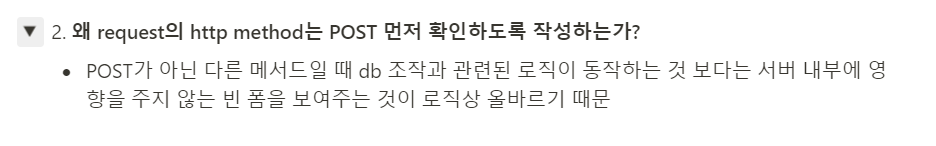
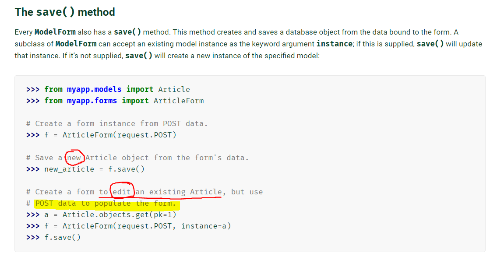

## views.py의 `create` 함수에 대하여

### CREATE로 들어오는 요청의 종류:

1. 주소를 입력하고 enter (또는, 게시글 작성하는 `<a> 태그` 클릭) → **GET 방식**

   : 페이지 요청과 페이지 이동은 GET 방식

2. 데이터를 입력하고 submit → **POST 방식**

   : DB에 변화를 야기하는 작업은 POST 방식

### 함수 내에서 POST 방식을 먼저 가르는 이유:



실제 순서는 GET 부터 일어난다. 빈 폼을 받는 게 데이터 입력에 앞서기 때문!

### `create` 함수

create 함수의 로직과 코드를 살펴보면 다음과 같다:

**로직**

- if 문
         5. create 경로로 요청이 들어옴(POST): "나 다 썼어"
         6. 사용자 입력이 담긴 종이를 가져옴 - ArticleForm으로 인스턴스화(빈 종이 + 사용자 데이터)
         7. 유효성 검사
             7-1. 유효하지 않음
                 7-1-1. (유효하지 않은) 데이터가 담긴 종이를 넘겨준다. (-> context 꾸러미에 담김)
                 : 재입력을 받기 위함
                 7-1-2.  context 꾸러미에 form을 담고, 꾸러미와 함께 폼을 넘겨준다.
                 (기존 데이터가 입력된 상태의 form)
             7-2. 유효함
                 데이터를 DB에 저장한다.
                 특정 페이지로 redirect 해준다.
- else 문
         1. create 경로로 요청이 들어옴(GET)(DB에 영향X): "나 처음으로 쓸래" -> 빈 종이(Form) 응답
         2. 빈 종이를 생성 (ArticleForm 클래스의 인스턴스 생성)
         3. 사용자에게 빈 종이 주기 위해 context 꾸러미에 form을 담음
         4. 사용자에게 데이터를 받기 위해 form을 넘겨줌

**코드**

```python
@require_http_methods(["GET", "POST"])
def create(request):
    if request.method == 'POST':
        form = ArticleForm(data=request.POST)   # 'data=' 생략 가능
        if form.is_valid():
            form.save()
            return redirect('articles:index')
    else: 
        form = ArticleForm()
    context = {
        'form': form,
    }
    return render(request, 'articles/create.html', context)
```

## 공부하며 생겼던 의문점 해결하기 & 주의할 점 알아보기!

- ModelForm의 Meta 클래스의 `fields` 변수 등에 튜플로 속성값을 작성할 때, 튜플의 원소가 하나이면 `,`를 빠뜨리지 않도록 주의해야 한다.

  - 튜플의 원소가 하나일 때는 마지막에 ','를 붙여줘야 튜플로 인식된다. 그렇지 않으면, 문자열로 인식된다.

- ModelForm의 Meta 클래스에서 폼에 포함시킬 필드를 추가할 때, `exclude` 변수만 사용해도 된다. 이 경우, `exclude` 변수에 작성한 필드를 제외한 모든 (사용자의 입력값을 받는) 필드가 폼의 필드로 사용된다.

- update 함수에서, 

  ```python
  @require_http_methods(["GET", "POST"])
  def update(request, pk):
      article = Article.objects.get(pk=pk)
      if request.method == 'POST':
          form = ArticleForm(request.POST, instance=article)	# 여기!
          if form.is_valid():
              form.save()
              return redirect('articles:detail', article.pk)
      else:   # GET
          form = ArticleForm(instance=article)
      context = {
          'article': article,
          'form': form,
      }
      return render(request, 'articles/update.html', context)
  ```

  (1) else 문은 요청이 GET 방식으로 왔을 때, 즉 수정을 시작하려 할 때 받는 요청이므로 기존의 정보를 담은 폼을 보내는 것이라고 이해가 됐다.

  그런데, if 문은 요청이 POST 방식으로 올 때를 보는 것인데, 폼을 채우는 부분이 `data` 인자값으로 전달되는데도 `instance` 인자값을 전달해야 하는 이유가 궁금했다.

  👉 어제 공부한 부분 중에서 `save() method`가 `instance` 인자값을 기준으로 CREATE를 수행할지, UPDATE를 수행할지 결정한다고 한 부분이 있다: [여기는 공부한 부분](https://velog.io/@minchae9/Django-3-Form#update-%E2%87%A2-%ED%82%A4%EC%9B%8C%EB%93%9C-%EC%9D%B8%EC%9E%90-instance), [이거는 참고자료](https://docs.djangoproject.com/en/3.2/topics/forms/modelforms/#the-save-method)

  

  (2) 여전히, `instance` 인자가 어떻게 작용하기에 save() method가 해당 인자의 값에 따라 수행하는 작업이 변하는지 궁금했다.

  👉 [Django Github에서 관련 부분 보기](https://github.com/django/django/blob/3921b1c6d24c9d5a60e5f5f83c9a394104089c21/django/forms/models.py#L286)

  (ModelForm을 검색해보면 BaseModelForm을 그대로 상속받고 있음을 볼 수 있다.)

  

  `instance` 인자에 대한 if-else문을 보면,

  - if문: instance 인자에 아무 값도 주어지지 않으면, 새로운 인스턴스를 만들고
  - else문: instance 인자에 값이 주어지면, 값으로 전달한 인스턴스를 활용한다는

  (대략의) 내용을 발견할 수 있다. 

  save() 메서드에서 instance의 값에 따라 기존 인스턴스를 인식한다고 했던 게 이런 구조로 작동했음을 <u>대충</u> 알게 되었다. 

- `DateTimeField`로 시간을 구했을 때, filter를 사용하여 시간의 출력형식을 지정할 수 있다.

  포맷은 [여기에서](https://docs.djangoproject.com/en/3.2/ref/templates/builtins/#date) 살펴보고 활용할 수 있다.

  필터를 사용할 때는:

  ```django
  {{ article.created_at|date:"Y년 M j일 g:i a"}}
  ```

  - 파이프라인 기호(|) 양쪽에 띄어쓰기를 하지 않으며
  - 'date: ' 라고 적어준 후에 포맷을 "" 안에 적어주면 된다.

*끝*