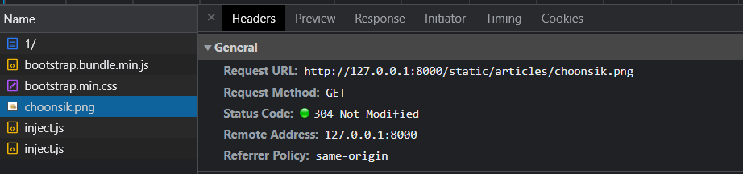
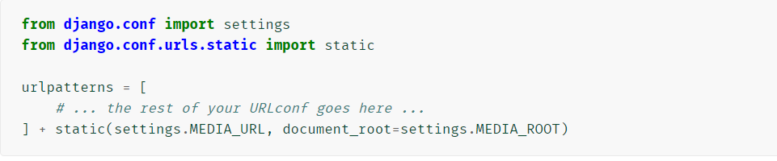
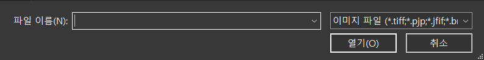
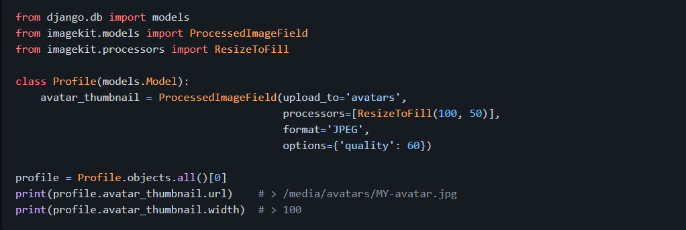

💬 순서 알아두기, 해야할 사항 기억하기

# Static Files

## 1. Static Files (정적 파일)

> 사용자의 요청에 따라 변하는 것이 아니라, 미리 제작된 것을 그대로 보여주면 되는 파일.
>
> ***개발자가 쓰는 것***

- ### ✔ 구성

  <django 에 이미 되어있는 부분>

  1. settings.py의 INSTALLED_APPS에 `django.contrib.staticfiles`가 있는지 확인한다.

     : django 라이브러리의 contrib 패키지 속 staticfiles 앱

     : django에서 정적 파일을 관리해주는 앱

  2. settings.py에서 `STATIC_URL`을 정의한다.

     ```python
     # settings.py
     STATIC_URL = '/static/'
     ```

  < 우리가 해야할 부분>

  3. 템플릿에서 `img 태그`를 사용할 때, `src` 속성값에 **static 템플릿 태그**로 url을 만들어준다.

     ```django
     {# template #}
     
     
     ```

     - `static 태그` 안의 경로는 해당 이미지의 url을 설정할 때, `호스트주소/static/`의 뒷부분에 이어질 부분이다. static을 찾아볼 때 기본적으로 'app 내 static 폴더'를 찾아보는데, 이름공간 분리를 위해 하위 폴더로 앱 이름의 폴더를 하나 더 만들어주면:

       `앱/static/앱이름/example.jpg`의 경로에 있게 되는 것이다.

     - *load를 필수로 해야 한다.*

  4. 앱의 `static 폴더`에 정적 파일을 저장한다.

<br/>

- ### `static 태그` 뜯어보기

  - ``

    : 특정 라이브러리가 가진 모든 filter와 tag를 해당 template에서 사용하기 위함

    : `extends 태그` 아래에 작성한다.

    (※참고: extends 태그는 어떤 태그보다 우선하여 위치해야 한다 - 템플릿의 최상단)

  - ``

    - `STATIC_ROOT`에 저장된 정적 파일에 연결

      ※ 참고: STATIC_ROOT --- 배포 시에 사용함. 개발 시엔 사용 X.

      > 서비스 배포 시에, django가 모든 정적 파일을 다른 웹 서버에 제공하기 위한 경로.
      >
      > collectstatic 명령어로 현재 django에서 사용하는 모든 정적 파일을 수집한다.
      >
      > 개발 과정에서는 settings.py의 DEBUG 값이 True이므로 작용하지 않지만, 최종 단계에 직접 settings.py에 작성해주어 사용한다.
      >
      > ```bash
      > $ python manage.py collectstatic
      > ```

      ```python
      STATIC_ROOT = BASE_DIR / 'staticfiles'
      ```

  - `STATIC_URL` (작성되어 있음)

    ```python
    # settings.py
    STATIC_URL = '/static/'
    ```

    > 정적 파일에 대한 url을 생성한다.

    - 기본적으로 앱/static/ 경로를 탐색하고, 추가적으로 `STATICFILES_DIRS`에 정의된 추가 경로를 탐색한다.

      - 추가 경로는 `STATICFILES_DIRS`에 리스트 형태로 작성한다.

        ```python
        STATICFILES_DIRS = [
            BASE_DIR / 'static',
        ]
        ```

    - end slash(/)가 필수이다.

  

## 3. Image Upload

### [1] 기본 설정

> **Media File**이란?
>
> ***사용자가***  웹에서 업로드하는 정적 파일 (user-uploaded)

#### ✔ 구성

1. settings.py에 `MEDIA_ROOT`와 `MEDIA_URL`을 설정한다. (모두 추가해줘야 함)

   ```python
   # settings.py
   # MEDIA_ROOT: 미디어 파일을 보관할 디렉토리의 절대경로 (디렉토리는 업로드 시 자동생성)
   MEDIA_ROOT = BASE_DIR / 'media'
   
   MEDIA_URL = '/media/'
   ```

2. models.py에서 `upload_to` 속성을 정의하여, 파일에 사용할 MEDIA_ROOT의 하위 경로를 지정한다. (`upload_to`는 optional)

3. url이 만들어질 수 있도록 urls.py에 추가 경로를 작성해준다.

   👉 [공식문서에서 코드 들고오기](https://docs.djangoproject.com/ko/3.2/howto/static-files/#serving-files-uploaded-by-a-user-during-development)

   

   위의 코드를 작성해준다.

   - settings.MEDIA_URL: media file public URL을 의미

   - document_root: 실제 해당 미디어 파일은 어디에 있는지

     이때, document_root는 키워드 인자로 media file이 위치한 경로를 전달한다.

4. 업로드 된 파일의 url은 django의 url 속성을 통해 얻을 수 있다:

   ```django
   

- #### ImageField

: 이미지 업로드에 사용하는 Model field

- **FileField**를 상속받는 서브 클리스이다 - FileField의 속성과 메서드를 사용할 수 있다.

  👉 [FileField](https://docs.djangoproject.com/en/3.2/ref/models/fields/#filefield)

  👉 [ImageField](https://docs.djangoproject.com/en/3.2/ref/models/fields/#imagefield)

- 유효성 검사를 한다.

- DB의 ImageField 컬럼 안에는 *이미지 파일 자체가 아닌, **경로**가 <u>문자열</u>로 들어간다.*

  (이유: 성능)

- ImageField를 사용하려면, [Pillow 라이브러리](https://pillow.readthedocs.io/en/stable/installation.html)의 설치가 <u>필수</u>적이다.

  ```bash
  $ pip install Pillow
  ```

  

<br/>

- FileField - 선택인자 중 `upload_to`

  > 이미지를 업로드할 디렉토리, 그리고 파일 이름을 설정할 수 있다.

  작성방식 2가지: *(`models.py`에 작성하는 것)*

  (1) 문자열로 작성

  - 경로의 시작점은 늘 `MEDIA_ROOT/` 이후이다.
  - 파이썬의 `strftime()` 형식 참조하기: [여기](https://docs.python.org/3/library/datetime.html#datetime.date.strftime)

  ```python
  # models.py
  class Article(models.Model):
      # MEDIA_ROOT/uploads/ 경로로 업로드
      upload = models.FileField(upload_to='uploads/')
      # MEDIA_ROOT/uploads/연/월/일 경로로 업로드
      upload = models.FileField(upload_to='uploads/%Y/%m/%d/')
  ```

  (2) 함수 호출

  - 인자: (1) instance	 (2) filename

    - instance

      : 모델의 인스턴스. 아직 DB에 저장되지 않아서 pk값이 존재하지 않을 수 있다.

    - filename

      : 기존 파일에 제공된 파일 이름

    - 모델 클래스 위쪽에 함수 하나를 만든다:

      ```python
      # models.py
      def articles_image_path(instance, filename):
          # MEDIA_ROOT/user_<pk>/ 경로로, <filename> 이름으로 업로드
          return f'user_{instance.pk}/{filename}'
      
      class Article(models.Model):
          image = models.ImageField(upload_to=articles_image_path)
      ```

      경로값을 만들고, 그걸 `upload_to`의 속성값으로 넣는다.
      
      > ❓ **Question**: 함수에 인자를 넣어주지 않는데 어떻게 사용되는 걸까?
      
      > ❕ **Answer**: Django가 instance와 filename에 해당하는 전역변수를 가지고 있어서, `upload_to`의 값으로 함수가 전달되면, 자동으로 첫 번째 인자로 instance를, 두 번째 인자로 filename을 넣어서 값을 받는다.
      >
      > 함수명이나 함수의 인자 이름과는 상관이 없다.

<br/>

### [2] CREATE

#### ✔ 구성

##### 1) ImageField 작성

```python
# models.py
class Article(models.Model):
    ...
    image = models.ImageField(upload_to='images/', blank=True)
```

- `blank=True`의 의미는:

  → DB에는 빈 문자열(' ')이 저장된다.

  - 기존재하는 게시글들 중 이미지 필드가 비어있는 경우, 빈 값으로도 DB에 저장될 수 있게끔, 즉 빈 값도 허용하게끔 하겠다는 것

  - 이미지 필드에 빈 값을 허용함으로써 이미지를 선택적으로 업로드할 수 있도록 하겠다는 것

  - 즉, 유효성 검사에서 빈 값에서 에러를 제기하지 않고 허용하겠다는 것!

  - **[참고] `null` 속성과 비교**

    > null은 의도적으로 비움을 나타낸다.

    → 빈 값에 대해, 빈 문자열이 아닌 NULL이 저장된다.

    - Django 에서는 기본적으로 NOT NULL 상태이며, 빈 값은 빈 문자열로 처리한다.

    - 주의사항:

      - 문자열 기반 필드에는 `null=True`로 설정하는 것을 지양해야 한다.
    
        : '데이터 없음'의 의미가 두 가지로 전달된다. 즉, 의미가 중복된다.

  ⇒ `blank` 속성은 유효성(validation)과 관련된 것이고, `null` 속성은 DB 저장에 관련된 것이다.
  
  (null은 DB에서 오류를 일으킬 수 있으므로 가급적 사용하지 않는 편이 권장된다.)

<br/>

##### 2) 템플릿의 form에서 `enctype` 속성값 지정하기

```django
<form action="" method="POST" enctype="multipart/form-data">
    
    {{ form.as_p }}
    <input type="submit" value="작성">
</form>
```

모델에서 이미지를 받게 되면, ModelForm으로 생성된 폼에서도 이미지를 받을 수 있는 형태가 된다. 이때, 이미지를 받을 수 있도록 `enctype` 속성을 추가로 지정해줘야 한다.

: 속성값으로 `multipart/form-data` 적어주면 된다.

: `<input type="file">`을 사용할 경우에 적어준다.

​	► `<input type="file">`에서 `accept` 속성

​	👉 [MDN 문서](https://developer.mozilla.org/en-US/docs/Web/HTML/Element/input/file)

> 파일이 업로드 될 때 허용할 파일 유형을 나타낸다.
>
> ⭐ 중요: 파일을 검증하는 것은 아니다. 즉, 특정 파일 유형을 accept에 지정했다 하더라도, 다른 파일 유형을 올릴 수 있다.
>
> → 파일 선택 화면에 특정 파일 유형만 뜰 수 있도록 필터링 기능을 제공함으로써, 사용자 경험을 향상시킬 수 있다.



##### 3) views.py의 create 함수 수정하기

```python
# views.py

@require_http_methods(['GET', 'POST'])
def create(request):
    if request.method == 'POST':
        form = ArticleForm(request.POST, request.FILES)
        # form = ArticleForm(data=request.POST, files=request.FILES)
        if form.is_valid():
            article = form.save()
            return redirect('articles:detail', article.pk)
    else:
        form = ArticleForm()
    context = {
        'form': form,
    }
    return render(request, 'articles/create.html', context)
```

- 이미지는 `request.POST`가 아닌, `request.FILES`에 들어있다. 

  따라서, ModelForm을 상속받은 ArticleForm의 두 번째 인자로 `request.FILES`를 전달해주어야 한다.

  (이때, data가 첫 번째 인자이고, files가 두 번째 인자이기에 두 인자 모두 위치인자로 작성할 수 있는 것이다.

  파이썬 문법을 떠올리며, 키워드 인자가 위치 인자에 앞설 수 없음을 기억하자.)

- 참고

  Q. 사용자가 같은 이름의 이미지 파일을 올리면 어떻게 될까?

  A. django에서 새로운 파일의 뒤쪽에는 임의의 난수값을 붙여서 서로 다른 이름으로 만들어 저장해준다.

<br/>

### [3] READ

```django
<!--detail.html-->
...

```

업로드된 파일의 경로는 django 에서 제공하는 `url` 속성을 통해 얻을 수 있다.

이미지를 조회하기 위해서는 서버에 요청해야 하고, 서버에 요청하기 위한 방법이 url 주소이다.

- `{{ article.image.url }}`은 url이고, `{{ article.image }}`는 경로를 나타내는 문자열로, 이미지의 이름이다.

<br/>

### [4] UPDATE

이미지는 일부만 수정하는 것이 불가능하다. (∵ 바이너리 데이터 (하나의 덩어리)이기 때문이다.)

따라서, 이미지를 수정하는 것은 기존의 이미지를 다른 이미지로 덮어씌우는 방법을 사용한다.

#### ✔ 구성

1. update.html에 `enctype` 속성 추가하기

   수정하는 화면에서도 이미지를 받을 수 있게 하기 위함이다.

   ```django
   <!--update.html-->
   <form action="" method="POST" enctype="multipart/form-data">
       ...
   </form>
   ```

2. views.py의 update 함수 수정하기

   인자에 `request.FILES`를 추가하여 이미지도 전달받을 수 있도록 한다.

   ```python
   # views.py
   @require_http_methods(['GET', 'POST'])
   def update(request, pk):
       article = Article.objects.get(pk=pk)
       if request.method == 'POST':
           form = ArticleForm(request.POST, request.FILES, instance=article)
           if form.is_valid():
               form.save()
               return redirect('articles:detail', article.pk)
       else:
           form = ArticleForm(instance=article)
       context = {
           'article': article,
           'form': form,
       }
       return render(request, 'articles/update.html', context)
   ```

3. detail.html에서, 이미지가 없는 경우 ValueError가 뜨면서 오류가 나므로, 이를 해결

   → `if문`으로 이미지가 있는 경우에만 출력하도록 한다.

   ```django
   <!--detail.html-->
   
   
   
     
       
     
   	...
   
   ```

   

## 4. Image Resizing

원본 이미지가 큰 경우, 그대로 서버에 업로드하는 건 서버의 부담을 가중시킨다.

따라서, 이미지 사이즈를 조정하는 작업이 필요할 수 있다.

- [방법 1] `` 태그에서 width와 height 속성 등을 정의하여 조정한다.

- [방법 2] 업로드 될 때 이미지 자체의 사이즈를 바꾸는 방법

  ​			: <u>django-imagekit 라이브러리</u> 활용 ✔

###  django-imagekit 설치 및 사용

👉 [django-imagekit 깃헙 읽어보기](https://github.com/matthewwithanm/django-imagekit)

- 설치

  (1)

  ```bash
  $ pip install django-imagekit
  
  # requirements.txt 업데이트
  $ pip freeze > requirements.txt
  ```

  (2) settings.py의 INSTALLED_APPS에 `'imagekit'` 추가

  

- 용례 (`models.py`에 작성)

  1) 원본과 썸네일이 각각 있는 방식

     - 캐쉬 파일이 생기고 썸네일 파일이 저장됨 (CACHE/images/)

       >**캐시(CACHE)**
       >
       >임시 저장소.
       >
       >페이지를 띄우기 위해 이미지 등을 사용하는데, 창을 띄울 때마다 매번 브라우저가 구성요소를 요청해서 가져오면 소모적이므로, 용량이 큰 파일은 브라우저의 캐시 메모리에 저장해두고, 페이지 요청이 들어오면 저장소에서 꺼내서 사용하는 방식을 활용한다.

     - 일단 원본을 저장하고, 조회할 때 썸네일이 만들어짐

     

  2) 원본 없이, 썸네일만 있는 방식 (기본)

     

