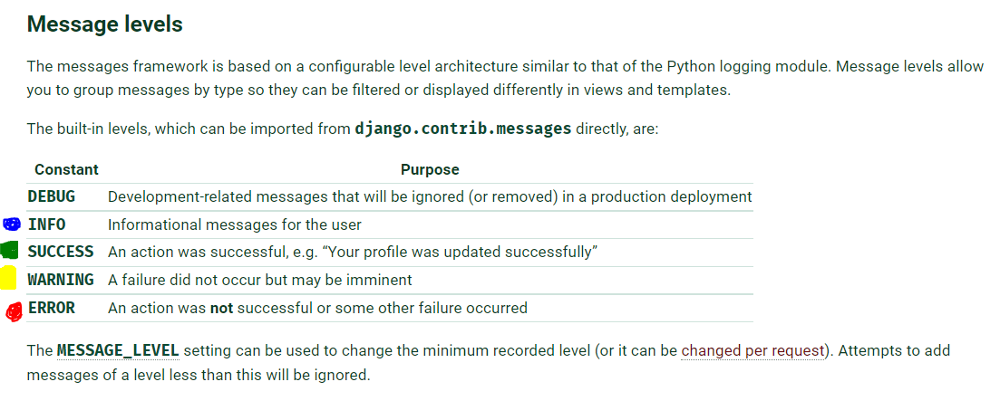
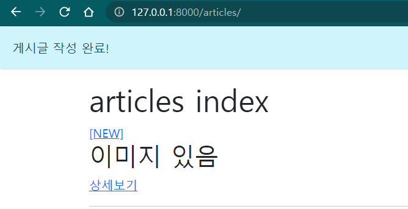

# 🗨 Django의 일회성 메시지 출력 기능 사용해보기 

## 👉 참고 사이트:

- [블로그](https://jjinisystem.tistory.com/47)
- [공식문서: Django Messages Framework](https://docs.djangoproject.com/en/3.2/ref/contrib/messages/)

## 알고가기

0. 1회만 노출되고, 새로고침을 하면 사라진다.

0. Django 프로젝트의 settings.py 안에 해당 기능을 실행하기 위한 기본적 요소가 갖추어져 있다.

   (자세한 내용은 공식문서 참고)

0. 메시지의 경중에 따라 level을 조절할 수 있다. Level에 따라 메시지가 출력되는 색상이 달라진다.

   `tags`라는 이름의 속성으로 접근할 수 있다.

   

## 사용하기

1. `settings.py`에 다음을 작성한다:

   ```python
   # settings.py
   MESSAGE_STORAGE = 'django.contrib.messages.storage.session.SessionStorage'
   ```

2. `views.py`에서 해당 기능을 적용할 함수를 수정한다.

   > [방법 1] `messages.add_message(request, messages.<레벨>, '메시지 내용')`
   >
   > [방법 2] `messages.<레벨>(request, '메시지 내용')`

   

   ```python
   # views.py
   from django.contrib import messages
   
   ## 방법 1
   messages.add_message(request, messages.INFO, '게시글이 성공적으로 작성되었습니다.')
   ## 방법 2
   messages.info(request, '게시글 작성 완료!')
   ```

   - [방법 1]의 'INFO'와 [방법 2]의 'info' 부분을 원하는 level의 메시지 태그로 바꾸면 된다.

   - 부트스트랩 환경에서 'error (ERROR)'은 색이 흰색이 나옴 (❓)

   - 예시:

     ```python
     # views.py의 create 함수
     @require_http_methods(["GET", "POST"])
     def create(request):
         if request.method == 'POST':
             form = ArticleForm(request.POST, request.FILES) # data= 생략 가능
             if form.is_valid():
                 form.save()
                 ## add_message
                 # messages.add_message(request, messages.INFO, '게시글이 성공적으로 작성되었습니다.')
                 ## shortcut
                 #messages.info(request, '게시글 작성 완료!')
                 return redirect('articles:index')
         else:
             form = ArticleForm()
         context = { 
             'form': form,
         }
         return render(request, 'articles/create.html', context)
     ```

## 결과물 예시

- 글 생성 시에 `info` 태그의 '게시글 작성 완료!' 메시지 출력



