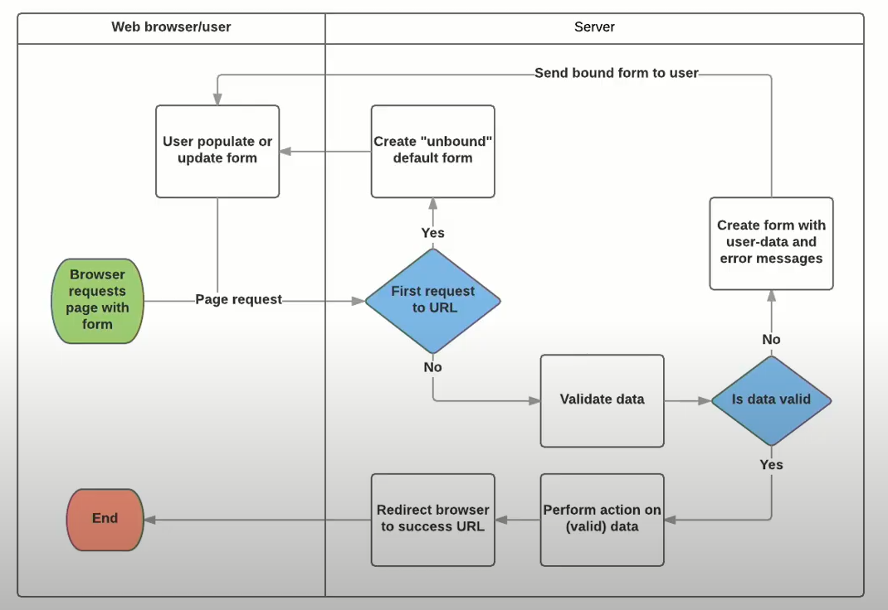

# Django Form에 관한 추가 공부 내용

## 1. Django Form의 핵심 역할 2가지

1. data validation (유효성 검사) (★)
2. HTML(`<input>` 태그) 생성

## 2. Django Form의 workflow



- "unbound": 사용자가 제출한 데이터가 없음을 의미

## 3. created_at과 updated_at

created_at과 updated_at 필드, 즉 자동으로 생성 시각과 수정 시각을 업데이트 하도록 만든 필드는 `DateTimeField` 를 사용해서 `auto_now`나 `auto_now_add`  옵션을 설정했다.

→ 위 옵션을 설정하면, editable 속성이 False 로 바뀌어 ORM에서 건드릴 수 없게 된다.

그래서 ModelForm을 이용해서 만들어도 출력되지 않는 것이다.


## 4. HTML에서 enter를 쓰는 방법?

파이썬에서는 '\n'이 줄바꿈을 의미하지만, html에서 해당 기호는 아무런 의미를 갖지 않는다.

→ html에서 줄바꿈은 'line break', 즉 `<br>` 태그를 사용해야 한다.

→ 입력값의 엔터값을 줄바꿈으로 인식하도록 하는 방법은, 인풋에 필터를 거는 것이다.

```django
{{ article.content|linebreaks }} 
{{ article.content|linebreaksbr }}
```

- `linebreaks` 필터: 해당 변수를 감싸는 태그가 앞뒤에 한 번 더 써진다. (앞에 여닫히고, 뒤에서도 여닫히고)
- `linebreaksbr` 필터: 앞뒤에 빈 태그가 생기지는 않는다.


## 5. 선택지를 제한하고 싶다면?

모델에서 CharField의 choices 옵션을 사용한다. 해당 옵션에 튜플로 이루어진 리스트를 전달함으로써 사용할 수 있다.

```python
CATEGORY_CHOICES = [
    ('web', '웹'),
    ('django', '장고'),
    ('python', '파이썬'),
]

# model
category = models.CharField(choices=CATEGORY_CHOICES)
```

- '한 번 정의하면 바꾸지 말라'는 의미에서 주로 대문자로 쓴다.
- 선택지 내 튜플에서:
  - 첫 번째 원소는, DB에 저장되는 내용
  - 두 번째 원소는, 사용자에게 보여지는 내용


## 6. 모델의 CharField는 최소 글자수는 지정할 수 없을까?

- 모델의 CharField에는 min_length가 없어서 할 수 없다.
- 폼의 CharField에서 minlength를 설정해 줄 수 있다. → 추가 검증을 할 수 있다.

## 7. Model의 `fields` 변수

- `fields`에 쓰는 변수는:

  (1) model에 있어야 하며, (2) 데이터 검증 + HTML 생성을 한다.

- 모델의 필드가 아니면:

  데이터 검증 + HTML 생성은 하지만, 저장은 하지 않는다.

※ 참고: 폼에서 검증이 끝난 (모델 필드의) 유효한 데이터들만 모아놓은 것은 `form.cleaned_data`로 접근할 수 있다.

## 8. 다른 html을 현재 html에서 포스트잇처럼 사용하려면?

부분을 담당하는 html을 만들어 하나의 html에 간단하게 모으려면, `include 태그`를 사용하면 된다.

→ 개별 html을 만들고, 부분 html을 넣을 자리에 `include 태그(내용은 '파일 이름')`을 써주면 된다.

(흔히, 부분 html의 이름은 앞에 '_'를 붙이기도 한다.)