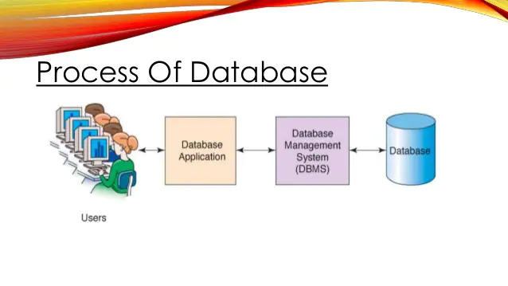
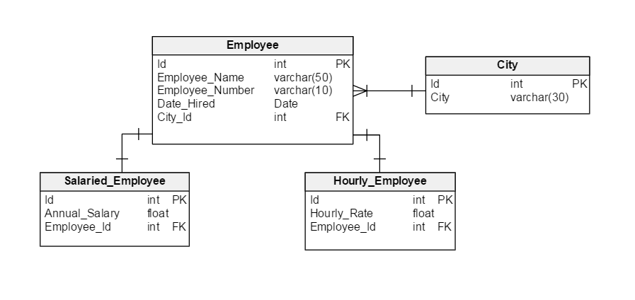

# DB [01]

## 1. Database

- 정의:

  > 표(→ RDB)나 사전(→ NoSQL) 등의 형태로 체계화된 데이터의 모임.
  >
  > 논리적으로 연관된 하나 이상의 자료의 모음.
  >
  > 자료의 조직적 통합을 통해 자료의 중복을 제거하고, 고도로 구조화하여, 검색과 생산의 효율화를 이루어놓은 자료의 집합체이다.

  

- DB의 장점:
  - 데이터 중복 최소화
  - 데이터 무결성: 정확한 정보
  - 데이터 일관성: 언제 봐도 일정한 상태를 지켜나감
  - 데이터 독립성: 데이터 간 서로 영향이 없음
  - 데이터 표준화
  - 데이터 보안 유지

<br/>

## 2. RDB (관계형 데이터베이스)

> Relational Database
>
> 키(key)와 값(value)의 관계를 테이블로 표현한, 관계형 모델 기반의 데이터베이스

### 용어

- 스키마(schema): DB에서 자료의 구조, 표현방법, 관계 등 전반적인 명세를 기술한 것

  (즉, 컬럼에 어떤 데이터타입이 들어가는지 등을 적어준 것)

  테이블을 어떻게 만들지에 대한 설계도.

- 테이블(table): 열(컬럼, 필드)와 행(레코드, 값)의 모델로 조직된 데이터 요소의 집합

  - 열(column): 고유한 데이터 형식이 지정된다.
  - 행(row): 실제 저장되는 데이터

- 기본키(primary key, pk): 각 레코드를 구분해주는 고유한 값

  조건:

  - Not Null
  - Unique

<br/>

## 3. RDBMS

>관계형 데이터베이스 관리 시스템 (Relational Database Management System)
>
>: 관계형 모델 기반의 DB 관리 시스템

- DB-Engine의 종류

  - SQLite

    : 파일 형식의 경량 데이터베이스, 오픈소스.

  - ORACLE

  - MySQL

    등

<br/>

## 4. SQL

> Structured Query Language
>
> 관계형 DBMS의 데이터 관리를 위해 설계된 특수 목적 언어.
>
> SQL을 사용하여 데이터베이스의 스키마 및 데이터에 대한 CRUD를 수행할 수 있다.

- SQL의 분류

  - DDL (데이터 정의 언어): RDB의 구조(테이블, 스키마)를 정의하는 명령어

    > CREATE
    >
    > DROP
    >
    > ALTER

  - DML (데이터 조작 언어): 데이터의 조회, 생성, 수정, 삭제를 위한 명령어

    > INSERT --- 생성
    > SELECT --- 조회
    >
    > UPDATE --- 수정
    >
    > DELETE --- 삭제

  - DCL (데이터 제어 언어): DB 사용자의 권한 제어를 위한 명령어

    > GRANT
    > REVOKE
    >
    > COMMIT
    >
    > ROLLBACK

<br/>

### 0) 초기 설정

```bash
$ sqlite3 db.sqlite3
sqlite>	.database	# 데이터베이스 생성
		.mode csv	# csv를 받을 수 있는 모드로 변경
		.import hellodb.csv exmaples # hellodb.csv 파일을 받아 examples 테이블 만들기
		.tables		# 테이블 확인
		.headers on # 첫 행을 헤더로 인식
		.mode column # 컬럼 형태로 출력하게 해줌
		.schema 테이블명	# 테이블의 스키마를 보여줌
```

- SQL 구문

  ```sqlite
  SELECT * FROM examples;
  ```

  - `;`까지 하나의 SQL 쿼리로 간주된다. (마침표 역할을 한다고 보면 된다)

  - SQL 구문은 대소문자를 구분하지 않는다.

    ⇢ 스타일 가이드에서는, 변하지 않는 부분은 대문자로, 변하는 부분(변수 등)은 소문자로 작성하기를 권함

<br/>

### 1) 테이블 생성 및 삭제

#### 테이블 생성: CREATE TABLE

```sqlite
CREATE TABLE hotels (
room_num TEXT NOT NULL,
check_in TEXT NOT NULL,
check_out TEXT NOT NULL,
grade TEXT NOT NULL,
price INTEGER NOT NULL    
);
```

- 'hotels'라는 이름의 테이블을 생성
  - 'room_num', 'check_in', 'check_out', 'grade' 컬럼의 데이터타입은 text, 빈 값을 허용하지 않는다.
  - 'price' 컬럼의 데이터타입은 integer, 빈 값을 허용하지 않는다.
- 기본키 속성의 컬럼을 따로 작성하지 않는 경우, SQLite에서 자체적으로 `rowid 컬럼`을 정의한다
  - 값이 자동으로 증가하는 `AUTOINCREMENT` 속성을 가짐
  - 스키마에 기본키 속성의 칼럼을 직접 작성한 경우에는, 이후 데이터를 생성할 때 기본키 컬럼도 작성해 주어야 한다. (아니면 값의 개수가 미달이라는 에러가 뜬다.)
- 주의❗
  - trailing comma를 허용하지 않음!
  - 데이터 타입 INTEGER는 대소관계 비교가 되지만, TEXT는 되지 않는다.

#### 테이블 삭제: DROP TABLE

```sqlite
DROP TABLE hotels;
```

<br/>

### 2) 데이터 생성: INSERT

> 테이블에 레코드(행)을 삽입(생성)하는 명령

```sqlite
INSERT INTO 테이블명(컬럼1, 컬럼2, ⋯) VALUES (값1, 값2, ⋯);
```

- 모든 열에 데이터가 있는 경우, column을 명시하지 않고 테이블명만 작성해도 된다.

  ```sqlite
  INSERT INTO hotels VALUES ('B203', '2019-12-31', '2020-01-03', 'suite', 900);
  ```

- 한 번에 여러 데이터를 넣는 경우, 다음과 같이 작성할 수 있다:

  ```sqlite
  INSERT INTO countries VALUES 
  ('1102', '2020-01-04', '2020-01-08', 'suite', 850),
  ('303', '2020-01-01', '2020-01-03', 'deluxe', 500),
  ('807', '2020-01-04', '2020-01-07', 'superior', 300);
  ```

<br/>

### 3) 데이터 조회: SELECT

```sqlite
SELECT 컬럼1, 컬럼2, ⋯ FROM 테이블명;
```

모든 컬럼에 대해 조회하고 싶은 경우,

```sqlite
SELECT * FROM 테이블명;
```

으로 쓸 수 있다.

- #### LIMIT

  쿼리에서 반환되는 행의 개수를 정한다.

  **OFFSET** 키워드와 함께 사용하여, 특정 행부터 특정 개수의 행만 조회하도록 할 수 있다.

  ```sqlite
  SELECT room_num, price FROM hotels ORDER BY price DESC LIMIT 2 OFFSET 1;
  ```

  ⇢ price 컬럼을 기준으로 내림차순으로 정렬한 후, 1개 행을 건너뛰고, 2개의 행의 room_num과 price 컬럼 값을 조회한다.

  

- #### WHERE

  쿼리에서 반환될 행에 대한 조건을 지정한다.

  ```sqlite
  -- SELECT 컬럼명 FROM 테이블명 WHERE 조건;
  SELECT price FROM hotels WHERE grade='deluxe';
  ```

  ⇢ 테이블 hotels에서, grade 컬럼의 값이 'deluxe'인 행에 대해, price 컬럼의 값을 조회한다.

  - WHERE 절의 조건은 `AND`로 나열된다.

- #### SELECT DISTINCT

  조회 결과에서 중복 행을 제거한다.

<br/>

### 4) 데이터 수정: UPDATE

```sqlite
UPDATE 테이블명 SET 컬럼1=값1, 컬럼2=값2, ⋯ WHERE 조건;
```

WHERE 절의 조건을 통해 특정 레코드를 수정할 수 있다. 조건에는 중복값이 없는(unique) 컬럼을 기준으로 삼는다.

<br/>

### 5) 데이터 삭제: DELETE

```sqlite
DELETE FROM 테이블명 WHERE 조건;
```

- 일반적으로 중복값이 없는(unique) 컬럼을 기준으로 삼는다.

- SQLite는 기본적으로 `rowid` 값을 재사용한다.

  → 재사용을 방지하기 위해서는 기본키 컬럼에 `AUTOINCREMENT` 속성을 지정해 주어야 한다.

  (Django에서는 기본값으로 사용되는 개념이다.)

  ```sqlite
  CREATE TABLE countries (
  id INTEGER PRIMARY KEY AUTOINCREMENT,
  ...
  );
  ```

<br/>

## 5. SQLite Functions

- "윈도우 함수"라고 부르기도 한다.
- 실제로 저장된 데이터는 아니지만, 요약 등의 목적으로 사용자가 보기 위한 특정 데이터를 만들기 위해 사용한다.

### 1) COUNT

그룹의 항목 개수를 가져온다.

검색 결과를 보여주는 서비스 등에서 많이 사용된다.

```sqlite
SELECT COUNT(컬럼) FROM 테이블명;
```

> 예)
>
> ```sqlite
> SELECT COUNT(*) FROM users;
> ```
>
> - (NOT NULL이라면) 어떤 컬럼을 선택하든 개수는 같을 것이므로 흔히 컬럼값을 *로 둔다.

### 2) AVG

평균 값을 계산한다.

해당 컬럼이 숫자(INTEGER)일 때만 사용 가능하다.

```sqlite
SELECT AVG(컬럼) FROM 테이블명;
```


### 3) MAX / MIN

최대값 / 최소값을 가져온다.

해당 컬럼이 숫자(INTEGER)일 때만 사용 가능하다.

```sqlite
SELECT MAX(컬럼) FROM 테이블명;
SELECT MIN(컬럼) FROM 테이블명;
```


### 4) SUM

모든 값의 합을 계산한다.

해당 컬럼이 숫자(INTEGER)일 때만 사용 가능하다.

```sqlite
SELECT SUM(컬럼) FROM 테이블명;
```

<br/>

## 6. LIKE operator

> 데이터를 조회할 때 패턴을 이용하는 방법 (문자열로 넣기)

```sqlite
SELECT * FROM 테이블 WHERE 컬럼 LIKE '패턴'
```


- ### 와일드카드

#### 1) % (percent sign)

> 0개 이상의 문자

(예) '김%' : 김으로 시작되는 걸 다 찾음 ('김'도 나옴)

#### 2) _ (underscore)

> 임의의 단일 문자

(예) '김_' : 김으로 시작되는 것 중, 총 두 글자 짜리만

(예) '김__%' : 김으로 시작되는 것 중, 세 글자 이상인 것만

<br/>

## 7. ORDER BY

> 기준에 따라 정렬
>
> - SELECT 문에 추가하여 사용한다.
> - 키워드
>   - ASC: 오름차순 (기본값)
>   - DESC: 내림차순

```sqlite
--(1)
SELECT * FROM 테이블 ORDER BY 컬럼 ASC;
--(2)
SELECT * FROM 테이블 ORDER BY 컬럼1, 컬럼2 DESC;
```

(2)의 경우, 컬럼1에 대해서는 키워드를 지정하지 않았으므로 기본값이 ASC가 적용되고, 컬럼2에는 DESC가 적용된다.

→ 1) 먼저 컬럼1을 기준으로 오름차순 정렬을 한 후,

→ 2) 컬럼1에서 같은 값이 있는 것들은, 컬럼2를 기준으로 내림차순 정렬을 한다.

즉, 첫 번째 기준이 우선 적용되고, 첫번째가 같다면 두 번째 기준을 적용하여 정렬한다.

<br/>

## 8. GROUP BY

> 행을 묶어 요약한다.
>
> ※ 주의: 문장에 WHERE절이 포함된 경우에는 <u>반드시 WHERE 절 뒤에 작성해야 한다.</u>

```sqlite
SELECT 컬럼1, aggregate_function(컬럼2) FROM 테이블 GROUP BY 컬럼1, 컬럼2;
```

- aggregate_function이라 함은, 앞에서 언급한 COUNT, MIN, MAX, SUM, AVG 등을 가리킨다.

- `AS`를 사용하여 alias를 설정함으로써 나타나는 컬럼명을 바꿀 수 있다:

  ```sqlite
  SELECT room_num, COUNT(*) AS room_count FROM hotels GROUP BY price;
  ```

<br/>

## 9. ALTER TABLE

1. 테이블 이름 변경

   ```sqlite
   ALTER TABLE 기존테이블명 RENAME TO 새테이블명;
   ```

2. 테이블에 새로운 column 추가

   ```sqlite
   ALTER TABLE 테이블명 ADD COLUMN 컬럼 데이터타입;
   ```

   - 예)

     ```sqlite
     ALTER TABLE news ADD COLUMN created_at TEXT NOT NULL;
     ```

     - ❗ 그러나, 새로운 컬럼에 `NOT NULL` 속성을 지정해 줄 때 오류가 발생한다.

       - 이유: 기존 레코드는 해당 컬럼의 값을 갖고 있지 않으므로, NOT NULL 속성을 충족시키지 못하는 모순이 발생하기 때문이다.

       - 해결방법:

         1) NOT NULL 속성 없이 추가하기 

            (그러나, 컬럼의 목적에 부합하지 않는다.)

         2) <u>기본값(DEFAULT) 설정하기</u> ✔

            ```sqlite
            ALTER TABLE news ADD COLUMN created_at TEXT NOT NULL DEFAULT '00:00:00';
            ```

            

3. [참고] column 이름 수정

   ```sqlite
   ALTER TABLE 테이블명 RENAME COLUMN 기존이름 TO 새이름;
   ```

<br/>

## 10. SQL & ORM

[SQL] --------- [ORM] -------- [DB]

### 0) 초기 설정

#### (1) sqlite3 (SQL문 작성)

```bash
# 가상환경
$ python -m venv venv
$ source venv/Scripts/activate
# 필요 구성요소 설치
$ pip install -r requirements.txt
# (기존 모델이 있는 경우) migrate
$ python manage.py migrate
# db.sqlite3 실행하기
$ sqlite db.sqlite3
```

* sqlite 나가기: `.exit`

* [참고] 필요 구성요소 `requirements.txt`

  > asgiref == 3.3.1
  > backcall == 0.2.0
  > beautifulsoup4 == 4.9.3
  > colorama == 0.4.4
  > decorator == 4.4.2
  > Django == 3.1.7
  > django-bootstrap-v5 == 1.0.0
  > django-extensions == 3.1.1
  > importlib-metadata == 2.1.1
  > ipython == 7.21.0
  > ipython-genutils == 0.2.0
  > jedi == 0.18.0
  > parso == 0.8.1
  > pickleshare == 0.7.5
  > prompt-toolkit == 3.0.18
  > Pygments == 2.8.1
  > pytz == 2021.1
  > soupsieve == 2.2
  > sqlparse == 0.4.1
  > traitlets == 5.0.5
  > wcwidth == 0.2.5
  > zipp == 3.4.1

#### (2) Django shell_plus 사용하기 (ORM 작성)

```bash
$ python manage.py shell_plus --print-sql
```

> 가정: 모델 이름은 User

<br/>

### 1) READ

- ORM

  ```python
  User.objects.all()
  User.objects.get(pk=102)
  ```

- SQL

  ```sqlite
  SELECT * FROM users_user;
  SELECT * FROM users_user WHERE id=102;
  ```

<br/>

### 2) CREATE

- ORM

  ```python
  User.objects.create(
  	first_name='길동',
  	last_name='홍',
  	age=100,
  	country='제주도',
  	phone='010-0000-0000',
  	balance=5000
  )
  ```

- SQL

  ```sqlite
  INSERT INTO users_user VALUES ('길동', '홍', 100, '제주도', '010-0000-0000', 5000);
  ```

<br/>

### 3) UPDATE

- ORM

  ```python
  user = User.objects.get(pk=102)
  user.last_name = '박'
  user.save()
  ```

- SQL

  ```sqlite
  UPDATE users_user SET first_name='박' WHERE id=102;
  ```

<br/>

### 4) DELETE

- ORM

  ```python
  User.objects.get(pk=102).delete()
  ```

- SQL

  ```sqlite
  DELETE FROM users_user WHERE id=102;
  ```

<br/>

### 5) 활용하기

- 전체 수 조회

  - ORM

    ```python
    User.objects.count()
    ```

  - SQL

    ```sqlite
    SELECT COUNT(*) FROM users_user;
    ```

- 조건으로 조회하기 (AND)

  → `filter`를 사용하여 조건을 걸고, `values`로 출력할 컬럼을 지정한다.

  (values 안에는 컬럼을 따옴표 안에 넣어 작성한다.)

  → 조건이 여러 개일 경우에는 `,`로 구분하며, 조건은 AND로 연결된다.

  - ORM

    ```python
    User.objects.filter(age=30, last_name='김').values('first_name')
    User.objects.filter(age=30).filter(last_name='김').values('first_name')
    ```

  - SQL

    ```sqlite
    SELECT first_name FROM users_user WHERE age=30 AND last_name='김';
    ```

-  조건으로 조회하기 (OR)

  - ORM

    filter에서 OR를 활용하려면, `Q object`를 활용해야 한다:

    ```python
    from django.db.models import Q
    
    User.objects.filter(Q(age=30) | Q(last_name='김'))
    ```

    ⇢ 조건은 `Q()`로 감싸준 후, 파이프라인(|)으로 연결해주면 된다.

  - SQL

    ```sqlite
    SELECT * FROM users_user WHERE age=30 OR last_name='김';
    ```

    

- 대소비교

  - 이상: `__gte`

  - 이하: `__lte`

  - 초과: `__gt`

  - 미만: `__lt`

    

  - ORM

    ```python
    User.objects.filter(age__gte=30).count()
    ```

    ⇢ age 컬럼 값이 30 이상인 행의 수를 계산

  - SQL

    ```sqlite
    SELECT COUNT(*) FROM users_user WHERE age>=30;
    ```

- 내림차순

  - ORM

    ```python
    User.objects.order_by('-age')[:10]
    ```

    ⇢ 나이 많은 순으로, 상위 10명

  - SQL

    ```sqlite
    SELECT * FROM users_user ORDER BY age DESC LIMIT 10;

- 그 외

  [공식문서 참고하기 1](https://docs.djangoproject.com/en/3.2/topics/db/queries/)

  [공식문서 참고하기 2](https://docs.djangoproject.com/en/3.2/ref/models/querysets/)

  - `__startswith`: 시작 문자열을 조건으로 지정할 때
  - `__endswith`: 끝 문자열을 조건으로 지정할 때
  - `__contains`: 특정 문자열의 포함여부를 지정할 때

<br/>

## 11. Django Aggregation

[공식문서 참고하기](https://docs.djangoproject.com/en/3.2/topics/db/aggregation/)


- 특정 필드 전체의 합, 평균, 개수 등을 계산할 때 사용한다.

- 활용 예시:

  ```sqlite
  from django.db.models import Avg, Max
  
  User.objects.aggregate(Avg('age'))
  User.objects.aggregate(Max('balance'))
  ```

<br/>

### Annotate()

> 주석 달기
>
> 원본 테이블의 데이터를 변화시키는 게 아니라!
>
> 참고용으로 추가 정보를 같이 보여주는 것.

- 예시:

  - ORM

    ```python
    from django.db.models import Count
    
    # 1
    User.objects.values('country').annotate(Count('country'))
    # <QuerySet [{'country': '강원도', 'country__count': 14}, ⋯]
    ```

  - SQL

    ```sqlite
    SELECT country, COUNT(country) FROM users_user GROUP BY country;
    ```

---

## 추가 예시

- first_name 이 '수'로 끝나면서, 행정구역이 경기도인 사람들의 balance 조회하기

  - ORM

    ```python
    User.objects.filter(first_name__endswith='수', country='경기도').values('balance')
    ```

  - SQL

    ```sqlite
    SELECT balance FROM users_user WHERE first_name LIKE '%수' AND country='경기도'
    ```

- phone에 '123'을 포함하고, age가 30 미만인 정보를 조회하기

  - ORM

    ```python
    User.objects.filter(phone__contains='123', age__lt=30)
    ```

  - SQL

    ```sqlite
    SELECT * FROM users_user WHERE phone LIKE '%123%' AND age<30;
    ```

- phone 이 '010'으로 시작하는 사람들의 행정구역을 중복 없이 조회하기

  - ORM

    ```python
    User.objects.filter(phone__startswith='010').values('country').distinct()
    ```

  - SQL

    ```sqlite
    SELECT DISTINCT country FROM users_user WHERE phone LIKE '010%';
    ```

- 제주특별자치도에 사는 사람 중, balance가 가장 많은 사람의 first_name을 조회하기

  - ORM

    ```python
    User.objects.filter(country='제주특별자치도').values('first_name').order_by('-balance')[0]
    ```

  - SQL

    ```sqlite
    SELECT first_name FROM users_user WHERE country='제주특별자치도' ORDER BY balance DESC LIMIT 1;
    ```

*끝*

