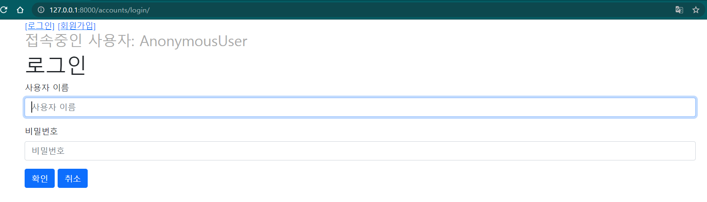

# Django 05

## Authentication System I

### 1. Django 인증 시스템

Django의 인증 시스템은 **인증(authentication)**과 **권한(authorization)** 관리를 함께 제공하며, 이 둘을  이를 통합하여 인증시스템이라고 부른다.

> 1) 인증 (authentication)
>
>    신원 확인
>
> 2) 권한 부여 (authorization)
>
>    인증을 거친 후, 인증된 사용자가 수행할 수 있는 작업을 결정

- Django 인증 시스템의 필수 구성

  ```python
  # settings.py
  
  INSTALLED_APPS = [
      ...,
      django.contrib.auth,			# 유저와 관련된 인증 모델
      django.contrib.contenttypes,	# 권한 관리
  ]
  ```

  프로젝트를 만들면 이미 구성되어 있다.

- 앱 생성

  `accounts`라는 이름의 앱을 생성하여, 여기에서 인증 관리 등을 수행한다.

  (Django의 기본 설정 등에서 accounts라는 이름을 사용하므로, 이를 그대로 사용하도록 한다.)

<br/>

💬참고: [OAuth란?](https://d2.naver.com/helloworld/24942)

💬 인증 --- 401 Unauthorized

​		권한 --- 403 Forbidden

<br/>

### 2. 쿠키🍪와 세션

쿠키와 세션은 로그인과 로그아웃 기능에 대한 이해의 바탕이 된다.

먼저, 쿠키와 세션이 필요한 이유를 알아보자.

#### HTTP의 특징

> **HTTP란?**
>
> Hyper Text Transfer Protocol로, HTML 문서 등의 데이터를 가져올 수 있게 해주는 <u>규약</u>이다.

1. 비연결지향 (connectionless)

   서버는 클라이언트와 지속적인 연결을 유지하는 게 아니라, 응답을 보낸 후 연결을 끊는다.

2. 무상태 (stateless)

   비연결지향으로 인해 무상태의 특징을 갖게 된다. 즉, 상태가 유지되지 않는다는 것이다. 

   연결이 지속되지 않으므로 클라이언트와 서버가 주고받는 메시지들은 서로 완전히 독립적이다.

**그러나**, HTTP의 특징은 한 가지 문제를 안겨준다.

*"그렇다면 새로운 페이지를 요청할 때마다 로그인 상태가 유지되지 않는걸까?" "매번 로그인을 새로 해줘야 하나?"*

그렇다. 그러나 이것은 아주 소모적인 일이며, 로그인을 지속할 수 있는 방법이 있다면 활용하는 게 옳을 것이다.

여기서 쿠키와 세션의 개념이 등장한다.

> 클라이언트와 서버 간 연결을 지속적으로 유지하기 위해 쿠키와 세션이 존재한다.

✔ 쿠키는 세션 정보를 담아 요청을 보낼 때마다 서버에 보냄으로써, 로그인되어 있다는 사실을 매번 서버에 알린다.

<br/>

그렇다면, 쿠키와 세션은 무엇일까?

- #### 쿠키(Cookie)🍪

  > 서버가 사용자의 브라우저에 전송하는 작은 데이터 조각으로, 사용자가 요청을 보낼 때 사용자의 컴퓨터에 저장된다.

  - KEY - VALUE 형식으로 저장된다.

  - 브라우저는 서버로부터 받은 쿠키를 로컬에 저장해 두었다가, <u>동일한 서버에 재요청을 할 때, 저장된 쿠키를 요청과 함께 전송한다.</u>

  - [참고] 쿠키로 사용자의 행동을 추적하거나, 쿠키를 훔쳐 사용자의 계정 접근권한을 획득하는 등의 방식으로 악용될 수 있다. 

    (→ 민감한 정보를 저장하기 위해서는 세션 개념이 도입)

  - HTTP 쿠키는 "상태가 있는 세션을 만들어준다." ★

  - 쿠키의 사용 목적:
    - (1) 세션 관리: <u>로그인</u>, 아이디 자동 완성, 공지 하루동안 안 보기, 팝업 체크, 장바구니 등의 정보 관리
    - (2) 개인화: 사용자 선호, 테마 등 설정
    - (3) 트래킹: 사용자 행동 기록 및 분석

- #### 세션(Session)

  > 쿠키 중에서도, "상태"를 유지시키는 데에 사용되는 것들

  - 클라이언트가 서버에 접속하면, 서버가 특정 **session id**를 발급해주고, 이를 클라이언트는 쿠키에 저장한다.
  - 쿠키에는 session id만 저장되고, value 값은 서버가 갖고 있다. (서버 측에서 id를 제공받으면, 해당하는 id의 value 값을 찾는다.)

##### 쿠키의 수명

- 세션 쿠키 (session cookies)

  현재 세션이 종료되면 삭제된다.

  브라우저가 유효기간을 설정하며, 브라우저가 종료되면 삭제된다.

- 지속적 쿠키 (persistent cookies, permanent cookies)

  유효기간까지 저장된다.

#### Django의 세션

- Django는 세션을 DB에 저장한다. 세션 정보는 django_session 테이블에 저장된다.

- 특정 session id를 가진 쿠키를 사용하여 각 브라우저와 사이트가 연결된 세션을 찾는다.

- 다만, 모든 것을 세션으로 하려고 하면 서버에 부하가 걸릴 수 있으므로, 보안을 요하는 것들은 세션으로, 그렇지 않은 것들은 쿠키로 할 수 있다. (세션으로 하면 value 값은 서버에 있고 클라이언트에게 공개되지 않기 때문이다.)

- Django의 세션은 미들웨어를 통해 구현된다.

  > **미들웨어(Middelware)란?**
  >
  > : 요청과 응답의 중간 과정에서 작동하는 시스템.
  >
  > - 요청이 들어오면 → 미들웨어를 거쳐서 → 해당 url에 등록된 view로 연결되고,
  >
  > 응답도 미들웨어를 거쳐 나가게 된다.
  >
  > - 주로 데이터 관리, 애플리케이션 서비스, 메시징, 인증 및 API 관리를 담당한다.

<br/>

### 3. 로그인 사용자에 대한 접근 제한

로그인 사용자에 대한 접근 제한은, 로그인한 사용자에게 로그인 버튼이 보이지 않도록 하는 것, 회원가입 경로로 향하지 않도록 하는 것 등의 제한을 두기 위해 사용된다.

로그인 사용자들이 특정 경로에 접근하지 못하도록 하기 위한 방법으로, 

1. 속성을 이용한 방법
2. 데코레이터를 이용한 방법

이 있다.

#### (1) `is_authenticated` 속성

> User 모델의 속성.
>
> 모든 User 인스턴스에 대해 항상 True인 속성이지만, AnonymousUser에 대해서는 항상 False이다.
>
> 즉, 인증 여부만을 알 수 있다.

- 일반적으로 'request.user'을 쓸 때 사용하여, 'django.contrib.auth.middleware.AuthenticationMiddleware'를 통과했는지 확인한다.

- ※주의: 권한과는 관련이 없다.

- `if`문 에서 활용하여, 로그인과 비로그인 상태에서 출력되는 링크를 다르게 설정하거나, 특정 view 함수를 실행하지 못하도록 할 수 있다 (예: login 함수).

  반대로, 로그인 상태에서만 특정 로직을 수행하도록 처리할 수도 있다 (예: logout 함수, 글 작성 등).

<br/>

#### (2) `@login_required` 데코레이터

다음 함수를 import하여 사용한다:

```python
from django.contrib.auth.decorators import login_required
```

사용자가 로그인 되어 있으면 뷰 함수를 정상적으로 실행한다. 그러나, 사용자가 로그인 되어 있지 않으면 settings.LOGIN_URL에 설정된 경로로 redirect 한다: 기본값은 '/accounts/login/' 이다.

(앱 이름을 accounts로 지정했었기 때문에, 위의 경로로 redirect 되면 로그인 화면이 뜨게 된다.)

로그인 화면으로 이동하면, url의 `next` 파라미터에 이동 직전의 주소가 저장된다:

```http
# /articles/create/ 주소에서 이동한 경우
http://127.0.0.1:8000/accounts/login/?next=/articles/create/
```

로그인 인증이 성공하면, 함수에 설정된 값이 아니라 `next` 파라미터에 저장된 경로로 이동시켜준다. 

이때, redirect는 GET 방식이므로, GET 메서드를 받을 수 있는 함수에 사용해야 한다.★

(⇢ POST 메서드만을 받는 delete 함수에서 사용할 수 없음 -  HTTP ERROR 405 (Method Not Allowed 발생))

- next에 저장된 경로의 값은 GET방식으로 전달된 걸 받아오는 것이므로,

  ```python
  request.GET.get('next')
  ```

  로 접근할 수 있다.

<br/>

### 4. 로그인

세션을 CREATE 한다.

#### → `AuthenticationForm`

> 사용자 login을 위한 form
>
> - 첫 번째 인자는 request
> - 로그인은 GET과 POST 메서드를 모두 받는다: 로그인 페이지 제시, 로그인 작업 실행
> - 로그인을 위한 입력값을 받는다.
> - [공식문서 바로가기](https://docs.djangoproject.com/en/3.2/topics/auth/default/#module-django.contrib.auth.forms)

#### → `login(request, user, backend=None)`

>실제 로그인을 진행시켜주는 함수이다.
>
>- [공식문서 바로가기](https://docs.djangoproject.com/en/3.2/topics/auth/default/#how-to-log-a-user-in)
>- view 함수에서 사용된다.
>- 첫 번째 인자로 HttpRequest 객체를 받고, 두 번째 인자로 User 객체를 받는다.



```django
<!--base.html의 <body> 부분-->
<div class="container">
  <a href="">Login</a>
  
  
</div>
```

```python
# accounts 앱의 views.py
from django.shortcuts import render, redirect
from django.contrib.auth import login as auth_login
from django.contrib.auth.forms import AuthenticationForm
from django.views.decorators.http import require_http_methods


@require_http_methods(['GET', 'POST'])
def login(request):
    if request.user.is_authenticated:		# --- 1
        return redirect('articles:index')

    if request.method == 'POST':
        form = AuthenticationForm(request, request.POST)
        if form.is_valid():
            # 로그인
            auth_login(request, form.get_user())	# --- 2, 3
            return redirect(request.GET.get('next') or 'articles:index')	# --- 4
    else:
        form = AuthenticationForm()
    context = {
        'form': form,
    }
    return render(request, 'accounts/login.html', context)
```

1) `is_authenticated`

   로그인 된 상태의 인증된 사용자라면, articles 앱의 index 로 redirect 되도록 한다.

   (즉, login 기능을 수행할 수 없게 한다.)

2) `auth_login()`

   ```python
   from django.contrib.auth import login as auth_login
   ```

   Django의 login 함수 이름을 'auth_login'으로 바꿔 사용하기로 한 것이다.

   view 함수의 login 함수와 이름이 겹치기 때문이다 (이름공간(LEGB rule) 관련).

3. `form.get_user()`

   `get_user()`는 AuthenticationForm 클래스의 인스턴스 메서드로, (유효성 검사를 통과했을 때) 현재 로그인한 사용자를 객체로 제공해준다. (유효성 검사를 통과하지 못했다면, None)

   ```python
   def get_user(self, user_id):
       try:
           return User.objects.get(pk=user_id)
       except User.DoesNotExist:
           return None
   ```

   

4) `redirect(request.GET.get('next') or 'articles:index')`

   url의 `next` 파라미터에 경로값이 있으면 (즉, `@login_required 데코레이터에 의한 로그인이면) 저장된 경로로 이동한다. 그렇지 않으면, articles의 index url로 이동한다.

   * 참고

     로그인 주소가 하나로 일정하지 않기 때문에, 로그인 입력값을 받는 템플릿에서도 form의 action값을 비워둠으로써, 요청이 들어온 곳으로 응답을 보내도록 해야 한다. (하나로 고정하면 안 된다.)

<br/>

#### Authentication data in templates

인증 관련 데이터를 템플릿에서 어떻게 사용(출력)할 수 있을까?

- 템플릿에 그냥 `{{ user }}`로, 별도의 정의 없이 user라는 변수를 쓰면, 현재 로그인 되어있는 유저 객체가 출력이 된다. (로그인 되어있는 유저가 없으면, 'AnonymousUser'라는 이름이 뜬다.)

  - 이유: settings.py의 `context_processors`에서 context가 제공되고 있기 때문이다.

    `context_processors` 부분은 django의 기본적인 context 값이라고 할 수 있다.

    현재 로그인한 사용자를 나타내는 auth 앱의 User 클래스의 인스턴스가 변수 `{{ user }}`에 저장된 것이다.

  ```python
  'context_processors': [
  	'django.template.context_processors.debug',
      'django.template.context_processors.request',
      'django.contrib.auth.context_processors.auth',	# ✔
      'django.contrib.messages.context_processors.messages',
  ]
  ```

- `{{ request }}`도 마찬가지의 경우이다.

  (이 경우는 두 번째 줄의 request에 의한 것이다.)

<br/>

### 5. 로그아웃

세션을 Delete 한다.

#### → `logout(request)`

> 클라이언트의 쿠키에서 session id를 삭제해주고, DB에서도 현재 요청에 대한 session data를 삭제해준다.
>
> ⇢ 둘 다 지우는 이유: 타 사용자가 이전 사용자의 세션 데이터에 접근하는 것을 방지하기 위함이다.
>
> (예) 크롬 시크릿 모드: 쿠키를 저장하지 않는다.

```django
<!--base.html의 <body> 부분-->
<div class="container">
    
      <form action="" method="POST">
        
        <input type="submit" value="Logout">
      </form>
    ...
```

```python
# accounts 앱의 views.py
from django.shortcuts import render, redirect
from django.contrib.auth import logout as auth_logout
from django.views.decorators.http import require_POST

@require_POST
def logout(request):
    if request.user.is_authenticated:
        auth_logout(request)
    return redirect('articles:index')
```

