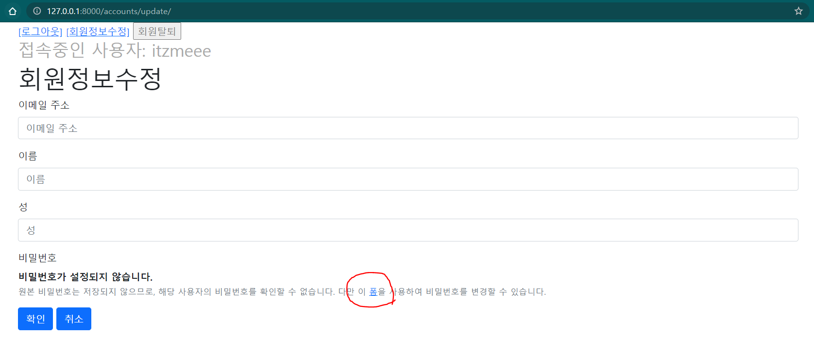

## Authentication System II

### 1. 회원가입 [CREATE]

유저를 create 하는 것이다.

#### → `UserCreationForm`

> - ModelForm을 상속받는다.
>   - User 모델을 사용한다.
>   - 첫 번째 인자로 data를 받는다.
> - 3개의 필드:
>   - username
>   - password1
>   - password2 (비밀번호 확인)
> - [django 깃헙](https://github.com/django/django/blob/main/django/contrib/auth/forms.py#L78)


```python
# accounts 앱의 views.py

from django.shortcuts import render, redirect
from django.contrib.auth import login as auth_login
from django.contrib.auth.forms import UserCreationForm
from django.views.decorators.http import require_http_methods

@require_http_methods(['GET', 'POST'])
def signup(request):
    if request.user.is_authenticated:		# --- 1
        return redirect('articles:index')
    if request.method == 'POST':
        form = UserCreationForm(request.POST)
        if form.is_valid():
            user = form.save()
            auth_login(request, user)   # UserCreationForm은 get_user()가 없음! --- 2
            return redirect('articles:index')
    else:
        form = UserCreationForm()
    context = {
        'form': form,
    }
    return render(request, 'accounts/signup.html', context)
```

1. `is_authenticated`

   로그인을 한 인증된 사용자라면, articles 앱의 index 로 redirect 되도록 한다.

   (즉, 회원가입 기능을 수행할 수 없게 한다.)

   (이 속성을 활용하여 `base.html`에서도 회원가입 버튼을 감출 수 있다.)

2. `auth_login(request, user)`

   회원가입을 한 후, 자동으로 해당 계정으로 로그인이 되게끔 하는 부분이다.

   login 함수의 AuthenticationForm에서는 `get_user()`메서드를 사용하여 유저 정보를 가져올 수 있었지만, UserCreationForm은 해당 메서드를 지원하지 않는다.

   이때,

   ```python
   class UserCreationForm(forms.ModelForm):
       """
       A form that creates a user, with no privileges, from the given username and
       password.
       """
       ...
       def save(self, commit=True):
           user = super().save(commit=False)
           user.set_password(self.cleaned_data["password1"])
           if commit:
               user.save()
           return user
   ```

   UserCreationForm은 `save()`메서드를 사용하여 저장할 때 반환하는 객체가 유저 객체이다. 그러므로, 이를 저장하여 auth_login의 인자로 넘겨줄 수 있다.

<br/>

### 2. 회원탈퇴 [DELETE]

유저를 delete 하는 것이다.

```python
# accounts의 views.py

from django.shortcuts import redirect
from django.views.decorators.http import require_POST

@require_POST
def delete(request):
    if request.user.is_authenticated:		# 로그인한 사용자의 경우에만
        request.user.delete()
    return redirect('articles:index')
```

- `delete()`를 사용하여 삭제를 진행한다. 

- 유저가 삭제되더라도 세션은 유지된다. 해당 유저의 세션도 함께 지우려면 계정 삭제 코드 이후에

  ```python
  from django.contrib.auth import logout as auth_logout
  
  auth_logout(request)
  ```

  위의 코드를 작성하면 된다.

- POST 방식만 받기 때문에 delete 함수를 실행하는 버튼은 `<form> 태그` 에서 POST 방식으로 전달되어야 한다.

<br/>

### 3. 회원정보 수정 [UPDATE]

#### → `UserChangeForm`

> - 사용자의 정보 및 권한을 변경하기 위한 폼이다.
> - ModelForm을 상속받는다.
>   - 첫 번째 인자로 data를 받는다.
> - admin 인터페이스에서 사용된다.
> - [django 깃헙](https://github.com/django/django/blob/main/django/contrib/auth/forms.py#L138)


**그러나❗❗❗** 

일반 사용자 계정 정보를 변경한다고 하기에는 너무 많은 작업이 노출되어있다.

**그래서**

UserChangeForm을 상속받은 새로운 폼을 만들어 활용하는 것이 좋겠다.

```python
# forms.py

from django.contrib.auth.forms import UserChangeForm
from django.contrib.auth import get_user_model

User = get_user_model()

class CustomUserChangeForm(UserChangeForm):
    
    class Meta:
        model = User
        fields = ('email', 'first_name', 'last_name')
```

- `UserChangeForm`은 `User` 모델을 모델로 가지는 모델폼이다. 따라서, 우리도 User 모델을 가져와서 특정 필드만 보여질 수 있도록 만들어야 한다. [User 모델 확인하며 필드도 확인하기](https://github.com/django/django/blob/6426c3077c8048bb3fa5bfcec6be80f73476b534/django/contrib/auth/models.py#L389), [공식문서](https://docs.djangoproject.com/en/3.2/ref/contrib/auth/)

  ***이때,***

  <u>django에서 User 모델을 가져올 때는 모델 자체를 import 해서는 안 되고, `get_user_model()`을 통해서만 해야 한다고 권고하고 있다.</u> (미흡하나마 설명을 덧붙이자면, 한 프로젝트 내에 유저가 여러 개 생겼을 때, 유저 모델을 들고오면 코드가 작동하지 않을 수 있기 때문이라고 한다.) [관련 문서](https://docs.djangoproject.com/en/3.2/topics/auth/customizing/#referencing-the-user-model)

  `get_user_model()`을 사용하면 현재 활성화된 (currently active) User 모델을 들고온다.

```python
# accounts의 views.py

from django.contrib.auth.decorators import login_required
from django.shortcuts import render, redirect
from django.views.decorators.http import require_http_methods
from .forms import CustomUserChangeForm


@login_required
@require_http_methods(['GET', 'POST'])
def update(request):
    if request.method =='POST':
        form = CustomUserChangeForm(request.POST, instance=request.user)
        if form.is_valid():
            form.save()
            return redirect('articles:index')
    else:
        form = CustomUserChangeForm(instance=request.user)
    context = {
        'form': form,
    }
    return render(request, 'accounts/update.html', context)
```

- instance 인자에 request.user을 넣어, 기존 정보가 출력되도록 한다.


이제 위와 같이 제한된 정보가 노출된 형태의 회원정보수정 페이지가 만들어졌다.

<br/>

### 4. 비밀번호 변경 [UPDATE]

회원정보 수정 폼에서는 비밀번호를 변경할 수 없다. 비밀번호는 또다른 폼에서 수정해야 한다.

#### → `PasswordChangeForm`

> - 기존 비밀번호를 입력하여 새로운 비밀번호를 설정할 수 있도록 한다.
>
> - SetPasswordForm을 상속받는다.
>
>   (위의 폼은 기존 비밀번호를 입력하지 않고 비밀번호르 설정할 수 있도록 해주는 클래스이다.)
>
>   - 첫 번째 인자로 user가 들어간다. [django 깃헙: SetPasswordForm의 `__init__` 함수 보기](https://github.com/django/django/blob/6426c3077c8048bb3fa5bfcec6be80f73476b534/django/contrib/auth/forms.py#L319)
>
> - [django 깃헙](https://github.com/django/django/blob/main/django/contrib/auth/forms.py#L363)

회원정보수정 페이지에서,



비밀번호를 변경할 수 있는 폼에 대한 링크를 발견할 수 있는데, 이는 기본적으로 `/accounts/password/` 경로로 되어 있다.

그러므로, 해당 url을 사용하여 폼을 만들 수 있다.

```python
# accounts의 views.py

from django.contrib.auth.decorators import login_required
from django.shortcuts import render, redirect
from django.contrib.auth import update_session_auth_hash
from django.contrib.auth.forms import PasswordChangeForm
from django.views.decorators.http import require_http_methods

@login_required
@require_http_methods(['GET', 'POST'])
def change_password(request):
    if request.method == 'POST':
        form = PasswordChangeForm(request.user, request.POST)
        if form.is_valid():
            user = form.save()
            update_session_auth_hash(request, user)		# --- 1
            return redirect('articles:index')
    else:
        form = PasswordChangeForm(request.user)
    context = {
        'form': form,
    }
    return render(request, 'accounts/auth_form.html', context)
```

1. `update_session_auth_hash(request, user)`

   비밀번호를 변경하면, 인증정보가 변경되기 때문에 세션이 무효화되고, 따라서 로그아웃이 된다. 

   즉, 기존 세션과 회원의 인증정보가 일치하지 않게 되므로 세션이 바뀌는 것이다.

   따라서, 기존 로그인 상태를 유지하려면 기존 세션의 session hash를 업데이트 해주어야 한다.

   이를 위해 사용되는 게 `update_session_auth_hash`이다.

   > 현재 요청(request)과, 새 session hash가 파생될 업데이트될 사용자 객체를 가져오고, session hash를 적절하게 업데이트 한다.


*끝*