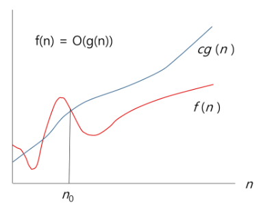
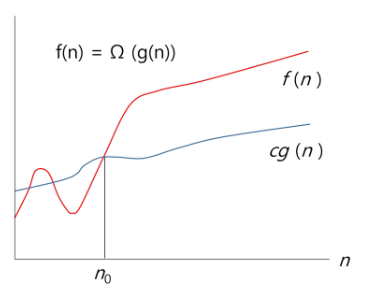
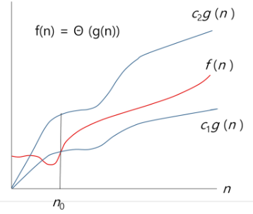
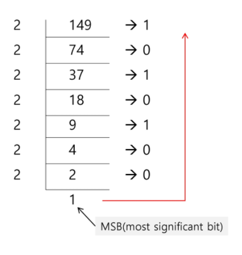

# Start

## 0. Computational Thinking

### 0. 복잡도 분석

**O(빅오)-표기**

> 복잡도의 *점근적 상한* 을 나타낸다.
>
> 최고차항에서 계수를 떼어낸 항을 표기함.
>
> 실행시간이 이에 "비례한다"고 말할 수 있다.
>
> 

**Ω(빅오메가)-표기**

>복잡도의 *점근적 하한* 을 나타낸다.
>
>이도 최고차항에서 계수를 떼어낸 항을 표기하면 된다.
>
>"최소한의 시간"이라고 말할 수 있다.
>
>

**θ(세타)-표기**

> 빅오 표기와 빅오메가 표기가 같은 경우에 사용한다.
>
> 이는 해당 알고리즘이 빅오 또는 빅오메가로 표기된 것과 "동일한 증가율을 가진다"는 의미이다.
>
> 

<br/>

### 1. 논리와 증명

#### 연산

- NOT: **~p** 또는 **¬p**
- AND: **p ^ q**
- OR: **p ∨ q**
- XOR(exclusive OR): 하나만 참일 때 참이 된다 **p ⨁ q**

#### 조건명제의 역, 이, 대우

기본 명제: p → q

- 역: q → p
- 이: ¬p → ¬q
- 대우: ¬q → ¬p


#### 수학적 귀납법

> P(1)이 참이고, P(n) → P(n+1)이 참이면, P(n)은 모든 자연수 n에 대해서 참이다.
>
> (이때, P(n)이 참이라고 가정하고  P(n+1)이 참임을 증명하면 된다.)


#### Trivial Proof (자명한 증명)

> ∀x, P(x) → Q(x)를 증명하는데, Q(x)가 항상 참인 경우
>
> ⇒ 참

#### Vacuous Proof (공허한 증명)

> ∀x, P(x) → Q(x)를 증명하는데, P(x)가 항상 거짓인 경우
>
> ⇒ 참 (가정이 거짓이면 해당 명제는 늘 참이다.)

#### 귀류법

> 간접증명 방법 중 하나로, 본 명제가 참임을 증명하기 어려우면 결과를 반대로 해서 검증하여 증명하는 것

<br/>

### 2. 기초 수식

* 원소 n개에 대한 조합의 개수

  

  |  | =    | number of combinations                  |
  | ------------------------------------------------------------ | ---- | --------------------------------------- |
  |  | =    | total number of objects in the set      |
  |  | =    | number of choosing objects from the set |

* 등비수열의 합


​	(a는 첫째 항, r는 공비, n은 항의 개수)

<br/>

### 3. 표준 입출력 방법

입력이 너무 클 때,

```python
import sys
sys.stdin = open('input.txt', 'r')	# 입력
sys.stdout = open('output.txt', 'w')	# 출력
```

<br/>

### 4. 비트 연산

> 8-bit = 1 byte
>
> 8개 비트를 묶어서 1바이트 단위로 주소가 부여된다.

#### 비트 연산자

같은 자리의 비트끼리 연산한다.

* **&** (AND): 모두 1일 경우 1
* **|** (OR): 모두 0일 경우 0
* **^** (XOR; exclusive or): 서로 다를 경우 1
* **~** (NOT): 반전
* **<<**, **>>** (시프트 연산자): 비트 열을 각각 왼쪽/오른쪽으로 이동시킨다.

예) 홀짝 판단
a & 1 했을 때, a가 짝수면 0, 홀수면 1이 나온다.
⇢ 1과 & 연산을 하므로, 상대의 비트 0번 자리에 따라 결정이 되는 것이다.

예) 부분집합 생성

원소의 개수만큼 돌아가며 `i & (1 << j)` 연산을 각 원소에 대해 수행하여, j번 비트가 1이면 포함, 0이면 미포함으로 결정하여 부분집합을 추출해낼 수 있다.

***참고***

- 16진수 한 자리 == 2진수 4자리

  즉, 16진수 두 자리가 1byte가 된다 (= 2 * 4-bit)

비트 쓸 때 16진수로 0x 를 종종 앞에 붙인다.

- XOR 연산자를 사용하여 i) 비트를 반전시키거나 (1과 연산), ii) 비교를 할 수 있다. 

  (같으면 0, 다르면 1이 나오므로)

<br/>

#### 엔디안(Endianness)

> 컴퓨터 메모리 등의 1차원 공간에 여러 개의 연속된 대상을 배열하는 방법.
>
> 즉, 여러 바이트에 나눠 저장해야 할 때, 방법 1) 또는 방법 2) 을 결정하는 것을 엔디안이라 한다.

* 방법1) **빅 엔디안**

  높은 자리를 더 빠른 주소에 저장하는 방법

* 방법2) **리틀 엔디안**

  낮은 자리를 더 빠른 주소에 저장하는 방법

<br/>

### 5. 진수



: 변환하려는 진수의 숫자로 바꾸려는 숫자를 나누다 더 작은 애가 나오면 중단하고, 거꾸로 읽으면 된다.

이는 진법의 숫자를 한 자리씩 잘라내는 과정이다 (10진수로 생각해보면 금방 이해 가능하다!)

큰 비트 쪽을 MSB, 작은 비트 쪽을 LSB 라고 한다.


- 컴퓨터에서의 음의 정수 표현 방법

   부호 비트로 표현: 맨 앞자리 하나를 부호로 써서(예: 0이면 +, 1이면 -) 표현하기

- 1의 보수:
  x에 대해, 더해서 모든 자리가 1이 되는 값.
  즉, x를 표현했을 때 0인 자리를 모두 1로 하고, 1을 0으로 하는 값이다. (모두 반대로!)

  - 단점: 0의 표현이 두 가지가 되어 -0이 생기는 문제가 있다.

- 2의 보수
  x에 더해서 진법의 한 자리가 더 늘어나도록 하는 수
  (예: 0110 인 6에 대해 10000으로 만들어주는 수)
  이는 1의 보수에다 1을 더함으로써 만들어줄 수 있다.