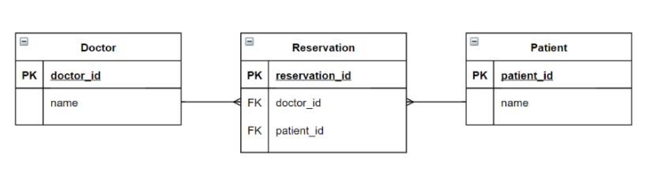
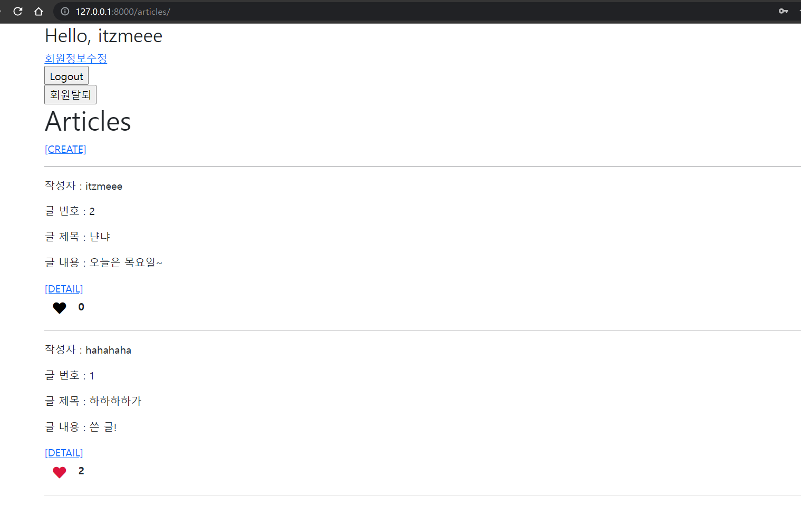
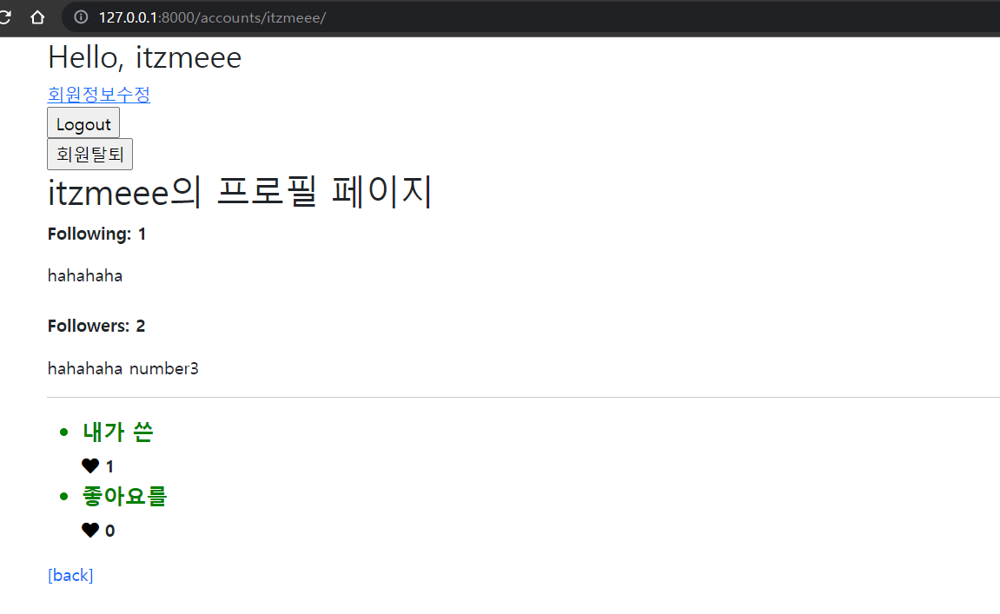

# Model Relationship 02

**다대다(N:M) 관계에 대해 알아보자!**

*1:N을 서로 주고받으면 N:M이다.*

## Intro: 병원 진료 기록 시스템

> **모델링**
>
> 현실 세계를 최대한 유사하게 반영하기 위한 것

#### 1:N의 한계

```python
# models.py

from django.db import models

class Doctor(models.Model):
    name = models.TextField()
    
    def __str__(self):
        return f'{self.pk}번 의사 {self.name}'
    
class Patient(models.Model):
    doctor = models.ForeignKey(Doctor, on_delete=models.CASCADE)	# ← 여기
    name = models.TextField()
    
    def __str__(self):
        return f'{self.pk}번 환자 {self.name}'
```

참조하는 테이블의 외래키 필드에는 하나의 기본키만 대응이 가능하다.

이를 병원 진료 시스템의 사례로 생각해보자면, 환자는 종합병원에서 내과, 이비인후과, 정형외과 등 여러 부서에서 진료를 받을 수 있다. 즉, 환자 1명에 N개의 부서가 대응되는 것이고, 각 부서에는 여러 명의 환자가 다녀가므로 상호 간에 1:N 관계가 이루어지는 것이다.

이때, 서로가 각각에 대해 외래 키 필드를 둔다면, 같은 데이터를 반복하여 기록해야 함으로 인하여 데이터를 관리하기 힘들어질 것이다. 예로, 한 명의 환자가 내과와 정형외과 진료를 받았다면, 환자의 입장에서 본인의 데이터를 두 번 작성해야 하고, 이는 튜플에서 서로 다른 데이터로 인지된다. 반대로, 부서의 입장에서 환자의 예약이 2번 이상 이루어진다면, 해당 환자의 정보를 중복하여 입력해야 한다. 

즉, 새로운 객체를 생성하지 않고 새로운 예약을 생성하는 것이 불가능하고, 환자 한 명이 여러 의사에게 진료 받은 기록을 환자 한 명의 데이터가 아닌, 여러 데이터로 저장해야만 한다.

<u>다대다 관계를 표현함에 있어 1:N 관계만을 활용하는 데에는 한계가 있다. 그래서 우리는 다대다 관계를 표현할 수 있는 **중개 테이블**을 활용한다.</u>

<br/>

#### 중개 테이블 작성

```python
# models.py

from django.db import models

class Doctor(models.Model):
    name = models.TextField()
    
    def __str__(self):
        return f'{self.pk}번 의사 {self.name}'
    
class Patient(models.Model):
    name = models.TextField()
    
    def __str__(self):
        return f'{self.pk}번 환자 {self.name}'
    
class Reservation(models.Model):
    doctor = models.ForeignKey(Doctor, on_delete=models.CASCADE)	# ← 여기
    patient = models.ForeignKey(Patient, on_delete=models.CASCADE)	# ← 여기
    
    def __str__(self):
        return f'{self.doctor.pk}번 의사의 {self.patient.pk}번 환자'
```



관계에 포함된 각 모델 클래스를 1로 두고, 그에 대응되는 N을 가지는 'Reservation' 모델 클래스를 만든 것이다. 즉, Doctor : Reservation = 1 : N, Patient : Reservation = 1 : N 인 것이다.

<u>Django에서는 이런 중개 테이블을 자동으로 만들어주는 `ManyToManyField`를 제공한다.</u>

※ 참고사항

중개 테이블을 만듦에 있어서 관계 속성만 필요하다면 ManyToManyField를 사용하지만, 

필드를 추가하려면 중개 테이블을 따로 작성해야 한다. (**through** 이용) ~~(뒤에 더 자세히)~~


## ManyToManyField

- 다대다(N:M) 관계 설정 시 사용하는 모델 필드

- 하나의 필수 위치인자를 필요로 한다: 관계를 설정할 상대 모델 클래스

- 관계를 맺는 두 모델 중 어느 쪽에 작성해도 괜찮다.

- ForeignKeyField와 마찬가지로, 관계 설정 필드의 이름 뒤에 '_id'가 붙는다.

- 모델 필드의 RelatedManager를 통해 관련 개체를 추가, 제거 또는 만드는 등의 메서드를 사용할 수 있다: `add()`, `remove()`, `create()` 등

  - add()

    : 지정된 객체를 관련 객체 집합에 추가한다. 모델 인스턴스와 필드 값을 인자로 허용한다.

  - remove()

    : 관련 객체 집합에서 지정된 모델 객체를 제거한다. 모델 인스턴스와 필드 값을 인자로 허용한다.

  > Related Manager
  >
  > 1:N 또는 N:M 관련 컨텍스트에서 사용되는 매니저

```python
# models.py

from django.db import models

class Doctor(models.Model):
    name = models.TextField()
    
    def __str__(self):
        return f'{self.pk}번 의사 {self.name}'
    
class Patient(models.Model):
    doctors = models.ManyToManyField(Doctor)	# ← 여기
    name = models.TextField()
    
    def __str__(self):
        return f'{self.pk}번 환자 {self.name}'
```

- `앱이름_모델명_필드명`을 이름으로 가지는 중개 테이블이 데이터베이스에 만들어진다.

- ManyToManyField가 작성된 모델 클래스가 1:N 관계에서의 N 처럼 역할하며, 상대 클래스에서 본 클래스의 객체에 접근하려면 역참조 manager을 사용해야 한다.

- > 🍪 ***완전히 별도의 중개 테이블을 작성하지 않고, MTM 필드를 사용하여 중개 테이블을 설정하는 이유?***
  >
  > → ManyToManyField를 사용하지 않고 중개 테이블을 만들면, 1) 중개 테이블에서 객체를 찾고 ii) 조작하는, 총 두 개의 과정을 거쳐야 한다. 즉, doctor나 patient 모델에서 Reservation의 객체를 먼저 참조하게 되는 것이다.
  >
  > 그러나, ManyToManyField를 사용한다면 (중개 테이블을 거치긴 하지만) 상대 객체를 참조한다는 점에서 관계를 맺는 두 모델에서 서로의 객체에 접근하기 더 쉬워진다. (중개 테이블을 거치지 않는 것처럼 접근할 수 있게 해준다.)

#### ManyToManyField의 arguments

- (1) `related_name`

  관계 필드를 가지지 않은 모델(target model)이 관계 필드를 가진 모델(source model)을 참조할 때, 즉 역참조 시에 사용할 manager의 이름을 설정하는 옵션

- (2) `through`

  중개 테이블을 직접 작성하는 경우, 중개 테이블을 나타내는 Django 모델을 지정할 수 있는 옵션.

  중개 테이블에 추가 데이터를 사용하려는 경우에 주로 사용된다.

  👽 "중개 테이블은 쟤예요."

  ```python
  # models.py
  
  from django.db import models
  
  class Doctor(models.Model):
      name = models.TextField()
      
      def __str__(self):
          return f'{self.pk}번 의사 {self.name}'
      
  class Patient(models.Model):
      doctors = models.ManyToManyField(Doctor, through='Reservation')	# ← 여기
      name = models.TextField()
      
      def __str__(self):
          return f'{self.pk}번 환자 {self.name}'
      
  class Reservation(models.Model):
      doctor = models.ForeignKey(Doctor, on_delete=models.CASCADE)
      patient = models.ForeignKey(Patient, on_delete=models.CASCADE)
      symptom = models.TextField()	# ← 컬럼 추가
      reserved_at = models.DateTimeField(auto_now_add=True)	# ← 컬럼 추가
      
      def __str__(self):
          return f'{self.doctor.pk}번 의사의 {self.patient.pk}번 환자'
  ```

  👉예약(관계) 생성 방법 (doctor1, patient1, patient2 객체 생성 후)

  (i)

  ```shell
  reservation1 = Reservation(doctor=doctor1, patient=patient1, symptom='headache')
  reservation1.save()
  ```

  (ii)

  ```shell
  patient2.doctors.add(doctor1, through_defaults={'symptom': 'flu'})
  ```

  👉 예약(관계) 삭제 방법

  ```shell
  # 1
  doctor1.patient_set.remove(patient1)
  # 2
  patient2.doctors.remove(doctor1)
  ```

  

- (3) `symmetrical`

  *ManyToManyField가 동일한 모델을 가리키는 경우, 즉 재귀적 정의에서만 사용한다.*

  - 기본값: True

    ↳ '_set' 매니저를 추가하지 않는다. 자동으로 역참조도 이루어지기 때문이다.

    (True면 어차피 대칭이라 역참조의 개념이 없음 - `related_name`도 설정하지 않는다.)

  - source 모델의 인스턴스가 target 모델의 인스턴스를 참조하면, target 모델 인스턴스도 source 모델 인스턴스를 자동으로 참조하도록 하는 옵션이다.

  - 이를 False로 설정하는 경우의 예시: Follow 기능


#### 중개 테이블의 필드명

- source model과 target model이 다른 경우
  - id
  - <containing_model>_id
  - <other_model>_id
- ManyToManyField가 동일한 모델을 가리키는 경우
  - id
  - `from_<model>_id`
  - `to_<model>_id`

<br/>

### <예시>

###  articles 앱 안에 Article 모델, accounts 앱 안에 (커스텀) User 모델

<hr>

### 1. '좋아요' 기능

- 유저는 여러 게시글에 좋아요를 누를 수 있음

- 게시글은 여러 유저로부터 좋아요를 받을 수 있음

  즉, 다대다 관계.

```python
# 1. articles/models.py

from django.db import models
from django.conf import settings

# Create your models here.
class Article(models.Model):
    user = models.ForeignKey(settings.AUTH_USER_MODEL, on_delete=models.CASCADE)
    like_users = models.ManyToManyField(settings.AUTH_USER_MODEL, related_name='like_articles')		# ← 좋아요를 위한 다대다 관계
    title = models.CharField(max_length=10)
    content = models.TextField()
    created_at = models.DateTimeField(auto_now_add=True)
    updated_at = models.DateTimeField(auto_now=True)

    def __str__(self):
        return self.title
```

- 이때, `related_name` 옵션을 반드시 설정해 주어야 하는데, 이는 외래 키 필드와 다대다 관계 필드가 모두 Article 모델에 있기 때문이다. User 모델에서 Article모델에 대해 역참조를 하려면 'article_set' manager가 생성되는데 두 관계에서 manager 이름이 겹치기 때문이다.

  *※ 참고사항*

  관습적으로, 1:N 관계에서는 manager을 소문자 단수형으로, 다대다 관계에서는 manager을 소문자 복수형으로 두어 관계를 구분한다.

- 위의 결과로 `articles_article_like_users` 이름의 테이블이 만들어진다. ('앱이름 _ 모델명 _ 필드명')

  ↳ 컬럼은 'id', 'article_id', 'user_id'

```python
# 2. articles/urls.py

urlpatterns = [
    ...
    path('<int:article_pk>/like/', views.like, name='like'),
]
```

```python
# 3. articles/views.py

@require_POST
def like(request, article_pk):
    if request.user.is_authenticated:	# 로그인한 유저라면
        article = get_object_or_404(Article, pk=article_pk)
        if article.like_users.filter(pk=request.user.pk).exists():	# 이미 좋아요 누름
            article.like_users.remove(request.user)
        else:	# 좋아요 누를 차례
            article.like_users.add(request.user)
        return redirect('articles:index')
    return redirect('accounts:login')
```

- `exists()`

  : 쿼리셋에 결과가 포함되어 있으면 True, 아니면 False를 반환

```django
<!-- 4. articles/index.html 중 '좋아요' 부분 -->

<form action="" method="POST">
  
  
    <input type="submit" value="좋아요 취소">
  
    <input type="submit" value="좋아요">
  
</form>
```

* 결과 사진에서는 '좋아요'와 '좋아요 취소'를 font-awesome의 아이콘을 사용함



### 2. 프로필 페이지

```python
# 1. accounts/urls.py

urlpatterns = [
    ...
    path('<username>/', views.profile, name='profile'),
]
```

- variable routing의 기본값은 str

```python
# 2. accounts/views.py
from django.shortcuts import render, redirect, get_object_or_404
from django.contrib.auth import get_user_model

def profile(request, username):
    person = get_object_or_404(get_user_model(), username=username)
    context = {
        'person': person,
    }
    return render(request, 'accounts/profile.html', context)
```

```django
<!-- 3. accounts/profile.html -->



  
    <h1>{{ person.username }}의 프로필 페이지</h1>
    <div>
      <div>팔로잉 수: {{ followings|length }} / 팔로워 수: {{ followers|length }}</div>
    </div>
    
      <div>
        <form action="" method="POST">
          
          
            <input type="submit" value="언팔로우">
          
            <input type="submit" value="팔로우">
          
        </form>
      </div>
    
  
  <hr>
  
  <h2>{{ person.username }}가 작성한 게시글</h2>
  
    <div>{{ article.title }}</div>
  

  <hr>

  <h2>{{ person.username }}가 작성한 댓글</h2>
  
    <div>{{ comment.content }}</div>
     <div>{{ comment.article }}</div> 
  

  <hr>

  <h2>{{ person.username }}가 좋아요를 누른 게시글</h2>
  
    <div>{{ article.title }}</div>
  

  <a href="">[back]</a>


```

* Django template language에서 쿼리셋 API를 쓸 때에는 소괄호를 안 쓴다!

+

base.html와 index.html에 프로필 링크 작성

```django
<!-- base.html -->

<div class="container">
    
      <h3>Hello, {{ user }}</h3>
      <a href="">내 프로필</a>
      ...
```

```django
<!-- index.html -->


    <p>작성자 : 
      <a href="">{{ article.user }}</a>
    </p>
	...
```



### 3. 팔로우 기능

재귀: 첫 번째 인자로 'self' 가 들어간다.

```python
# 1. accounts/models.py

from django.db import models
from django.contrib.auth.models import AbstractUser

# Create your models here.
class User(AbstractUser):
    followings = models.ManyToManyField('self', symmetrical=False, related_name='followers')   
```

- `accounts_user_following` 이름의 테이블이 만들어짐

  ↳ 컬럼은 'id', 'from_user_id', 'to_user_id'

```python
# 2. accounts/urls.py

urlpatterns = [
    ...,
    path('<int:user_pk>/follow/', views.follow, name='follow'),
]
```

```python
# 3. accounts/views.py

@require_POST
def follow(request, user_pk):
    if request.user.is_authenticated:	# 로그인한 사용자만 접근 가능
        person = get_object_or_404(get_user_model(), pk=user_pk)
        if request.user != person:	# 스스로를 팔로우하지 못함
            if person.followers.filter(pk=request.user.pk).exists(): # 이미 팔로잉 중
                person.followers.remove(request.user)
            else:	# 팔로우 할 차례
                person.followers.add(request.user)
            return redirect('accounts:profile', person.username)
    return redirect('accounts:login')
```

```django
<!-- accounts/profile.html -->
<!-- 자기 자신을 팔로우 할 수 없음 -->




  ...
  <div>
    <p><b>Following: {{ person.followings.all|length }}</b></p>
    <div>
      
        <span>{{ following.username }} </span>
      
    </div>
    <br>
    <p><b>Followers: {{ person.followers.all|length }}</b></p>
    <div>
      
        <span>{{ follower.username }} </span>
      
    </div>
  </div>
  ...

```

<hr/>

❓ 추가 정보

`is.authenticated`를 할 때에는 request에 들어있는 user 객체, 즉 **request.user**를 사용하도록 되어 있고, 아닌 것들은 **user** 객체를 사용하도록 되어 있다. (공식 문서 권장사항)

<hr/>

*끝*

