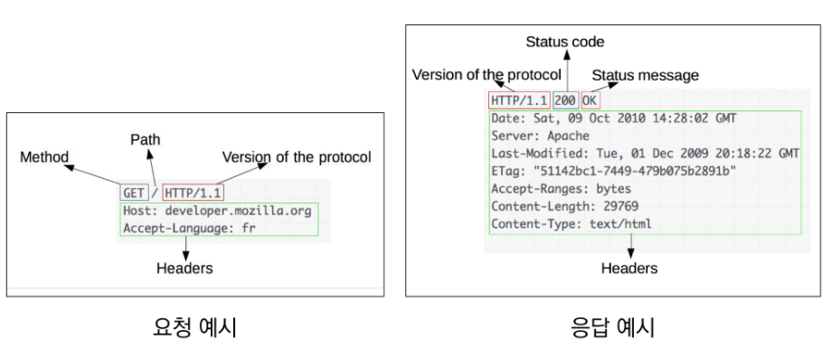
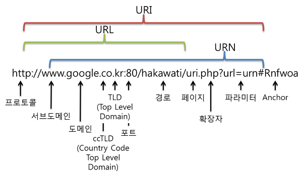
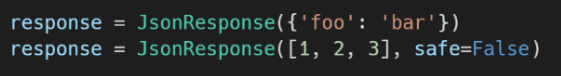

# REST API

## 0. 준비사항

- django, django-seed, django-extensions, 그리고 rest_framework를 설치하여 사용한다.

- Postman 앱을 사용하여 요청을 보내고 응답을 확인할 수 있다.

  (API 개발, 생성 도구)

## 1. HTTP

> **HTTP (HyperText Transfer Protocol)**
>
> 웹 상에서 컨텐츠를 주고 받기 위한 규약. HTML 문서 따위의 리소스를 가져올 수 있도록 하는 프로토콜.

클라이언트에서 *"요청 "* 을 보내고, 서버가 *"응답 "* 을 보내는 것으로 이루어져 있다.

- 특징: 무상태(stateless), 비연결성(connectless)

  ↳ 연결을 지속하지 않기 때문에, 이를 유지하는 것처럼 만들기 위해 *쿠키* 와 *세션* 을 사용한다.

### HTTP 메시지



### HTTP request methods

**자원에 대한 행위**를 정의한다.

- 조회: GET
- 작성: POST
- 수정: PUT
- 삭제: DELETE

### HTTP response status codes

특정 HTTP 요청이 성공적으로 완료되었는지 여부를 메시지와 함께 나타낸다.

- 1xx: Informational responses
- 2xx: Successful responses
- 3xx: Redirection responses
- 4xx: Client error responses
- 5xx: Server error responses

[공식 문서 참고하기](https://developer.mozilla.org/en-US/docs/Web/HTTP/Status/)

### 리소스

> HTTP 요청의 대상. URI를 통해 식별된다.

#### URI (통합 자원 식별자)

- URI의 구성요소
  - URL (Uniform Resource Locator, 통합 자원 위치)
  - URN (Uniform Resource Name, 통합 자원 이름)

  URL은 바뀔 수 있지만, URN은 위치에 영향을 받지 않는 본질적인 주소이다.

  URL을 URI와 같은 의미로 사용하기도 한다.

- URI의 구조

  

- Scheme (Protocol): 브라우저가 사용해야 하는 프로토콜 (http(s), data, file, ftp, mailto 등)

- Host (Domain name): 요청을 받는 웹 서버의 이름 (IP address를 직접 사용하기는 불편하므로 잘 사용하지 않음)

- Port: 웹 서버 상의 리소스에 접근하기 위해 사용되는 기술적인 '문(gate)'

  - 표준 포트
    - HTTP 80
    - HTTPS 443

- Path: 웹 서버 상의 리소스 경로. 즉, 자원의 위치.

  초기에는 실제 파일의 물리적 위치를 나타냈지만, 현재는 추상화된 의미론적 구조로 표현된다.

- Query (Identifier): 웹 서버에 제공되는 추가적인 매개변수. (물음표 이후로 나오는 키=값 형태의 값들)

  - &로 구분되어 나열된다.

- Fragment: 자원 안에서 북마크의 한 종류로, 브라우저에게 해당 문서(HTML)의 특정 부분을 보여주기 위한 방법. "anchor" (#으로 시작되는 부분)
  - 대주제, 소주제들이 있을 때 해당 주제로 바로 연결되도록 해준다.
  - 즉, 자원 안에서 특정 부분의 위치를 알려준다.
  - "브라우저"에게 알려주는 요소이다. 서버에 보내지는 부분은 아니다.

## 2. RESTful API

보다 자세한 내용은 [여기](https://velog.io/@kjh03160/%EA%B7%B8%EB%9F%B0-REST-API%EB%A1%9C-%EA%B4%9C%EC%B0%AE%EC%9D%80%EA%B0%80) 읽어보기

### API

> **API (Application Programming Interface)**
>
> *"프로그래밍을 통해" 애플리케이션과 소통하는 방법.*
>
> 프로그래밍 언어가 제공하는 기능을 수행할 수 있게 만든 인터페이스
>
> - CLI, GUI와 같은 흐름임

> **Web API**
>
> 웹 애플리케이션 개발에서 다른 서비스에 요청을 보내고 응답을 받기 위해 정의된 명세.

- HTML, XML, <u>JSON</u> 등의 타입으로 응답한다.


### REST

> **REST (Representation State Transfer)**
>
> API Server를 개발하기 위한 일종의 소프트웨어 설계 방법론.
>
> - 로이 필딩
>
> - 네트워크 구조 원리의 모음
>
>   ⇢ <u>자원을 정의하고 자원에 대한 주소를 지정하는 전반적인 방법</u>
>
> - REST 원리를 따르는 시스템을 "RESTful"이라고 한다.

- ⭐규칙: 자원, 행위, 표현

  - '자원'(정보)은 **URI**로 작성하자.

  - 자원에 대한 '행위'는 **HTTP Method**로 결정하자: GET, POST, PUT, DELETE

  - 결과물에 대한 '표현'은 **JSON** 형식으로 하자.

    > **JSON (JavaScript Object Notation)**
    >
    > - 가벼운 데이터 교환 포맷
    > - 타입은 '문자열'이다.
    > - 특징:
    >   - 사람이 읽거나 쓰기 쉽고, 파싱(해석, 분석)하고 만들어내기 쉽다.
    >   - 파이썬의 딕셔너리처럼 key-value 형태의 구조를 가진다.


### RESTful API

> REST 원리를 따라 설계한 API


## 3. Response

※ 참고: 더미 객체 생성

django-seed 를 이용:

```bash
$ python manage.py seed 앱이름 --number=20
```

### 1) JsonResponse 객체를 활용하기

딕셔너리를 리스트에 넣고, 이를 JsonResponse 응답 객체에 인자로 넣는다.

```python
# JsonResponse 객체를 활용한 응답
from django.http.response import JsonResponse, HttpResponse
from .models import Article

def article_json_1(request):
    articles = Article.objects.all()
    articles_json = []

    for article in articles:
        articles_json.append(
            {
                'id': article.pk,
                'title': article.title,
                'content': article.content,
                'created_at': article.created_at,
                'updated_at': article.updated_at,
            }
        )
    return JsonResponse(articles_json, safe=False)
```

- application/json 이라는 content type을 가진다. 

  (* html은 text/html)

- dict 외의 객체를 직렬화(serialization)하려면, `safe=False`로 지정해 주어야 한다.

  

#### Serialization

> "데이터 구조나 객체 상태를 동일하거나 다른 컴퓨터 환경에 저장하고, 나중에 재구성할 수 있는 포맷으로 변환하는 과정"
>
> ⇒ 즉, QuerySet이나 Model Instance 같은 복잡한 데이터를, JSON, XML 등으로 쉽게 변환할 수 있는 형태의 Python  데이터 타입으로 만드는 과정이다.

### 2) Serializer을 활용하기

```python
# serializer 사용
from django.http.response import HttpResponse
from django.core import serializers
from .models import Article

def article_json_2(request):
    articles = Article.objects.all()
    data = serializers.serialize('json', articles)
    return HttpResponse(data, content_type='application/json')
```

내장 serializers 모델을 사용하고, 내장 HttpResponse 응답 객체를 활용한 방법이다.

`serializers.serialize(변환할 타입, 데이터)`

### 3) Django REST Framework (DRF) 라이브러리를 사용하기 ⭐

> **Django REST Framework(DRF)**
>
> Web API 구축을 위한 강력한 toolkit을 제공하는 라이브러리.
>
> - DRF의 Serializer는 Django의 Form 및 ModelForm 클래스와 매우 유사하게 구성되고 작동한다.

```python
# serializers.py
from rest_framework import serializers
from .models import Article

class ArticleSerializer(serializers.ModelSerializer):

    class Meta:
        model = Article
        fields = '__all__'
```

- ModelSerializer: 모델에 맞춰 자동으로 필드를 생성해 serialize를 해준다.

```python
# views.py

# DRF 라이브러리를 사용
from rest_framework.decorators import api_view
from rest_framework.response import Response
from .serializers import ArticleSerializer
from .models import Article

# @api_view(['GET'])
@api_view()
def article_json_3(request):
    articles = Article.objects.all()
    serializer = ArticleSerializer(articles, many=True)
    return Response(serializer.data)
```

- `@api_view()` 데코레이터는 기본적으로 'GET'을 의미한다.

  ↳ 어떤 HTTP 메서드를 받을지 지정해준다.

  ↳ 필수 요소

- `모델Serializer(Queryset data, many 옵션)`

- DRF의 응답 클래스로 응답을 보내며, DRF 라이브러리에서 UI도 제공해준다.


# 4. Single Model

단일 모델에서의 DRF 살펴보기

### ModelSerializer

> 모델 필드에 속하는 필드로 구성된 Serializer 클래스를 자동으로 만들 수 있는 클래스
>
> - 모델 정보에 맞춰 자동으로 필드를 생성해준다.
> - serializer에 대한 유효성 검사기를 자동으로 생성해준다.
> - `.create()`와 `.update()` 의 간단한 기본 구현을 포함한다.

```python
@api_view(['GET'])
def article_json_3(request):
    articles = get_list_or_404(Article)
    serializer = ArticleSerializer(articles, many=True)
    return Response(serializer.data)
```

- `get_list_or_404`: 하나의 객체를 가져올 때 `get_object_or_404`라면, 이는 복수 객체를 가져올 때

- `many` 옵션: 단일 객체가 아닌, 다중 객체 또는 쿼리셋일 경우에는 many 옵션을 True로 지정해야 한다.

  *"Serializing multiple objects"*

- <u>DRF 뷰 함수는 `@api_view()` 데코레이터를 필수로 요한다!</u>


# 5. 1:N Relation

### Models

```python
from django.db import models

# Create your models here.
class Artist(models.Model):
    name = models.CharField(max_length=200)

class Music(models.Model):
    artist = models.ForeignKey(Artist, on_delete=models.CASCADE)
    title = models.CharField(max_length=200)
```

Artist : Music = 1 : N 관계를 맺고 있다.

외래키 필드인 'artist'가 Music 모델 클래스에 존재한다.

### Serializers

```python
from rest_framework import serializers
from .models import Artist, Music

class ArtistListSerializer(serializers.ModelSerializer):

    class Meta:
        model = Artist
        fields = ('id', 'name',)

        
class MusicListSerializer(serializers.ModelSerializer):

    class Meta:
        model = Music
        fields = ('id', 'title',)


class MusicSerializer(serializers.ModelSerializer):

    class Meta:
        model = Music
        fields = '__all__'
        read_only_fields = ('artist',)	# 외래키 필드이므로 읽기 전용으로 둔다 (입력 X)


class ArtistSerializer(serializers.ModelSerializer):
    # music_set = serializers.PrimaryKeyRelatedField(many=True, read_only=True)
    music_set = MusicSerializer(many=True, read_only=True)	# 역참조
    ## 개수 세기
    music_count = serializers.IntegerField(source='music_set.count', read_only=True)

    class Meta:
        model = Artist
        fields = '__all__'
```

- `read_only_fields`

  외래키 필드는 클라이언트가 입력하는 정보가 아니므로 해당 정보는 form-data로 넘겨지지 않는다.

  때문에, 직렬화 과정에서 해당 필드가 유효성 검사(is_valid)를 통과하지 못한다.

  → 따라서, 읽기 전용 필드 설정을 통해 직렬화하지 않고 반환 값에만 해당 필드가 포함되도록 설정할 수 있다.

- #### 1:N Serializer

  1. 기존 필드를 override: `PrimaryKeyRelatedField`, Nested relationships

     (1) PrimaryKeyRelatedField

     ```python
     music_set = serializers.PrimaryKeyRelatedField(many=True, read_only=True)
     ```

     - pk를 사용하여 관계된 대상을 나타낼 때 사용할 수 있다.
     - 필드가 N을 나타내는 데 사용되는 경우, `many=True` 속성을 지정해 주어야 한다.
     - 입력값을 받지 않으므로 `read_only=True` 설정도 해주어야 한다.

     (2) Nested relationships

     ```python
     music_set = MusicSerializer(many=True, read_only=True)
     ```

     - 이때, 코드에 포함된 serializer 클래스가 작성되는 클래스 보다 위에 위치해야 한다.

       <br/>

  2. 새로운 필드를 추가

     별도의 값을 만들기 위한 필드를 사용하려는 경우에는 자동으로 구성되는 매니저가 없으므로 직접 필드를 작성해야 한다.

     ```python
     music_count = serializers.IntegerField(source='music_set.count', read_only=True)
     ```

     - `source` 인자: 필드를 채우는 데에 사용할 속성의 이름
     - dot notation을 통해 속성을 탐색한다.

### Views

```python
from django.shortcuts import get_list_or_404, get_object_or_404, render
from rest_framework.decorators import api_view
from rest_framework.response import Response
from rest_framework import status
from rest_framework.serializers import Serializer
from .models import Artist, Music
from .serializers import ArtistListSerializer, ArtistSerializer, MusicListSerializer, MusicSerializer

# Create your views here.

@api_view(['GET', 'POST'])
def artist_list(request):
    if request.method == 'GET':
        artists = get_list_or_404(Artist)
        serializers = ArtistListSerializer(artists, many=True)
        return Response(serializers.data)
    elif request.method == 'POST':
        serializer = ArtistSerializer(data=request.data)
        if serializer.is_valid(raise_exception=True):
            serializer.save()
            return Response(serializer.data, status=status.HTTP_201_CREATED)


@api_view(['GET'])
def artist_detail(request, artist_pk):
    artist = get_object_or_404(Artist, pk=artist_pk)
    serializer = ArtistSerializer(artist)
    return Response(serializer.data)


@api_view(['POST'])
def create_music(request, artist_pk):
    artist = get_object_or_404(Artist, pk=artist_pk)
    serializer = MusicSerializer(data=request.data)
    if serializer.is_valid(raise_exception=True):
        serializer.save(artist=artist)	# 외래키 필드의 정보를 따로 넣어주어야 한다.
        return Response(serializer.data, status=status.HTTP_201_CREATED)


@api_view(['GET'])
def music_list(request):
    music = get_list_or_404(Music)
    serializers = MusicListSerializer(music, many=True)
    return Response(serializers.data)


@api_view(['GET', 'PUT', 'DELETE'])
def music_detail(request, music_pk):
    music = get_object_or_404(Music, pk=music_pk)
    if request.method == 'GET':
        serializer = MusicSerializer(music)
        return Response(serializer.data)
    elif request.method == 'PUT':
        serializer = MusicSerializer(instance=music, data=request.data)
        if serializer.is_valid(raise_exception=True):
            serializer.save()
            return Response(serializer.data)
    elif request.method == 'DELETE':
        music.delete()
        data = {
            'delete': {music_pk}
        }
        return Response(data, status=status.HTTP_204_NO_CONTENT)
```


# 6. 구현 예시 코드

### Models

```python
# models.py

from django.db import models

class Article(models.Model):
    title = models.CharField(max_length=100)
    content = models.TextField()
    created_at = models.DateTimeField(auto_now_add=True)
    updated_at = models.DateTimeField(auto_now=True)


class Comment(models.Model):
    article = models.ForeignKey(Article, on_delete=models.CASCADE)
    content = models.TextField()
    created_at = models.DateTimeField(auto_now_add=True)
    updated_at = models.DateTimeField(auto_now=True)

    def __str__(self):
        return self.content

```

### Serializers

```python
from rest_framework import serializers
from .models import Article, Comment

# 여러 개는 list로 만듦
class ArticleListSerializer(serializers.ModelSerializer):

    class Meta:
        model = Article
        fields = ('id', 'title',)


class CommentSerializer(serializers.ModelSerializer):

    class Meta:
        model = Comment
        fields = '__all__'
        read_only_fields = ('article',) # 입력 안 받음 -> 입력값 없어도 validation 체크 통과
        # depth = 1   # nested 방법에서, x단계 더 깊이 있는 데이터까지 보여준다.


class ArticleSerializer(serializers.ModelSerializer):
    ## 게시물에 달린 댓글 모두 가져오기
    # 방법1
    comment_set = serializers.PrimaryKeyRelatedField(many=True, read_only=True)
    # 방법2: nested
    comment_set = CommentSerializer(many=True, read_only=True)
    
    ## 댓글 개수 출력
    comment_count = serializers.IntegerField(source='comment_set.count', read_only=True)
    
    ## 첫 번째 댓글 가져오기
    # 방법1: 모델의 __str__에 설정한 값 나옴
    comment_first = serializers.CharField(source='comment_set.first', read_only=True)
    # 전체 정보 나옴
    comment_first = CommentSerializer(source='comment_set.first', read_only=True)

    ## 만약 댓글 중 id 값이 15 이하인 댓글을 찾고 싶다면?
    # 아래 함수의 결과값을 내용으로 갖는다
    comment_filter = serializers.SerializerMethodField('less_15')
    
    def less_15(self, article):
        qs = Comment.objects.filter(pk__lte=15, article=article)
        serializer = CommentSerializer(instance=qs, many=True)
        return serializer.data

    class Meta:
        model = Article
        fields = '__all__'
```


### Urls

```python
from django.urls import path
from . import views

urlpatterns = [
    path('articles/', views.article_list),
    path('articles/<int:article_pk>/', views.article_detail),
    path('comments/', views.comment_list),
    path('comments/<int:comment_pk>/', views.comment_detail),
    path('articles/<int:article_pk>/comments/', views.comment_create),
]
```


### Views

```python
from rest_framework.response import Response
from rest_framework import status	# 요청 처리의 상태 정보를 표시해준다.
from rest_framework.decorators import api_view

from django.shortcuts import get_list_or_404, get_object_or_404, render

from articles.serializers import ArticleListSerializer, ArticleSerializer, CommentSerializer
from .models import Article, Comment


@api_view(['GET', 'POST'])  # 404 에러를 json으로 보내줌 (없으면, HTML로 보여짐)
def article_list(request):

    if request.method == 'GET':
        articles = get_list_or_404(Article) # QuerySet
        serializers = ArticleListSerializer(articles, many=True)   # Serialization
        return Response(serializers.data)

    elif request.method == 'POST':
        serializer = ArticleSerializer(data=request.data)
        if serializer.is_valid(raise_exception=True):
            # raise_exception=True는 기본적으로 문제가 있을 경우 HTTP 400 코드를 응답
            serializer.save()
            return Response(serializer.data, status=status.HTTP_201_CREATED)
       		## 아래 방법을 사용 or raise_exception 옵션을 사용
        	# return Response(serializer.errors, status=status.HTTP_400_BAD_REQUEST)  

            
@api_view(['GET', 'DELETE', 'PUT'])
def article_detail(request, article_pk):

    article = get_object_or_404(Article, pk=article_pk)
    if request.method == 'GET':
        serializer = ArticleSerializer(article)
        return Response(serializer.data)

    elif request.method == 'DELETE':
        article.delete()
        data = {
            'delete': f'데이터 {article_pk}번이 삭제되었습니다.'
        }
        return Response(data, status=status.HTTP_204_NO_CONTENT)

    elif request.method == 'PUT':
        serializer = ArticleSerializer(article, data=request.data)
        # serializer = ArticleSerializer(instance=article, data=request.data)
        if serializer.is_valid(raise_exception=True):
            serializer.save()
            return Response(serializer.data)

        
@api_view(['GET'])
def comment_list(request):
    if request.method == 'GET':
        comments = get_list_or_404(Comment)
        serializer = CommentSerializer(comments, many=True)
        return Response(serializer.data)

    
@api_view(['GET', 'PUT', 'DELETE'])
def comment_detail(request, comment_pk):
    comment = get_object_or_404(Comment, pk=comment_pk)
    if request.method == 'GET':
        serializer = CommentSerializer(comment)
        return Response(serializer.data)

    elif request.method == 'PUT':
        serializer = CommentSerializer(comment, data=request.data)
        if serializer.is_valid(raise_exception=True):
            serializer.save()
            return Response(serializer.data)

    elif request.method == 'DELETE':
        comment.delete()
        data = {
            'delete': f'댓글 {comment_pk}번이 삭제되었습니다.'
        }
        return Response(data, status=status.HTTP_204_NO_CONTENT)

    
@api_view(['POST'])
def comment_create(request, article_pk):
    article = get_object_or_404(Article, pk=article_pk)
    serializer = CommentSerializer(data=request.data)
    if serializer.is_valid(raise_exception=True):
        serializer.save(article=article)  # 외래키 필드는 입력 안 받으니까 저장 전 직접 넣어주기
        return Response(serializer.data, status=status.HTTP_201_CREATED)
```

- status 모듈

  DRF에는 status code를 보다 명확하고 읽기 쉽게 해주는 정의된 상수 집합이 제공된다.

  이를 사용함으로써 구체적인 상태 정보를 표시할 수 있도록 만들 수 있다.

- `raise_exception=True`

  *"Raising an exception on invalid data"*

  `is_valid()`의 인자로서, 유효성 검사 오류가 있는 경우 HTTP 400 Bad Request 예외를 발생시킨다.

---

*끝*