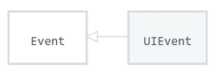

# JavaScript 01

## 0. Intro

Google Chrome, Microsoft Edge, Mozilla Firefox, Safari.

이들은 모두 **<span style="color:navy;">브라우저</span>**라고 하는 것으로, 

> 웹 서버에서 이동하며 클라이언트와 서버 간에 양방향으로 통신하며
>
> HTML 문서와 파일 등을 GUI 기반으로 출력해준다.

### JavaScript

이때, 브라우저 <u>화면을 동적으로</u> 만들어주며, ***브라우저를 조작할 수 있는 유일한 언어*** 가 있는데, 그것이 바로  **<span style="color:navy;">자바스크립트</span>**이다.

<br/>

JavaScript의 역사를 간략히 알아보자면:											(참고영상은 [여기](https://www.youtube.com/watch?v=wcsVjmHrUQg))

#### 역사

- 핵심인물

  - 팀 버너스리 (Tim Berners-Lee)

    : WWW, URL, HTTP, HTML의 최초 설계자. "웹의 아버지"

  - 브랜든 아이크 (Brendan Eich)

    : JavaScript의 최초 설계자. 모질라 재단 공동 설립자. Codename Phoenix 프로젝트 진행 (Firefox의 전신)

- JavaScript의 탄생

  **[1993]** UI를 갖춘 Mosaic Web Browser가 시장에 등장.

  개발자는 Marc Andreessen. 대학 졸업 후, 넷스케이프 사를 설립한다.

  **[1994]** Netscape Communications 의 Netscape Navigator(NN) 브라우저의 점유율이 80% 이상으로, 브라우저의 표준 역할을 하던 시절

  - 9월

    : 넷스케이프 사에 재직 중이던 Brandon Eich가 동적인 웹사이트를 만들 수 있는 JavaScript를 개발하게 됨

  - 이름: Mocha ⇢ LiveScript ⇢ JavaScript (1995)

    ~~(당시 Java의 인기에 편승하기 위해 이름을 JavaScript로 바꿈)~~

  **[1995]** Microsoft 사에서 자바스크립트를 역공학하여 JScript를 만듦, Internet Explorer의 등장.

  👉 자체적인 자바스크립트로 인해 **<span style="color:green;">크로스 브라우징</span>** 등의 이슈가 발생했다.

  > **크로스 브라우징 (Cross Browsing)**
  >
  > - 브라우저마다 렌더링에 사용하는 엔진이 다르기 때문에 발생하는 문제
  >
  >   → W3C에서 채택된 표준 웹 기술을 채용하여, 각각의 브라우저마다 다른 구현 기술을 비슷하게 만들되 어느 한쪽으로 너무 치우치지 않도록 웹 페이지를 제작하는 방법론
  >
  >   : 동일성이 아닌 동등성

  **[1996]** 넷스케이프 사가 ECMA International에 JavaScript의 표준화를 제안

  **[1997]** ECMAScript 1

- 제1차 브라우저 전쟁 (1996 ~ 2008)

  *넷스케이프 vs 마이크로소프트*

  **[1997]** IE 4 발표. 90%에 육박하던 Windows OS 의 시장 점유율과 공격적 마케팅에 힘입어, IE가 시장을 장악하기 시작.

  **[1998]** 브랜든 아이크와 그의 팀이 넷스케이프 사를 나와, 모질라 재단을 설립. Firefox 개발. 이후 점유율 꾸준히 상승.

  

  **[2000]** 당시 최고의 점유율을 누리던 MS 사는 IE가 표준이라고 얘기하며 ECMAScript 표준안에 적극적으로 참여하지 않음.

  **[2004]** Jesse James Garrett의 AJAX 발표.

  **[2008]** Google의 Chrome 브라우저 발표. ⭐ 

  ​	웹 표준을 가장 잘 지키며, JIT compilation이라는 강력한 엔진을 갖춘 브라우저로서 급속하게 시장 점유율을 확대함.

- 제2차 브라우저 전쟁 (2009 ~ )

  **[2009]** ECMAScript 5

  **[2011]** 3년 만에 Firefox의 점유율을 돌파하고, Chrome이 전세계 점유율 1위를 탈환.

  **[2015]** **ECMAScript 6**. 오늘날 자바스크립트의 모습을 갖추기 시작한 버전.

- JavaScript ES6+

  자바스크립트가 표준화되면서, 기존에 브라우저 간의 차이를 극복하기 위해 사용했던 라이브러리들을 더이상은 잘 사용하지 않게 되었다.

  이후로 문제점들을 해결한 순수한 자바스크립트의 활용이 증대되었고, 이러한 기본적인 자바스크립트를 *"Vanilla JavaScript"* 라고 부른다.

<br/>

## 1. DOM (Document Object Model)

> **문서를 구조화하고, 구조화된 구성요소를 하나의 객체로 취급하여 다루는 논리적 트리 모델**
>
> 
>
> - HTML, XML 과 같은 문서를 다루기 위한 문서 프로그래밍 인터페이스
> - 문서의 각 요소를 객체로 취급함으로써, JavaScript 를 사용하여 각 요소(객체)를 조작할 수 있다.
> - 주요 객체
>   - window: 최상위 객체. DOM을 표현하는 창. (작성 시 생략 가능)
>   - document: 페이지 컨텐츠의 entry point 역할을 하며, `<body>` 등의 수많은 요소들을 포함.
>   - navigator, location, history, screen

### DOM 해석: 파싱 (Parsing)

브라우저가 문자열을 해석하여 DOM 트리로 만드는 과정을 *"파싱"* 이라 한다.

브라우저는 아래 그림과 같이 코드를 파싱하고 구조화된 화면을 출력해준다

: 구조를 맞추고 - 스타일링 - 레이아웃 - 출력


​																																	(출처: [여기](https://hacks.mozilla.org/2017/08/inside-a-super-fast-css-engine-quantum-css-aka-stylo/))

>  **[참고] BOM (Browser Object Model)**
>
> JavaScript와 브라우저가 소통하기 위한 모델.
>
> 브라우저의 창이나 프레임을 추상화해서 프로그래밍적으로 제어할 수 있도록 제공하는 수단.


### DOM 조작

**<span style="color:red;">순서: 1) 선택 2) 변경</span>**

#### DOM 관련 객체의 상속 구조


- EventTarget

  : Event Listener를 가질 수 있는 객체가 구현하는 DOM 인터페이스

- Node

  : 여러 DOM 타입들이 상속하는 인터페이스

- Element/Document

  - Element
    - Document 안의 모든 객체가 상속하는 가장 범용적인 기반 클래스
    - 부모인 Node와, 그 부모인 EventTarget의 속성을 상속
  - Document
    - 브라우저가 불러온 웹 페이지를 나타냄
    - DOM 트리의 진입점(entry point) 역할을 수행

- HTMLElement

  : 모든 종류의 HTML 요소. 부모 element의 속성을 상속.

#### 1) 선택 메서드

- Document**<span style="color:blue;">.querySelector(selector)</span>**

  : 제공한 선택자와 일치하는 element를 <u>하나</u> 선택할 때

  - 제공한 [CSS selector](https://developer.mozilla.org/ko/docs/Web/CSS/CSS_Selectors)를 만족하는 첫 번째 element 객체를 반환한다 (없으면 null).

  - 선택자 문구가 '문자열'로 들어간다.

    (예) `document.querySelector('#id')`

- Document**<span style="color:blue;">.querySelectorAll(selector)</span>**

  : 제공한 선택자와 일치하는 element를 <u>여러 개</u> 선택할 때

  - 선택자 문구가 '문자열'로 들어간다.

    (예) `document.querySelectorAll('.name')`

  - 지정된 선택자에 일치하는 **NodeList**를 반환한다.

- 기타

  - Document.getElementById(id): id 값으로 가져오기. 반환값: 단일 element.
  - Document.getElementsByTagName(name): tag 값으로 가져오기. 반환값: HTMLCollection.
  - Document.getElementsByClassName(names): class명으로 가져오기. 반환값: HTMLCollection.

- 그러나, 기타 메서드는 사용하지 않고 위의 두 개 메서드를 주로 사용할 이유:

  👉 선택자로 id, class, 그리고 tag를 모두 사용가능하다!

>**NodeList & HTMLCollection**
>
>- 공통점: 배열처럼 각 항목에 접근하기 위한 index를 제공한다.
>
>- 차이점:
>
>  - HTMLCollection: name, id, index 속성으로 접근 가능하다.
>  - NodeList: index 로만 접근 가능하다. 단, HTMLCollection과 달리 배열에서 사용하는 forEach 함수 및 다양한 메서드를 사용 가능하다.
>
>- 둘 다 Live Collection으로, DOM의 변경사항을 실시간으로 반영하지만,
>
>  **<u>*<span style="color:purple;">`querySelectorAll()`에 의해 반환되는 NodeList는 Static Collection에 속하며, DOM의 변경사항이 실시간으로 반영되지 않는다!</span>*</u>**
>
>- 예시
>
>  ```html
>  <!DOCTYPE html>
>  <html lang="en">
>  <head>
>    <meta charset="UTF-8">
>    <meta http-equiv="X-UA-Compatible" content="IE=edge">
>    <meta name="viewport" content="width=device-width, initial-scale=1.0">
>    <title>Document</title>
>    <style>
>      .txt-blue {color: blue;}
>      .txt-red {color: red;}
>  
>    </style>
>  </head>
>  <body>
>    <ul class="list">
>      <li class="txt-blue">1번</li>
>      <li class="txt-blue">2번</li>
>      <li class="txt-blue">3번</li>
>      <li class="txt-blue">4번</li>
>      <li class="txt-blue">5번</li>
>      <li class="txt-red">6번</li>
>    </ul>
>  
>    <script>
>      // 1) Live Collection
>      const $li = document.getElementsByClassName('txt-blue')
>      for (let i = 0; i < $li.length; i++) {   // $li가 for문 돌면서 계속 바뀜
>      console.log($li[i])
>      $li[i].className = 'txt-red'   // 갱신되는 순간 $li에 변화 연동됨
>      }
>  
>  	// 2) Static Collection
>      const $li = document.querySelectorAll('.txt-blue')  // 저장 순간, 박제
>      for (let i = 0; i < $li.length; i++) {
>        console.log($li[i])
>        $li[i].className = 'txt-red'
>      }
>    </script>
>  </body>
>  </html>
>  ```
>
>  ##### 1)의 결과
>
>  
>
>  ##### 2)의 결과
>
>  

#### 2) 변경 메서드

*변경 전에 선택하는 거 잊지 말기!!*

- Document**<span style="color:blue;">.createElement()</span>**

  : 작성한 태그 명의 HTML 요소를 생성하여 반환

- Element**<span style="color:blue;">.append()</span>**

  : 특정 부모 Node의 자식 NodeList 중, 마지막 자식 다음에 Node 객체나 DOMString을 삽입

  - 복수 개의 Node 객체나 DOMString을 추가할 수 있다.
  - 반환값이 없다.

- Node**<span style="color:blue;">.appendChild()</span>**

  : 하나의 Node를 특정 부모Node의 자식 NodeList의 마지막 자식으로 삽입 (Node만 추가 가능)

  - 한 번에 하나의 Node 객체만 추가할 수 있다.
  - 주어진 Node가 이미 문서에 존재하는 다른 Node를 참조한다면, 새로운 위치로 이동한다.

  > **부모노드.append() vs 부모노드.appendChild()**
  >
  > ---
  >
  > - append()는 DOMString 객체도 가능하지만, appendChild()는 Node 객체만 가능하다.
  > - append()는 반환값이 없지만, appendChild()는 추가된 Node 객체를 반환한다.
  > - append()는 한 번에 여러 개를 추가할 수 있지만, appendChild()는 한 번에 하나만 가능하다.

  <br/>

- 변경 관련 속성

  - Node**<span style="color:blue;">.innerText</span>**

    : Node 객체와 그 자손의 text contents(DOMString)를 표현

  - Element**<span style="color:blue;">.innerHTML</span>**

    : 요소 내에 포함된 HTML 마크업을 반환

  > **비교**
  >
  > - innerText에 문자열로 작성한 태그는 태그로 인식되지 않는다.
  >
  > - 반면에, innerHTML에 작성한 태그는 태그로 인식된다. 이때문에 악성코드의 삽입과 실행이 가능해서 XSS 공격에 취약해지므로 사용 시 주의가 필요하다.
  >
  >   > **XSS (Cross-site Scripting)**
  >   >
  >   > 공격자가 웹 사이트 클라이언트 측 코드에 악성 스크립트를 삽입해 공격하는 방법

#### 3) 삭제 메서드

- ChildNode**<span style="color:blue;">.remove()</span>**

  : Node가 속한 트리에서 해당 Node를 제거

- Node**<span style="color:blue;">.removeChild()</span>**

  : DOM에서 자식 Node를 제거하고, 제거된 Node를 반환한다.

  :  `부모노드.removeChild(자식노드)`의 형태로 사용된다.

  (: 반환값이 있으므로 변수에 할당이 가능하다.)

  

#### 4) 속성 관련 메서드

 HTML 속성을 조작한다.

- Element**<span style="color:blue;">.setAttribute(name, value)</span>**

  : 지정된 요소의 값을 설정한다 (문자열로 적기)

  속성이 이미 존재하면 그 값을 갱신하고, 존재하지 않았다면 새롭게 추가한다.

- Element**<span style="color:blue;">.getAttribute(attributeName)</span>**

  : 해당 요소의 지정된 값(문자열)을 반환한다.

  

<br/>

## 2. Event Listener

### Event

> 네트워크 활동이나 사용자와의 상호작용 등 사건의 발생을 알리기 위한 객체.
>
> - 이벤트의 종류: [여기](https://developer.mozilla.org/ko/docs/Web/Events)
>
> - 그 중: **UIEvent**
>
>   : 간단한 사용자 인터페이스 이벤트
>
>   

#### Event의 역할

**<span style="color:crimson;">"~하면 ~한다"</span>**를 표현한다!

(예: "<u>클릭</u>하면, <u>경고창을 띄운</u>다.")

#### .addEventListener() ⭐

- EventTarget**<span style="color:blue;">.addEventListener()</span>**

  : 지정한 이벤트가 대상에 전달될 때마다 호출할 함수를 설정한다.

  ```javascript
  target.addEventListener(type, listener[, options])
  ```

  - target: 대상
  - type: 반응할 이벤트 유형 (문자열로 입력)
  - listener: JS function 객체(콜백 함수) 또는 EventListener 인터페이스가 위치하는 곳으로, 지정된 타입의 이벤트가 발생했을 때 알림을 받는 객체

#### .preventDefault(): 이벤트 취소

- Event**<span style="color:blue;">.preventDefault()</span>**

  : 현재 이벤트의 기본 동작을 중단한다. (태그의 기본 동작이 필요하지 않을 경우)

  <u>이벤트를 취소할 수 있는 경우에만</u> 효과가 있다.

  ↳ 예) 스크롤은 이벤트 취소 X.

#### 실습 예제

*CREATE, READ 기능을 갖는 todo app  만들기*

```html
<!DOCTYPE html>
<html lang="en">
<head>
  <meta charset="UTF-8">
  <meta http-equiv="X-UA-Compatible" content="IE=edge">
  <meta name="viewport" content="width=device-width, initial-scale=1.0">
  <title>Document</title>
</head>
<body>
  <form action="">
    <input type="text">
    <button type="submit">Add</button>
  </form>
  <ul></ul>
  <script>
    const form = document.querySelector('form')

    const addTodo = function (event) {
      event.preventDefault()	// .preventDefault()으로 submit 기능 취소

      const myInput = document.querySelector('input') 
      const todo = myInput.value

      if (todo.trim()) {
        const myLi = document.createElement('li')
        myLi.innerText = todo

        const myUl = document.querySelector('ul')
        myUl.appendChild(myLi)
      } else {
        alert('입력값을 넣어주세요.')
      }
      event.target.reset()
    }

    form.addEventListener('submit', addTodo)
// .addEventListener로, form에 submit event가 발생하면 함수 addTodo를 실행

  </script>
</body>
</html>
```

*끝*

