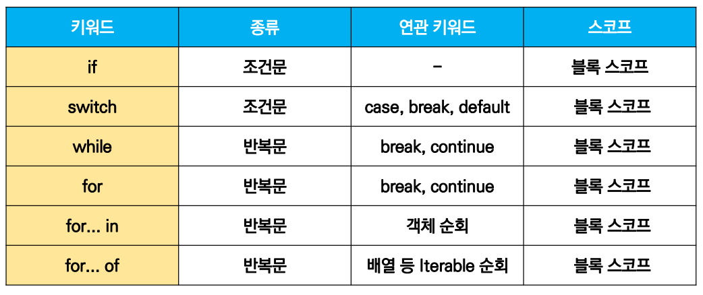
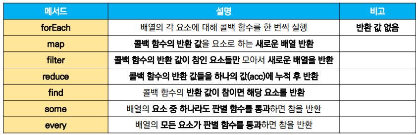

# ECMAScript 6 📑: 조건문·반복문, 함수, 배열과 객체

## 1. 조건문과 반복문

### 조건문(conditions)

- #### if 문

  > 조건식의 결과값을 Boolean으로 변환한 후 참, 거짓을 판단한다.
  >
  > - 조건은 소괄호 안, 코드는 중괄호 안에 작성
  > - 블록 스코프를 생성한다.

  ```javascript
  if (condition) {
      // 처리
  } else if (condition) {
      // 처리
  } else {
      // 처리
  }
  ```

  

- #### switch 문

  > 조건식의 결과값이 어느 case(값)에 해당하는지 판별한다.
  >
  > 가능한 경우의 수가 많을수록 가독성이 if문보다 좋을 수 있다.
  >
  > - break와 default 문은 optional
  >
  > - break 문이 없으면 break문을 만나거나, default문을 실행할 때까지 다음 조건문을 계속 실행한다.
  > - 블록 스코프를 생성한다.

  ```javascript
  switch(expression) {
    case 'first value': {
        // 처리
        [break]
    }
    case 'second value': {
        // 처리
        [break]
    }
    [default: {
        // 처리
    }]
  }
  ```

<br/>

### 반복문(loops)

- #### while

  > 조건문이 참인 동안 반복
  >
  > - 조건은 소괄호 안에, 실행할 코드는 중괄호 안에
  > - break문은 선택적으로 작성할 수 있다.
  > - 블록 스코프를 생성한다.

  ```javascript
  while (condition) {
      // 처리
  }
  ```

  

- #### for

  > - initialization: 최초 반복문 진입시 1회만 실행되는 부분
  > - condition: 매 반복 시행 전 평가되는 부분
  > - expression: 매 반복 시행 이후 평가되는 부분
  > - 블록 스코프를 생성한다.

  ```javascript
  for (initialization; condition; expression) {
      // 처리
  }
  ```

  

- #### for ... <span style="color:navy;">in</span>

  > <span style="color:crimson;">**객체(object)의 속성**을 순회할 때</span>
  >
  > - ***배열 X*** (권장되지 않음)
  > - 블록 스코프를 생성한다.

  ```javascript
  for (variable in object) {
      // 처리
  }
  ```

  ```javascript
  // 예시
  
  const capitals = {
      Korea: '서울',
      France: '파리',
      US: '워싱턴 D.C.',
  }
  
  for (let capital in capitals) {
      console.log(capital)
  }
  ```

  - 결과: Korea

    ​		  France

    ​		  US

- #### for ... <span style="color:navy;">of</span>

  > <span style="color:crimson;">**반복가능한 객체**를 순회할 때</span>
  >
  > ↳ <u>Array</u>, Map, Set, String 등
  >
  > - 블록 스코프를 생성한다.

  ```javascript
  for (variable of iterables) {
      // 처리
  }
  ```

  ```javascript
  // 예시
  
  const fruits = ['딸기', '바나나', '수박']
  
  for (let fruit of fruits) {
      console.log(fruit)
  }
  ```

  - 결과: 딸기

    ​		  바나나

    ​		  수박



<br/>

👉 참고

JavaScript 객체의 value는 점(.) 또는 대괄호 표기법을 사용하여 key 값을 통해 접근이 가능하다.

예) obj.key 또는 obj[key]

때로는 . 이 기능하고, 때로는 [] 가 기능한다.

<br/>

## 2. 함수(functions)

> - 참조 타입 중 하나. function 타입에 속한다.
> - JavaScript의 함수는 ***일급 객체(First-class citizen)***에 해당한다.
>   - **일급 객체**
>     - 변수에 할당 가능하고
>     - 함수의 매개변수로 전달 가능하고
>     - 함수의 반환값으로 사용 가능한 객체

- ### 함수 선언식 (function statement, declaration)

  : 함수의 이름과 함께 정의하는 방식

  - hoisting이 발생할 수 있다 - 사용이 권장되지 않음.

  함수 이름, 매개변수, 그리고 몸통(중괄호)으로 이루어져 있다.

  ```javascript
  function name(args) {
      // do something
  }
  ```

  

- ### 함수 표현식 (function expression) ✔

  : 함수를 표현식 내에서 정의하는 방식

  ​	(*표현식: 어떤 하나의 값으로 결정되는 코드의 단위)

  - 함수의 이름을 생략하고 익명 함수로 정의할 수 있다. (익명 함수는 함수 표현식에서만 가능)
  - 함수 이름 (생략 가능), 매개변수, 그리고 몸통(중괄호)으로 이루어져 있다.

  ```javascript
  const myFunction = function (args) {
      // do something
  }
  ```

- #### 기본 인자

  : 인자 작성 시에, '=' 문자를 사이에 두어 기본 인자를 선언할 수 있다.

  ```javascript
  // 예시
  
  const greeting = function (name = 'noName') {
      console.log(`Hi, ${name}`)
  }
  
  greeting()	// Hi, noName
  ```


### 화살표 함수 (Arrow Function) ⭐

> *자주 사용된다.*
>
> 함수를 비교적 간결하게 정의할 수 있는 문법.
>
> - **function 키워드** 생략 가능
> - 함수의 매개변수가 오직 하나라면, **'( )'** 생략 가능
> - 함수의 몸통이 표현식 하나라면, **'{ }'과 return 키워드**를 생략 가능

```javascript
// 기본 (함수 표현식)
const arrow = function (name) {
    return `hello! ${name}`
}


// 1. function 키워드 생략, 화살표(=>) 추가
const arrow = (name) => {return `hello! ${name}`}

// 2. 함수의 매개변수가 오직 하나이므로, () 생략
const arrow = name => {return `hello! ${name}`}

// 3. 바디의 표현식이 1개이므로, {}와 return 키워드 생략
const arrow = name => `hello! ${name}`
```

<br/>

## 3. 배열과 객체

### 배열(arrays)

> 키와 속성을 담고 있는, 참조 타입의 객체
>
> - 순서를 보장 (⇢ 0 이상의 정수 인덱스로 접근이 가능)
> - 배열 길이는 배열.length

- 주요 기본 메서드

  - `array.reverse()`: 원본 배열의 요소들을 반대로 정렬
  - `array.push()`: 배열의 마지막에 요소 추가
  - `array.pop()`: 배열의 마지막 요소를 제거
  - `array.unshift()`: 배열의 가장 앞에 요소 추가
  - `array.shift()`: 배열의 첫 번째 요소 제거
  - `array.includes(value)`: 배열이 특정 값을 포함하는지 판별 후 참/거짓 반환
  - `array.indexOf(value)`: 배열에 특정 값이 존재하는 경우 첫 번째 일치하는 요소의 인덱스 반환, 없으면 -1을 반환.
  - `array.join([separator])`: 배열의 모든 요소를 separator(구분자)를 사이에 두고 연결하여 반환. (구분자 생략 시, 쉼표가 기본값)

- #### Array Helper Methods ❗ (중요)

  > 배열을 순회하며 특정 로직을 수행하는 메서드
  >
  > - 메서드 호출 시, 인자로 callback 함수를 받는 것이 특징이다.
  >
  >   *callback 함수: 어떤 함수의 내부에서 실행될 목적으로 인자로 넘겨받는 함수

  

- ##### forEach

  `array.forEach(callback(element[, index[, array]]))`

  > 배열의 각 요소에 대해 콜백 함수를 한 번씩 실행한다.
  >
  > 콜백함수의 매개변수 3가지: 배열의 요소, 배열 요소의 인덱스, 배열 자체
  >
  > - 반환(return)값이 없다.

  ```javascript
  // (array function으로 표현)
  
  array.forEach((element, index, array) => {
      // do something
  })
  ```

  ```javascript
  const places = ['광주', '대전', '구미', '서울']
  
  places.forEach((region, index) => {
      console.log(region, index)
      // 광주 0
      // 대전 1
      // 구미 2
     	// 서울 3
  })
  ```

- ##### map

  `array.map(callback(element[, index[, array]]))`

  > 배열의 각 요소에 대해 콜백 함수를 한 번씩 실행하고, <u>콜백 함수의 반환 값을 요소로 하는 새로운 배열을 반환한다.</u>

  ```javascript
  array.map((element, index, array) => {
      // do something
  })
  ```

  ```javascript
  const numbers = [1, 2, 3, 4, 5]
  const doubleNums = numbers.map((num) => {
      return num * 2
  })
  
  console.log(doubleNums)	// [2, 4, 6, 8, 10]
  ```

- ##### filter

  `array.filter(callback(element[, index[, array]]))`

  > 배열의 각 요소에 대해 콜백 함수를 한 번씩 실행하고, <u>콜백 함수의 반환값이 **참인 요소들만** 모아서 새로운 배열을 반환한다.</u>

  ```javascript
  array.filter((element, index, array) => {
      // do something
  })
  ```

  ```javascript
  const numbers = [1, 2, 3, 4, 5]
  const oddNums = numbers.filter((num, index) => {
      return num % 2
  })
  
  console.log(oddNums)	// [1, 3, 5]
  ```

- ##### reduce

  `array.reduce(callback(acc, element[, index[, array]])[, initialValue])`

  > 배열의 각 요소에 대해 콜백 함수를 한 번씩 실행하고, <u>콜백 함수의 반환값들을 하나의 값(acc)에 누적 후 반환한다.</u>
  >
  > - acc: 이전 callback 함수의 반환값이 누적되는 변수
  > - initialValue (optional): 최초 callback 함수 호출 시 acc에 할당되는 값. 기본값은 배열의 첫 번째 값.
  > - 빈 배열의 경우에는 initialValue를 제공해야 한다. (그렇지 않으면, 에러 발생)

  ```javascript
  array.reduce((acc, element, index, array) => {
      // do something
  }, initialValue)
  ```

  ```javascript
  const numbers = [1, 2, 3]
  
  const result = numbers.reduce((acc, num) => {
      return acc + num
  }, 0)
  
  console.log(result)	// 6
  ```

- ##### find

  `array.find(callback(element[, index[, array]]))`

  > 배열의 각 요소에 대해 콜백 함수를 한 번씩 실행하고, <u>콜백 함수의 반환 값이 참이면 해당 요소를 반환한다.</u>
  >
  > - 찾는 값이 배열에 존재하지 않으면, undefined를 반환한다.

  ```javascript
  array.find((element, index, array) => {
      // do something
  })
  ```

  ```javascript
  const friends = [
      { name: 'Tiffany', age:36 },
      { name: 'Fred', age:73 },
      { name: 'Gabriel', age: 15 },
  ]
  
  const result = friends.find((friend) => {
      return friend.name === 'Fred'
  })
  
  console.log(result)	// { name: 'Fred', age:73 }
  ```

- ##### some

  `array.some(callback(element[, index[, array]]))`

  > 배열의 요소 중 <u>하나라도 주어진 판별 함수를 통과하면 참을 반환한다.</u>
  >
  > - 빈 배열은 항상 거짓(false)을 반환한다.

  ```javascript
  array.some((element, index, array) => {
      // do something
  })
  ```

  ```javascript
  const numbers = [1, 3, 5, 7, 9]
  
  const hasEvenNumber = numbers.some((num) => {
      return num % 2 === 0
  })
  console.log(hasEvenNumber) // false
  
  const hasOddNumber = numbers.some((num) => {
      return num % 2
  })
  console.log(hasOddNumber)	// true
  ```

- ##### every

  > 배열의 <u>모든 요소가 주어진 판별 함수를 통과하면 참을 반환한다.</u>
  >
  > - 빈 배열은 항상 참(true)을 반환한다.

  ```javascript
  array.every(element, index, array) => {
      // do something
  }
  ```

  ```javascript
  const numbers = [2, 4, 6, 8, 10]
  
  const isEveryNumberEven = numbers.every((num) => {
      return num % 2 === 0
  })
  console.log(isEveryNumberEven)	// true
  
  const isEveryNumberOdd = numbers.every((num) => {
      return num % 2
  })
  console.log(isEveryNumberOdd)	// false
  ```

<br/>

### 객체(objects)

> 속성(property)의 집합.
>
> 중괄호 내부에서 key와 value의 쌍으로 표현한다.
>
> - key: <u>문자열</u> 타입만 가능 (띄어쓰기 등의 구분자가 있으면 따옴표로 묶어야 한다.)
>
> - value: 모든 타입 가능
>
> - 객체 요소 접근은 **점(.)** 또는 **대괄호**로 가능하다. 
>
>   (key 이름에 구분자가 있는 경우는 대괄호 접근만 가능하다.)

#### 객체 관련 ES6 문법

- ##### 속성명 축약

  > 객체를 정의할 때 *key와 변수의 이름이 같은 경우*

  ```javascript
  // 예시
  let books = ['Learning JS', 'Eloquent JS']
  let magazines = null
  
  // ES5
  var bookShop = {
      books: books,
      magazines: magazines,
  }
  
  // ES6
  var bookShop = {
      books,
      magazines,
  }
  
  console.log(bookShop.books) // ['Learning JS', 'Eloquent JS'] 로 결과 같음
  ```

  

- ##### 메서드명 축약

  > 메서드 선언 시, *function 키워드 생략 가능*

  ```javascript
  // ES5
  var obj = {
      greeting: function () {
          console.log('Hi')
      }
  }
  obj.greeting()	// Hi
  
  // ES6
  const newObj = {
      greeting() {
          console.log('Hi')
      }
  }
  newObj.greeting()	// Hi
  ```

  

- ##### 계산된 속성명 사용하기

  > 객체를 정의할 때, *key의 이름을 표현식을 이용하여 동적으로 생성 가능*

  ```javascript
  const key = 'regions'
  const value = ['광주', '대전', '구미', '서울']
  
  const country = {
      [key]: value,
  }
  
  console.log(country)	// { regions: Array(4) }
  console.log(country.regions)	// ['광주', '대전', '구미', '서울']
  ```

  

- ##### 구조 분해 할당 ✔

  > 배열 또는 객체를 분해하여 속성을 변수에 쉽게 할당할 수 있는 문법
  >
  > *배열도 가능하다.*

  ```javascript
  const userInformation = {
      name: 'Taehee Kim',
      userId: 'lalalahappy123',
      phoneNumber: '010-0000-1111',
      email: 'taehee@taehee.com'
  }
  
  // ES5
  const name = userInformation.name
  const userId = userInformation.userId
  const phoneNumber = userInformation.phoneNumber
  const email = userInformation.email
  
  // ES6
  // 1)
  const { name } = userInformation
  const { userId } = userInformation
  const { phoneNumber } = userInformation
  const { email } = userInformation
  // 2)
  const { name, userId } = userInformation
  ```

#### JSON을 조작하는 내장 메서드

- **JSON.parse()**

  json 파일을 자바스크립트 객체로 바꿔준다.

  ```javascript
  const json = '{"result":true, "count":42}'
  const parsedData = JSON.parse(json)
  
  console.log(parsedData)	// {result: true, count: 42}
  console.log(typeof parsedData)	// object
  ```

  

- **JSON.stringify()**

   자바스크립트 객체를 json 형태로 바꿔준다.

  ```javascript
  const jsonData = JSON.stringify({
      coffee: 'Americano',
      iceCream: 'Cookie and cream',
  })
  
  console.log(jsonData)	// {"coffee":"Americano","iceCream":"Cookie and cream"}
  console.log(typeof jsonData)	// string
  ```


---

*끝*

