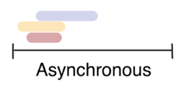
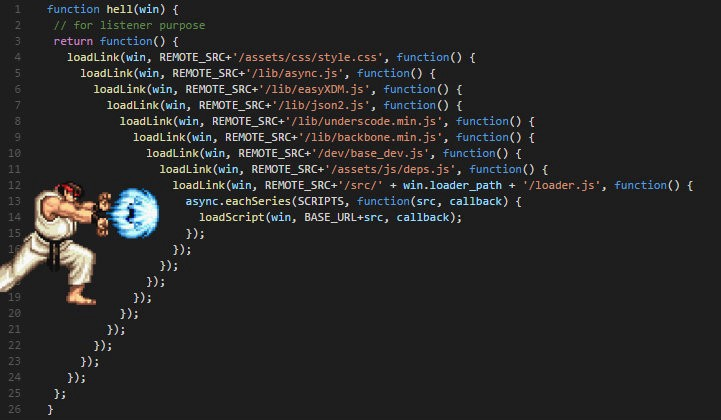

# JavaScript: AJAX 🐠

## 1. AJAX

> **AJAX *(Asynchronous JavaScript And XML, 비동기식 JavaScript와 XML)***
>
> <span style="color: red;">XMLHttpRequest 객체</span>를 활용하여 서버와 통신하며, JSON, XML, HTML 등의 다양한 포맷을 주고 받을 수 있는 기술적 접근법.
>
> (이름에는 XML이 들어가 있지만, 그 외의 여러 포맷을 지원하며, 최근에는 JSON의 사용이 활발하다.)
>
> - 배경
>
>   2005년, Google에서 구글 맵과 지메일 등에 활용되는 기술을 설명하기 위해 최초로 사용되었다.
>
>   특정 기술이 아닌, 기존의 여러 기술을 사용하는 새로운 접근법을 가리키는 용어이다.
>
> - 특징
>
>   - **<span style="color: blue">비동기성</span>** ⭐
>
>     → 페이지 전체를 reload 하지 않고, 필요한 데이터만 받아 일부분만 업데이트 할 수 있다.

- **XMLHttpRequest 객체**

  > *서버와 브라우저 사이에 데이터를 주고받기 위해 사용되는 것*
  >
  > 전체 페이지를 새로고침, 즉 문서 전체를 응답으로 받지 않고 변경된 일부의 데이터에 대해서만 XMLHttpRequest 객체로 받아올 수 있다.
  >
  > - 생성자 함수: `XMLHttpRequest()`

  

## 2. 비동기 JavaScript

#### 동기식(Synchronous)

> 
>
> **요청을 보낸 후, 응답이 올 때까지 다음 동작을 수행하지 않고 대기한다. 응답을 받아야만 다음 동작이 이루어진다.** "*blocking*"
>
> 순차적, 직렬적 수행.
>
> - 코드의 처리 완료 순서가 보장된다.

- 예시 코드

  ```javascript
  <script>
    const btn = document.querySelector('button')
    
    btn.addEventListener('click', function () {
      alert('You clicked the button!')
      const pElem = document.createElement('p')
      pElem.innerText = 'Button was clicked.'
      document.body.appendChild(pElem)
    })
  </script>
  ```

  `alert()` 함수는 동기식이기 때문에, alert 메시지의 확인 버튼을 누를 때까지 문장이 만들어지지 않고 프로그램의 실행이 대기상태가 된다. 

  👉 이유: JavaScript가 single-threaded 이기 때문이다.

  (즉, 일을 처리할 수 있는 스레드가 하나 뿐이므로, 일시에 다른 작업을 처리할 수 없다.)

  > **스레드(threads)**
  >
  > : 프로그램이 작업을 완료하기 위해 사용할 수 있는 단일 프로세스
  >
  > - 각 스레드는 한 번에 하나의 작업만 수행할 수 있다.
  >
  > - 싱글 스레드라면, 작업을 처리할 수 있는 프로세스가 하나 뿐이라는 것 (쉽게 말해, 일처리 하는 직원이 한 명 뿐이다.)
  > - 컴퓨터 CPU의 "멀티 코어"라는 용어와 밀접하게 관련되어 있다. 멀티코어라는 것은 일처리를 할 수 있는 프로세서(직원)가 여러 개라는 뜻이기 때문.

  

#### 비동기식 (Asynchronous)

> 
>
> **요청을 보낸 후, 응답을 기다리지 않고 다음 동작이 이루어진다.** "*non-blocking*"
>
> - 병렬적 수행.
> - 사용하는 이유: <u>사용자 경험(UX)</u>을 향상시켜주기 때문이다.
>   - 동기식 코드라면, 데이터를 모두 불러온 뒤에야 앱이 실행된다. 그때까지는 앱이 모두 멈춘 것처럼 보일 것이다. 사용자가 이를 접한다면 화면이 멈추고 응답이 없는 듯하게 느낄 것이다.
>   - 비동기식 코드라면, 데이터를 가져오면서 앱 실행을 함께 진행한다. 따라서, 앱이 구동되고 있다는 것을 사용자에게 보여줄 수 있다. ⇢ 더 나은 사용자 경험!
>   - 따라서, 현재 많은 웹 API 기능들은 "비동기" 코드로 실행된다.
> - 코드의 처리 완료 순서가 보장되지 않는다.

- 예시 코드

  ```javascript
  const request = new XMLHttpRequest()
  const URL = //url 주소
        
  request.open('GET', URL)	// XMLHttpRequest 메서드
  request.send()				// XMLHttpRequest 메서드
  
  const todo = request.response	// 응답이 오기 전에 실행되어 빈 값이 저장됨
  console.log(todo)
  ```

  위 코드에서는 요청을 보낸 후 응답이 채 오기도 전에 다음 코드가 곧바로 실행되어, 변수 todo에 응답 값이 저장되지 않고 빈 값이 저장된다.

  👉 기다려주지 않는 이유 또한: JavaScript는 single-threaded이기 때문이다.

- 또 다른 예시

  


#### "JavaScript는 single-threaded이다."

이 말인 즉슨, 컴퓨터 CPU가 멀티 코어라도, 자바스크립트에서는 main thread라고 하는 *하나의 스레드에서만* 작업을 수행한다는 것이다.

이를 해결하기 위해, JavaScript는:

(0) 처리해야 할 모든 이벤트들을  <span style="color: orange;">Call stack</span>에 넣어서

(1) 즉시 처리하지 못하는 이벤트들은 → <span style="color: orange;">Web API</span>로 보내서 처리하도록 하고,	 ~~"Web API야, 도와줘!"~~

(2) Web API에서 처리된 이벤트들을 처리된 순서대로  <span style="color: orange;">Task queue</span>로 보내 대기줄을 세워놓고,

(3) Call Stack이 비면,  <span style="color: orange;">Event Loop</span>가 대기줄에서 이벤트를 순서대로 Call Stack으로 보내어 처리가 완료되도록 한다.

이런 과정을 **"동시성 모델 (Concurrency model)"**이라고 부른다.

- *Call Stack* : 요청이 들어올 때마다 요청을 거꾸로 쌓아두고, 역으로(즉, 요청 순서대로) 꺼내어 처리하는 스택 형태의 자료구조 (LIFO)
- *Web API* : (JavaScript가 아닌) 브라우저 영역에서 제공하는 API로, 시간이 소요되는 일들을 처리한다.
  - 예) `setTimeout()`, DOM events, AJAX로 데이터 가져오기
- *Task Queue* : 비동기 처리된 Callback 함수가 대기하는 큐 형태의 자료구조 (FIFO)
- *Event Loop* : Call Stack이 비어있는지 확인하고, 비었을 경우에 Task Queue에서 대기중인 작업들이 있다면 순서대로 Call Stack으로 push 해주는 역할


- `setTimeout()` 함수의 **Zero delays** 문제

  0ms이든 1000ms이든, 실제로 0초 또는 1초 뒤에 callback 함수가 시작된다는 의미가 아니다.

  위의 지연 시간은 JavaScript가 해당 요청을 처리하는 데에 필요한 최소 시간을 지정하는 것이지, 보장된 시간이 아니다.

  즉, 특정 시간을 설정했더라도 대기 중인 메시지의 모든 코드가 완료될 때까지 대기한 후에야 실행된다.

**⇒ 여기서 알아차릴 수 있는 것은, 이벤트가 처리되는 시간에 따라 *코드의 실행 순서가 바뀔 수 있다* 는 것이다. 즉, 코드 작성 순서대로 이벤트가 처리될 것이라고 기대할 수 없다.**

비동기식을 사용하긴 해야 하는데, 이렇게 이벤트의 순서가 말썽이면 제대로 사용하기 힘들다. 그래서 비동기 방식을 (마치 동기 방식에서 순서대로 처리되는 것처럼) 순서를 준수하면서 수행되도록 만들기 위해 2가지 방식을 사용할 수 있다:

### ① 비동기 콜백

> 백그라운드에서 실행을 시작할 함수를 호출할 때 인자로 지정된 함수.
>
> 백그라운드 코드 실행이 끝나면 콜백 함수를 호출하여 작업이 완료되었음을 알리거나 다음 작업을 실행하게 할 수 있다.
>
> - 즉시 실행되는 게 아니라, 특정한 때가 됐을 때 실행된다.
>
>   ⇒ 비동기 로직에서 콜백 함수는 필수가 된다. (명시적인 호출 X. 함수 내에서 특정 시점에 호출.)
>
> - 예) `addEventListener()`의 2번째 인자, addEventListener 함수가 실행돼야 콜백 함수가 실행된다.
>
> - 비동기 처리의 순서 문제는 극복했지만, 연쇄 처리에서 한계에 부딪힌다.
>
>   콜백 함수가 연쇄적으로 나타나게 되면 다음과 같이 안으로 점점 깊이 들어가는 코드가 만들어진다. 흔히 ***콜백 지옥(Callback Hell)***이라고 부른다. 이는 디버깅을 어렵게 하고 코드의 가독성을 현저히 낮춘다.
>
>   

### ② Promise 스타일

> - 비동기 콜백의 연쇄 처리 시의 단점을 보완하는 현대적인 코드 스타일
>
>   (연쇄 처리가 이루어지더라도 안으로 깊어지지 않고 같은 레벨에서 작성된다.)

#### Promise 객체

: 비동기 작업의 최종 완료 또는 실패를 나타내는 객체

- 미래의 완료/실패와 그 결과값을 나타내며, 미래의 어떤 상황에 대한 약속이다.

  - `.then()`: 성공했을 때에 이어 실행할 코드, 즉 성공에 대한 약속

    - 이전 작업의 결과값을 인자로 전달받는다.
    - 여러 개 사용하여(*chaining*) 연쇄 작업을 수행할 수 있다.

  - `.catch()`: 실패했을 때에 실행할 코드, 즉 실패에 대한 약속

    - 이전 작업이 하나라도 실패했을 경우에 실행된다.
    - 실패로 인해 만들어진 error 객체를 인자로 받아 사용할 수 있다.

  - `.finally()`: 성공/실패와 관계없이 실행할 코드

  - ※ <u>반환값(Promise 객체)이 반드시 있어야 한다!</u>

    ↳ 즉, 응답이 와야 다음 코드를 실행하는 것이다. (기다린다!)

**⇒ 순서를 보장해주고, chaining을 사용할 수 있게 해준다.**

---

#### Axios

> *"**Promise-based** HTTP client for the browser and Node.js"* (브라우저를 위한 Promise 기반 클라이언트) (순서 보장하는 Promise 기반~)
>
> 원래는 AJAX 요청을 처리하기 위해 XHR이라는 브라우저 내장 객체가 사용되는데, 이보다 편리한 AJAX 요청을 가능케 한다.
>
> - 확장 가능한 인터페이스와 함께, 사용이 간편한 라이브러리를 패키지로 함께 제공한다.
>
> - 사용: 외부 라이브러리이므로, 설치하거나 CDN을 사용해야 한다.
>
> - [공식 깃헙](https://github.com/axios/axios), 그리고 [참고 자료](https://velog.io/@kysung95/%EA%B0%9C%EB%B0%9C%EC%83%81%EC%8B%9D-Ajax%EC%99%80-Axios-%EA%B7%B8%EB%A6%AC%EA%B3%A0-fetch)
>
> - ```javascript
>   axios.get('https://어쩌고.저쩌고/')	// Promise 객체가 반환됨
>     .then(콜백함수)
>     .then(콜백함수)
>     .catch(..)
>   ```

- 예시 코드

  ```javascript
  const URL = 'https://jsonplaceholder.어쩌구/저쩌구/'
  
  axios.get(URL)	// Promise 객체 반환하며 성공하면, 아래 .then 코드 실행
    .then(response => {	// 위 코드의 응답 객체가 인자(response)로 전달됨
      console.log(response.data)
    })
    .then(data => {
      return data.title
    })
    .catch(error => {
      console.log(error)
    })
    .finally(function () {
      console.log('안녕하세요? 무조건 실행되는 코드예요.')
    })
  ```

---

*끝*

👽 **Tip!**

- Alt키  + B

  ⇢ VSCode에서 html 파일 실행