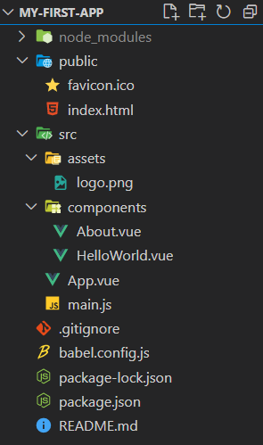

# Vue CLI

## 1. SFC (Single File Component)

(↔ monolithic)

### 컴포넌트

> - 기본 HTML element를 확장하여 **재사용** 가능한 코드의 캡슐화에 도움을 줌
> - 유지보수를 용이하게 하고, 재사용성의 측면에서 강력한 장점을 제공한다.

Vue 컴포넌트는 Vue instance를 말한다.


### SFC (Single File Component)

> Vue의 컴포넌트 기반 개발의 핵심적인 특징으로, **하나의 컴포넌트는 별도로 하나의 .vue 파일에 작성된다.**
>
> 즉, 하나의 화면을 여러 개의 컴포넌트로 나누고, 각 컴포넌트를 별도의 파일로 구성한다.
>
> (단, 모든 컴포넌트가 파일로 구분돼야 하는 것이 아니며, 임의의 기준에 따라 개발을 하면 된다. )
>
> - HTML, JavaScript, CSS를 모두 하나의 파일 안에서 관리할 수 있다.
>
>   
>
> - `Vue 컴포넌트 === Vue 인스턴스 === .vue 파일`
>
> - 처음 개발 시에는 하나의 파일에서 모두 관리하는 것에 비해 시간이 많이 소요되지만, 이후 변수 관리가 더 용이하고 유지보수 비용이 감소하는 효과가 있다.

## 2. Vue CLI

Vue를 CDN으로 이용하지 않고, 설치를 통해 더욱 다양한 도구를 활용할 수 있다.

Vue CLI는 Vue.js 개발을 위한 표준 *도구* 로서, 프로젝트의 구성을 돕는다.

- ### Node.js

> **==JavaScript를 브라우저가 아닌 환경에서도 구동할 수 있도록 하는 JS 런타임 환경==**
>
> 자바스크립트는 애초에 브라우저를 조작할 수 있는 언어로서 브라우저 환경에서만 작동이 가능했는데 이 한계를 극복하게 해주는 환경이다. 
>
> - NPM (Node Package Manager)
>
>   > JavaScript 언어를 위한, Node.js의 기본 패키지 관리자
>   >
>   > - Python의 pip 와 유사한 역할
>   > - 다양한 의존성 패키지들을 관리한다.

- 설치: [참고](https://cli.vuejs.org/guide/installation.html)

  ```shell
  $ npm install -g @vue/cli
  ```

- 프로젝트 생성

  ```shell
  $ vue create first-app
  ```

- 프로젝트 디렉토리 이동하고, 서버 실행하며 시작

  ```shell
  $ cd my-first-app
  $ npm run serve
  ```

- ### Vue CLI 파일 구조: Babel & Webpack

  - Babel (`babel.config.js`)

    > **JavaScript ==컴파일러==. 즉, JavaScript의 ES6 이후 버전의 코드를 이전 버전으로 번역/변환해주는 도구.**

  - Webpack (`node_modules` > `webpack`)

    > ==**"static module bundler"**==
    >
    > - 모듈 간 의존성 문제를 해결하기 위한 도구 (Bundler)
    > - 프로젝트에 필요한 모듈을 매핑하고, 내부적으로 종속성 그래프를 빌드한다.
    >   - 모듈끼리 긴밀하게 의존하고 있는 경우에는 업데이트 등의 경우에 버전이 일치하지 않아 호환되지 않는 등의 문제가 발생하게 된다.

  - `node_modules`는 라이브러리 등이 설치되는 곳이다.

    - node_modules의 의존성 깊이는 악명 높다.

      

    - 그래서 `package-lock.json`과 `package.json`이 Django의 requirements.txt와 같은 역할을 하며 설치된 라이브러리 등의 목록을 관리한다.

    - `App.vue`는 화면의 루트 컴포넌트로 하위 컴포넌트들을 통제한다.

  

  - public/index.html

    Vue 앱의 뼈대라고 할 수 있는, 실제 제공되는 단일의 html 파일. 이 파일을 통해 렌더링이 이루어진다.

  - src/

    - assets.html

      Webpack에 의해 빌드된 정적 파일

    - components

      하위 컴포넌트들이 위치한 곳

    - App.vue

      최상위 컴포넌트로, 하위 컴포넌트들이 최종적으로 App.vue에서 합쳐진다.

    - main.js

      (Webpack이 빌드를 시작할 때 가장 먼저 불러오는 entry point.

      실제 단일 파일에서 DOM과 data를 연결했던 것과 동일한 작업이 이루어지는 곳.

      Vue 전역에서 활용할 모듈을 등록하는 파일.)

  - babel.config.js

    babel 관련 설정 파일

  - package.json

    프로젝트의 종속성 목록과 지원되는 브라우저에 대한 구성 옵션을 포함한 파일

  - package-lock.json

    node_modules에 설치되는 모듈과 관련된 모든 의존성을 설정 및 관리하는 파일

    - 배포 환경에서 정확히 동일한 종속성을 설치하도록 패키지의 버전을 고정한다.
    - 개발 과정 간의 의존성 패키지 충돌을 방지한다.

## 3. Pass props & Emit event

컴포넌트의 부모-자식 간에 의사소통을 할 수 있는 방법이 데이터의 전달 방향에 따라 다르다.

- 부모 → 자식으로 데이터를 전달(*Pass Props*)하고,
- 자식 → 부모로 자식에게 일어난 일을 알린다 (*Emit event*).


즉, 부모 컴포넌트는 자식 컴포넌트로 데이터를 보낼 수 있지만, 자식을 부모에게 그러지 못한다. 

단방향 흐름으로 부모와 자식이 명확하게 격리된 상태를 유지할 수 있는 것이다.


※ 참고:

자식 컴포넌트는 부모 컴포넌트 파일에서 components 옵션에 등록된다.

```javascript
export default {
  name: 'TodoList',
  components: {
    TodoListItem,
  },
}
```


### 컴포넌트 등록 3단계: '불러오기 - 등록하기 - 사용하기'

#### Pass Props

> **Props**
>
> (쉽게 말하면, 부모가 자식에게 주는 데이터(변수))
>
> **부모(상위) 컴포넌트의 정보를 전달하기 위한 사용자 지정 특성이다.**
>
> - props를 받는 자식(하위) 컴포넌트는 props 옵션을 통해 수신된 props 명시적으로 선언해야 한다.
>
>   ```javascript
>   export default {
>     name: '###',
>     props: {
>       todo: {
>         type: Object,
>       }
>     },
>   ```
>
> - 상위 컴포넌트에서 아래로 전달되지 않았다면, 하위 컴포넌트에서 상위 데이터를 직접 참조할 수 없다.
>
> - 부모 컴포넌트에 작성된 자식 컴포넌트의 템플릿 태그에서 **v-bind** directive을 사용하여 `:todo="todo"` (왼쪽이 이름, 오른쪽이 데이터)로 props를 줘야 한다.
>
>   ```html
>   <div>
>     <todo-list-item :todo="todo"></todo-list-item>
>   </div>
>   ```
>
>   - v-bind를 통해 동적으로 바인딩
>   - 부모에서 데이터가 업데이트 될 때마다 자식으로도 전달된다.

- Props의 이름 컨벤션

  - 선언 시, 카멜 케이스(camelCase)
  - HTML 템플릿에서 사용시, 케밥 케이스(kebab-case)

- 자주 하는 실수

  - 숫자를 전달할 때는 값이 JavaScript 표현식으로 평가되도록 <u>v-bind를 사용해야 한다.</u>

    ```html
    <!-- 일반 문자열 '1'을 전달 -->
    <comp some-prop="1"></comp>
    <!-- 숫자 1을 전달 -->
    <comp :some-prop="1"></comp>
    ```

    

    

    

### data

***<span style="color:red;">컴포넌트의 'data'는 반드시 함수여야 한다!!! </span>***

컴포넌트 단위 개발에서 data는 함수의 <u>return 객체</u>로 선언되어야 한다.

그렇지 않아서 같은 이름 공간에서 사용하게 되면, 인스턴스가 모두 같은 data 객체를 공유하게 된다.

즉, 일종의 스코프를 만들어주기 위함이다.

```javascript
export default {
  name: 'TodoForm',
  data: function () {
    return {
      todoTitle: null,
    }
  },
}
```


### ==단방향== 데이터 흐름

모든 props는 하위 컴포넌트와 상위 컴포넌트 간의 ***단방향***  바인딩을 형성한다. 

단방향이라 함은, 부모의 속성이 변경되면 자식 속성으로 전달되지만, 반대 방향은 성립하지 않는다는 의미이다.

이는 데이터 흐름의 단순화에 효과적인데, 자식 요소가 의도치 않게 부모 요소의 데이터를 변경하여 데이터 흐름을 복잡하게 만드는 경우를 방지하기 때문이다.

### Emit event

> "Listening to Child Components' Events"
>
> 자식 컴포넌트가 자신에게 일어난 일을 알리기 위해 event를 보내는 것을 의미한다. (부모 컴포넌트를 **v-on** directive로 듣는다.)
>
> - `$emit`을 사용한다.
>
>   ```javascript
>   export default {
>     ...
>     methods: {
>       childInputChange: function () {
>         this.$emit('child-input-change', this.childInputData)
>       }
>     }
>   }
>   ```
>
>   `$emit(eventName, payload)`로 사용되며, 현재 인스턴스에서 이벤트를 트리거한다. payload로 적힌 추가 인자는 부모 컴포넌트의 리스너(v-on directive; @)에서 콜백 함수로 전달된다.
>
>   ```html
>   <about 
>     my-message="this is prop data"
>     :parent-data="parentData"
>     @child-input-change="parentGetChange"  
>   >
>   </about>
>   ```
>
>   ```javascript
>   export default {
>     ...
>     methods: {
>       parentGetChange: function (inputData) {
>         console.log(`About으로부터 ${inputData}를 받음!`)
>       }
>     }
>   }
>   ```
>
>   
>
>   (이벤트에서는 자동 대소문자 변환을 지원하지 않으므로, 카멜 케이스와 케밥 케이스 간 변환이 이뤄지지 않는다는 점을 기억하자. 쓰여진 대로 작동한다.
>
>   => <u>케밥 케이스(kebab-case)를 써라.</u>)

---

*끝*