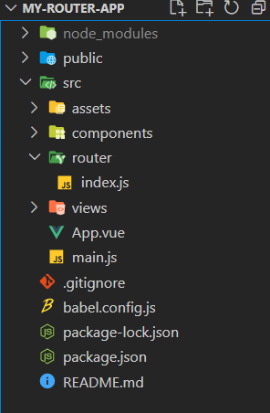
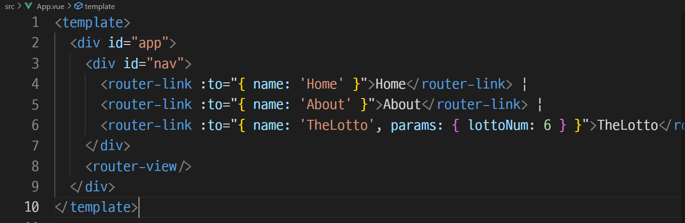
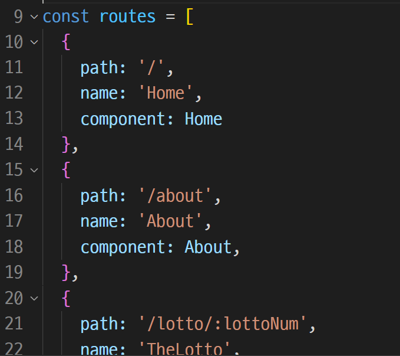
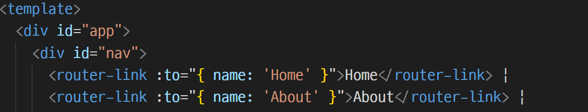
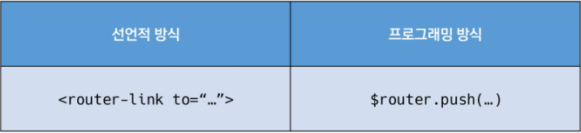

# Vue Router

***SPA 상에서 페이지를 이동하는 효과를 내준다!***

> Vue.js의 공식 라우터로, route에 컴포넌트를 매핑한 후 어떤 주소에서 렌더링할 지 알려준다.
>
> - 비유: 우체국에서 우편물을 배송 지역에 따라 분류하는 것
>
> - **router**
>
>   : 위치에 대한 최적 경로를 지정하며, 이 경로를 따라 데이터를 다음 장치로 전향시키는 장치

- 설치

  ```shell
  $ vue add router
  ```

  ※ 주의사항

  프로젝트를 진행하던 도중에 Vue router를 추가하면 기존의 App.vue를 덮어쓰게 된다.

  필요한 경우 파일을 백업(커밋)해두는 작업을 수행할 수 있다.

  - commit 여부: Yes

  - History mode 사용 여부: Yes

    > **History mode**
    >
    > : HTML History API를 사용하여 router를 구현한 것
    >
    > (*History API: DOM의 Window 객체가 history 객체를 통해 브라우저의 세션 기록에 접근할 수 있는 방법을 제공한다. history 객체는 사용자를 자신의 방문 기록 앞/뒤로 보내거나, 기록의 특정 지점으로 이동하는 등의 유용한 메서드와 속성을 가지고 있다.)
    >
    > - 브라우저의 히스토리를 남길 수 있어, 뒤로가기가 가능하다.
    >
    > - 동시에, 실제 페이지는 이동하지 않는 기능을 지원한다.
    >
    > - 즉, 페이지를 다시 로드하지 않고 URL을 탐색할 수 있게 해준다.
    >
    >   → Url 이동이 이루어지지 않는다는 SPA의 단점을 극복!
    >
    >   → url 변경이 이루어지지 않으면 사용자는 마치 페이지가 멈춰있는 것처럼 인식할 수 있다. 이는 양질의 UX를 제공하는 데에 장애물이므로 이를 개선할 수 있는 방법!
    >
    > - history mode 를 사용하지 않으면, url 뒤에 #이 붙게 되고, 이는 페이지 이동을 가로막는다.

- 변경사항

  

  - App.vue 파일의 코드

    하위 컴포넌트 태그가 `<router-link to="">` 태그로 되어 있다.

    

    - `<router-link>` 태그

      > "사용자 내비게이션을 가능하게 하는 컴포넌트"
      >
      > `<a>` 태그와 유사하다고 생각하면 된다. 다만, a 태그는 페이지 이동이 기본 기능으로서 강제되는 반면에, 라우터 링크 태그는 화면 상으로 a 태그이지만 기본 동작이 제거되어 있다. 즉, <u>GET 요청을 보내지 않는다.</u>
      >
      > ↳ HTML5 History mode에서 클릭 이벤트를 차단하여 브라우저가 페이지를 다시 로드하지 않도록 한다.
      >
      > - 목표 경로는 'to' prop으로 지정된다. (그래서 ':' 기호로 v-bind 되어 있다.)
      >
      >   ↳ prop 없이 직접 경로를 써줄수도 있지만, (예: `to="/about"`) 유지보수의 용이성과 일관성을 위해 prop으로 써주는 것이 권장된다. 
      >
      >   (name 속성을 활용하여 지정해줄 수 있다.)

    - `<router-view>` 태그

      > "주어진 route에 일치하는 컴포넌트를 렌더링하는 컴포넌트"
      >
      > 컴포넌트가 DOM에 실제로 위치하는 자리를 의미한다.

  - router/index.js 생성

    - route에 관한 정보 및 설정이 작성된 파일. url에 따라 어떤 컴포넌트가 렌더링 될 지 명시한다.
    - (Django의 urls.py와 비슷하다고 생각하면 된다.)

  - views 디렉토리 생성

### 1) Named Routes

: 이름을 가지는 route

👉 index.js 파일의 route에 name 속성을 지정하고, 이를 이용하여 router-link의 to 속성에 prop으로 사용하는 것이다.






### 2) 프로그래밍 방식 내비게이션



`<router-link>`를 사용해서 a 태그를 만드는 것 말고도,

router의 인스턴스 메서드를 사용하여 프로그래밍 방식으로 수행할 수도 있다.

↳ 스크립트에서 사용한다.

(🍪 참고: router 앞의 ==**'$'**==는 전역변수를 사용하기 위해 앞에 붙인다.)

- Vue 인스턴스 내부에서 **<span style="color: navy;">$router</span>**로 라우터 인스턴스에 접근할 수 있다.

  ↳ $router로 redirect!

- 다른 url로 이동하려면, <span style="color: navy;">this.$router.push</span>를 호출한다.

  → 새 항목을 history 스택에 넣음.

  ⇢ 사용자가 뒤로가기 버튼을 누르면 이전 url로 이동할 수 있다.

- 적용 예시:

  ```javascript
  // 문자열
  router.push('home')
  // 객체
  router.push({ path: 'home' })
  // named route ✔
  router.push({
    name: 'user',
    params: {
      userId: 'abc12'
    }
  })
  // query 전달 → /register?plan=private
  router.push({
    path: 'register',
    query: {
      plan: 'private'
    }
  })
  ```

  ```javascript
  export default {
    ...
    methods: {
      moveToHome: function () {
        this.$router.push({ name: 'Home' })
      }
    }
  }
  ```

  

### 3) Dynamic Route Matching

(variable routing 같은 거)

url로 동적 인자를 전달하는 방법으로, 특정 패턴을 가진 route를 동일한 컴포넌트에 매핑해야 하는 경우에 사용된다.

```javascript
const routes = [
  {
    path: '/lotto/:lottoNum',
    name: 'Lotto',
    component: TheLotto
  },
]
```

- 동적인자는 ':'(콜론)으로 시작한다.
- 컴포넌트에서 `this.$route.params`로 접근할 수 있다.

- 컴포넌트에서 사용 예시:

  ```html
  <router-link :to="{ name: 'TheLotto', params: { lottoNum: 6 }}">
    TheLotto
  </router-link>
  ```

  

#### components와 views

(관습적으로,)

- App.vue

  최상위 컴포넌트

- views/

  - index.js의 router에 매핑되는 컴포넌트를 모아둔 곳

- components/

  - router에 매핑된 컴포넌트의 내부에 작성하는 컴포넌트를 모아둔 곳
  - 즉, views/에 있는 컴포넌트들의 하위 컴포넌트를 여기에 작성한다.


### Vue Router가 필요한 이유

SPA의 등장 이전에는, 서버가 모든 라우팅을 통제하며 요청한 경로에 맞는 HTML을 제공했었다.

SPA의 등장 이후, 서버는 HTML 페이지를 하나만 제공하고, 이후의 모든 처리는 JS 코드를 활용해 진행되게 되었다. 즉, 요청에 대한 처리를 서버가 담당(SSR)하는 게 아니라, 브라우저가 담당하게 된 것이다(CSR).

라우팅 처리에 관해 SSR과 CSR을 비교해 보자면,

- SSR은,
  - 라우팅에 대한 결정권을 <u>서버</u>가 가지고 있다.
- CSR은,
  - 라우팅에 대한 결정권을 <u>클라이언트</u>가 가지고 있다.
  - 클라이언트는 서버로 요청을 보내는 대신, HTML 문서 안에서 주소가 변경되면 해당 주소에 맞는 컴포넌트를 렌더링한다. (즉, 전체 페이지를 새로 로드하는 게 아니라, 중간의 컴포넌트만 갈아끼운다.)

결론적으로, Vue Router는 라우팅의 결정권을 쥐고 있는 Vue.js에서 라우팅을 편리하게 할 수 있는 도구들을 제공해주는 유용한 라이브러리인 것이다.

---

*끝*

