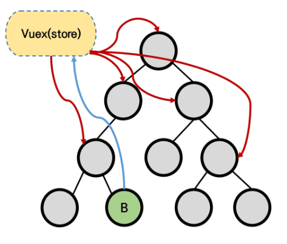

# Vuex

## 1. Vuex

### Vuex란?

> **"Statement management pattern + Library" for vue.js** (상태 관리 패턴이자, 라이브러리)
>
> : 상태(state)를 전역 저장소로 관리할 수 있도록 지원하는 라이브러리이다.
>
> - 상태가 예측가능한 방식으로만 변경되도록 보장하는 규칙을 설정하고
> - 앱의 모든 컴포넌트에 대한 ***중앙 집중식 저장소*** 의 역할을 한다.
>
> ※ 참고
>
> 여기서 "상태"는 '데이터'라고 생각하면 된다. 상태라고 부르는 정의한 이유는 다루는 데이터가 시시각각 일정하지 않고 계속해서 변하므로, 특정 시점의 상태를 주고받는다고 말하는 게 더 자연스럽기 때문이다.

- 공식 페이지는 [여기](vuex.vuejs.org.kr/)

- *상태 관리 패턴*

  : 컴포넌트의 <u>공유된 상태</u>를 추출하고, 이를 전역에서 관리하도록 한다.

  모든 컴포넌트는 <u>트리에 상관없이 (즉, 하위든 상위든)</u> 상태에 접근하거나 동작을 트리거 할 수 있다.

  (* 트리거: 특정한 동작에 반응하여 자동으로 필요한 동작을 실행하는 것)

  상태 관리 및 특정 규칙 적용과 관련된 개념을 정의하고 분리함으로써 코드의 구조와 유지 관리 기능이 향상된다.

### 어떤 장점이 있을까?

- 기존의 Pass props와 Emit event로 하기

  - 각 컴포넌트는 독립적으로 데이터를 관리한다.

  - 데이터는 부모 → 자식으로만 전달되며, 자식은 부모에게 이벤트를 트리거한다.

  - 🙂 데이터 흐름이 **단방향**이므로 파악하기 쉽다.

  - ☹ 컴포넌트의 중첩이 깊어지는 경우, 동위 관계의 컴포넌트로의 데이터 전달이 불편해진다.

    ​	(만나는 상위 컴포넌트까지 올라갔다가 다시 내려보내야 하기 때문에)

    
    
  - 단방향 데이터 흐름이란:

    state는 데이터, view는 state의 선언적 매핑 (템플릿과 유사), 그리고 action은 메서드

    

- Vuex로 하기

  - 중앙 저장소(store)에 state를 모아놓고 관리하며, 컴포넌트에서는 저장소를 통해 상태에 접근할 수 있다.

  - 따라서, **<span style="color:brown;">규모가 큰 / 컴포넌트의 중첩이 깊은 프로젝트에서 쓰기에 매우 효율적이다.</span>**

    ✔ Vuex는 개념에 대한 이해와 시작 비용이 높기 때문에 앱이 고도화된 단계에서 사용할 때 효용이 극대화된다.

  - 중앙 저장소의 state가 변하면, 이를 공유하는 컴포넌트들에서도 동기화가 이루어져 모두 같이 변경된다.

    

  - 공유되는 상태에 대해서 다른 컴포넌트를 신경 쓰지 않고, 상태의 변화를 store에서 한 번에 관리할 수 있다.

  - 구조의 변경에 대해서도 vuex가 더 유리하다. (컴포넌트 하나가 사라지면...!?)

  - <u>이때, vuex를 사용한다고 해서 모든 상태를 vuex에 넣어야 한다는 말은 아니라는 것을 알아두자. 각 컴포넌트에서 독립적으로 데이터를 관리하는 방법도 물론 같이 사용이 가능하다.</u>

## 2. Vuex Core concepts

✔ 공식문서는 [여기](https://vuex.vuejs.org/guide/state.html#single-state-tree).


### 1) State

**"중앙에서 관리되는 모든 상태 정보 (data)"**

> Vuex는 single state tree를 사용한다. 이 말인 즉슨, 하나의 앱은 단일한 저장소(store)를 사용한다는 의미이다.
>
> - 상태가 컴포넌트에 렌더링되고, 상태의 변화가 DOM의 변화를 일으킨다. (이건 기존 vue와 마찬가지!)
> - 기존 pass props & emit event 방식은 state를 찾기 위해 각 컴포넌트를 확인해야 했다면, vuex를 사용하고 state를 중앙 저장소에서 관리하게 되면 중앙에서 state를 한눈에 파악이 가능하다. 이렇게 state 관리가 더욱 더 용이해진다.
> - 각 컴포넌트는 vuex store의 state를 접근하여 가져와서 사용할 수 있다.

### 2) Mutations

**"실제로 state를 변경하는 유일한 방법"**

> actions 에서도 state에 접근하고 변경할 수 있지만, 그러지 않는다.
>
> vuex에서 정한 규칙은, ***mutations로만 상태를 변경하는 것*** 이다!
>
> → <u>명확한 역할 분담</u>을 통해 서비스의 규모가 커져도 state을 올바르게 관리하기 위함이다.
>
> - <span style="color:crimson;">mutations의 handler 함수는 <u>반드시 동기적</u>이어야 한다!!!</span>
>
>   ↳ 비동기적 로직으로 하면 상태의 변경 시점이 의도와 달라질 수 있다. 변화가 예측 가능한 쪽으로만 일어나도록 통제하기 위해 mutations에서는 동기적 로직만 사용한다.
>
> - 첫 번째 인자로 <span style="color:blue;">state</span>를 받는다. (state를 변경하는 방법이니까!)
>
> - Actions에서 `commit()` 메서드로 호출된다.
>
> - [참고] mutations의 핸들러 함수는 상수처럼 표기하는 것이 권장된다. (바로 식별할 수 있도록): `LIKE_THIS`

### 3) Actions

**"state 변경을 제외한 모든 작업을 담당"**

> - Mutations를 `commit()` 메서드를 통해 호출하고, Component에서 `dispatch()` 메서드에 의해 호출된다.
>
> - (mutations와 달리) 비동기 작업이 포함될 수 있다. 
>
>   ⇢ 상태를 직접 변경하지 않으므로.
>
>   → axios 등은 모두 actions에서 처리하기!
>
> - 첫 번째 인자로 <span style="color:blue;">context</span>를 받는다.
>
>   ↳ context 객체를 통해 state, commit 등 store.js 내의 모든 요소의 속성에 대한 접근과 메서드 호출이 가능하다.
>
>   그럼에도! state를 직접 변경하는 작업은 mutations 만 한다.

### 4) Getters

**"state를 변경하지 않고, state를 활용하여 계산을 수행"** (computed 속성과 유사)

> - 저장소의 상태를 기준으로 계산하는 함수들을 포함한다. (함수들은 첫 번째 인자로 state를 받는다.)
> - (computed 처럼) 캐시(cache)되었다가, 데이터가 변경되었을 경우에만 재계산된다.
> - store/index.js 에 적혀있지 않으므로 직접 적어줘야 한다.
> - 반환값이 있어야 한다 (return).


## 3. 설치 및 사용

- 설치

  ```shell
  $ vue add vuex
  ```

- 나타나는 변화

  1) store 디렉토리가 생긴다.

  2) 그 안에 index.js 파일이 생긴다.

     ↳ vuex의 핵심 개념인 state, mutations, actions, modules, getters가 작성되는 곳이다.

## 4. 알아두기

### 구조 분해 할당 (destructuring assignment)

> 배열의 값 또는 객체의 속성을 고유한 변수로 unpack할 수 있다.

- 예시

  ```javascript
  const context = {
    commmit: function () {
      console.log('커밋! 사실 개구리~')
    },
    state: {
      todo: '할 일',
    }
  }
  
  // 기존 코드
  const commit = context.commmit
  const state = context.state
  
  // 구조 분해 할당
  const { state, commit } = context
  //// 하나만 해도 된다
  const { commit } = context
  ```

  

### Spread syntax (전개 구문)

공식문서는 [여기](https://developer.mozilla.org/ko/docs/Web/JavaScript/Reference/Operators/Spread_syntax).

> 배열이나 문자열과 같이 반복가능한(iterable) 자료구조, 또는 객체를 확장하여 나타내는 방법
>
> 👉 '...'을 붙여서 요소 또는 키가 0개 이상인 반복가능한 객체를 하나의 객체로 간단하게 표현하는 방법
>
> (요소를 풀어서 하나의 객체 안에 늘어놓는다~)

- 객체 복사(shallow copy)

  (예)

  ```javascript
  const obj1 = { foo: 'bar', x: 42 }
  const obj2 = { foo: 'bax', y: 15}
  
  const clonedObj = { ...obj1 }	// { foo: 'bar', x: 42}
  
  const mergedObj = { ...obj1, ...obj2 } // { foo: 'baz', x: 42, y: 13 }
  
  const changeObj - { ...obj1, x: 67 }	// { foo: 'bar', x: 67 }
  ```

  ↳ 여러 개의 속성을 가진 객체에서 하나만 바꿔서 새로운 객체를 생성할 필요가 있을 때 사용할 수 있다.

  - 마지막 용법: '...기존객체' 써주고, 덮어쓸 부분만 새로 써준다.


### Component Binding Helper

컴포넌트의 computed 속성과 store의 속성을 매핑한다.

- mapState

  : computed와 state를 매핑

  - state를 객체 전개 연산자(`...`)로 계산해서 추가한다. (spread syntax)

  - ```javascript
    // 예시
    import { mapState } from 'vuex'
    
    export default {
      ...
      computed: mapState([
        'todos',
      ])
    }
    ```

    - 구조 분해 할당으로 vuex 모듈에서 mapState 메서드만 가져올 수 있다.

    - mapState로 this.$store.state.todos를 가져왔다. 

      (state에 지정한 이름을 사용해야 한다.)

  - 그런데, 동시에 여러 개의 헬퍼를 쓰고 싶다면?

    ```javascript
    computed: {
      ...mapState([
        'todos',
      ]),
      ...mapGetters([
        'getImg',
      ])
    }
    ```

    위와 같이 computed에 전해지는 값을 객체로 전해주고, '...'를 통한 spread syntax로 객체를 복사해 사용함으로써 안에 여러 개의 헬퍼를 적을 수 있다.

아래 helper 도 위와 같은 방식으로 각각 getters, actions, mutations에 연결된 것으로 쓰면 된다.

- mapGetters
- mapActions
- mapMutations


그렇다면, payload는 어떻게 전달할 수 있을까?

헬퍼만으로는 문법적으로 전달이 불가하고, prop으로 전달해야 한다. 함수의 ()에 props 데이터를 인자로 넣어주면 된다!


### Local Storage (in Vuex)

Vuex에는 로컬 스토리지를 사용하게 해주는 라이브러리가 있다: **vuex-persistedstate**

👉 [vuex-persistedstate 라이브러리 페이지](https://www.npmjs.com/package/vuex-persistedstate)

- 설치

  ```shell
  $ npm i vuex-persistedstate
  ```

- 사용

  ```javascript
  // store/index.js
  import createPersistedState from 'vuex-persistedstate'
  
  export default new Vuex.Store({
    plugins: [
      createPersistedState(),
    ],
    ...
  })
  ```

  적어주기

- 확인

  검사 > 개발자 도구 > Application > Local Storage 에서 저장된 데이터를 확인할 수 있다.

---

*끝*

