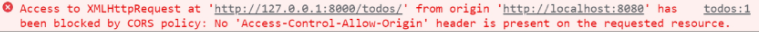
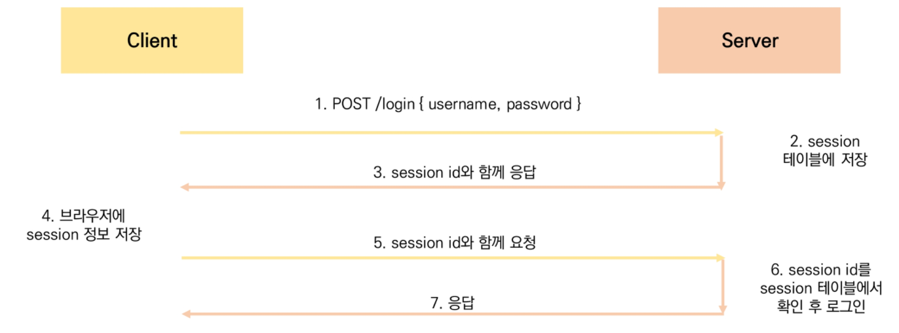
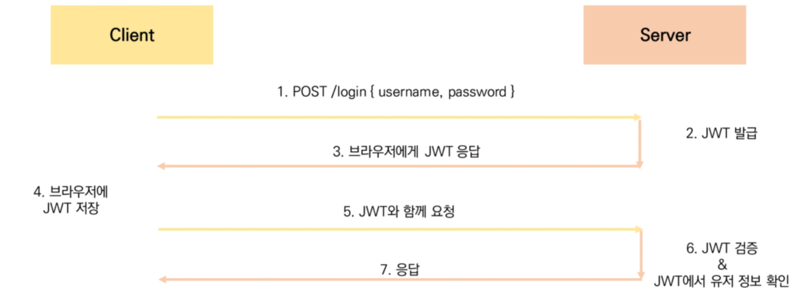
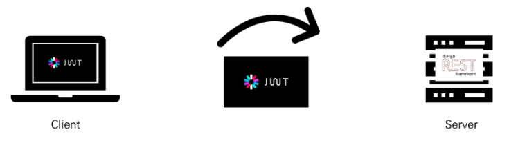
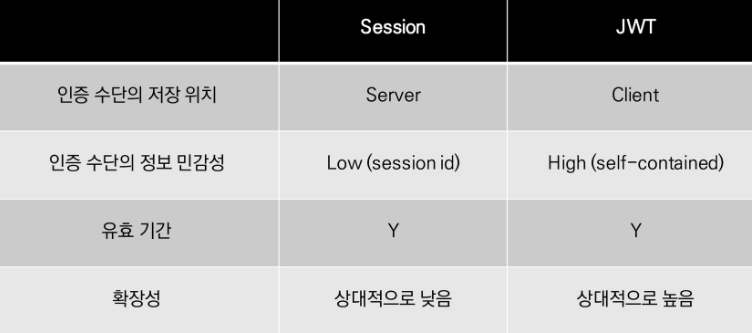

# Vue + API 서버 활용

## 1. 서버와 클라이언트

### 서버

클라이언트에게 **<u>정보와 서비스</u>를 제공**하는 컴퓨터 시스템.

- 정보와 서비스라 함은, html 문서 템플릿이나 JSON 등이 될 수 있다.

### 클라이언트

서버에게 **정보를 요청하고, 받은 응답을 표현**한다.

⑴ 서버에게 (적절한) 서비스를 요청하고,

⑵ 필요한 인자를 요구에 맞게 제공하며,

⑶ 서버로부터 받은 응답을 사용자에게 적절한 방식으로 표현하는 시스템

<br/>

## 2. SOP와 CORS

### SOP

***Same-origin policy*** (동일 출처 정책)

특정 출처(origin)의 문서 또는 스크립트가 다른 출처의 리소스와 상호작용하는 것을 제한하는 보안 방식으로, 잠재적으로 유해한 문서와의 접촉을 제한함으로써 공격받을 수 있는 경로를 줄인다. 즉, *"출처가 다른 경우는 제한한다."*

- 특징

  - 브라우저와 웹 애플리케이션을 보호한다.

    응답으로 받는 자원에 대해 브라우저 차원의 검증 단계를 설정함으로써, 악의적인 사이트의 데이터를 가져오는 일을 사전에 차단할 수 있다.


> [참고] Origin; 출처
>
> 
>
> 두 URL의 프로토콜, 호스트, 그리고 포트까지 모두 같아야 동일한 출처라고 할 수 있다. (path는 달라도 된다.)

- 에러메시지

  (서버 측은 정상적으로 응답, 브라우저에서 차단된 것임.)

  

### CORS

***Cross-Origin Resource Sharing*** (교차 출처 리소스 공유)

특정 출처에서 실행되는 웹 애플리케이션이 다른 출처의 자원에 접근할 수 있는 권한을 브라우저로 하여금 부여하도록 브라우저에 알려주는 체제이다. HTTP header에 추가 정보를 넣음으로써 사용한다.

즉, SOP 정책에 의해 출처가 다른 리소스의 응답이 브라우저 선에서 차단되고 있었는데, 브라우저가 이를 막지 않고 허용하도록 응답의 헤더에 메시지를 넣어 보내는 것이다.

이때, <u>서버 측에서</u> 헤더에 넣는 메시지는 바로 CORS header이다.

(CORS는 HTTP의 일부로, 어떤 호스트에서 자신의 컨텐츠를 불러갈 수 있는지 서버에 지정할 수 있는 방법이다.)

- 특징

    서버 측에서 헤더에 메시지를 넣어 조절할 수 있는 것이므로, 서버에서 해당 리소스에 대한 접근을 관리함으로써 자원을 관리할 수 있게 도와준다.

- 사용하는 방법: HTTP header!

  - Access-Control-Allow-Origin ✔
  - <span style="color:gray;">Access-Control-Allow-Credentials</span>
  - <span style="color:gray;">Access-Control-Allow-Headers</span>
  - <span style="color:gray;">Access-Control-Allow-Methods</span>

- Access-Control-Allow-Origin

  : 해당 출처의 응답이 요청 코드와 공유될 수 있는지를 나타낸다.

  ```javascript
  Access-Control-Allow-Origin: *
  ```

  ↳ 모든 출처를 허용한다. (다른 출처에서 요청을 보내어 리소스를 가져오는 것이 브라우저에 허용되게 한다.)

  - `'*'` 대신에 특정 출처를 적어 명시할 수도 있다.


### 사용해보기

Django 에는 CORS를 지원하는 라이브러리가 있다: **[django-cors-headers 라이브러리](https://github.com/adamchainz/django-cors-headers)**

👉 Django App의 header 정보에 CORS를 설정하여 응답을 보낼 수 있게 해준다.

```shell
$ pip install django-cors-headers
```

```python
# settings.py
INSTALLED_APPS = [
    ...,
    "corsheaders",
    ...,
]

MIDDLEWARE = [
    ...,
    "corsheaders.middleware.CorsMiddleware",
    "django.middleware.common.CommonMiddleware",
    ...,
]
```

```python
# settings.py
## 허용할 origin을 작성

# 1. 특정 origin만 선택적 허용
CORS_ALLOWED_ORIGINS = [
    'https://example.com',
    'https://sub.example.com',
    'http://localhost:8080',
    'http://127.0.0.1:9000'
]

# 2. 모든 origin 허용
CORS_ALLOW_ALL_ORIGINS = True
```

👉 개발자 도구의 Network 탭에서 Response Headers에서 CORS 헤더가 추가된 것을 확인할 수 있다.


## 3. JWT (JSON web token)

다양한 인증 방식(세션, 토큰, 제3자를 활용 등) 중에서 토큰 기반의 인증 방식 중 하나이다.

Django 프레임워크에서 내장 인증 도구를 활용할 때에는 *세션 기반 인증* 을 사용했었다:



**세션 인증 방식**에서는, 

- 세션 정보가 서버 측 DB에 저장되고,
- 클라이언트가 서버로부터 받은 세션 정보(세션에 접근할 수 있는 id값)는 브라우저의 쿠키에 저장되어 매 요청과 함께 전송된다.
- 매 요청마다 세션 테이블에서 요청과 함께 전달된 세션 정보를 확인하여 확인을 거치는 과정이었다.

<br/>

토큰 인증 방식의 JWT는 이와 다르다.



### **JWT **에서는,

- 토큰이 서버 측에 저장되지 않고 브라우저의 로컬 저장소에 저장되어 쓰인다.
- 처음에 서버에서 인증이 수행되었을 때 JWT를 발급해주면, 클라이언트 측은 브라우저에 해당 토큰을 저장해두면서 요청 헤더에 포함시켜 검증이 이루어지도록 한다.
- JWT는 ==*"self-contained"*==, 즉 자체적으로 필요한 정보를 모두 갖고 있으므로 다른 검증 수단을 필요로 하지 않는다. 자체로 이미 검증된 상태라는 의미이다. (DB로 토큰의 유효성을 검증할 필요가 없다.)
- 더불어, JSON 포맷을 활용하기 때문에 범용성이 높다. 

JWT를 사용하는 이유에는 다음이 포함될 수 있다:

- (세션에 비해) 상대적으로 HTML, HTTP 환경에서 사용하기 용이하다.

  − 세션 방식은 유저의 세션 정보가 서버에 보관되어야 하지만,

  − JWT는 클라이어트에서 토큰 정보를 저장하고 필요한 요청에 포함시켜 보내면 자체로 인증 수단이 된다.

- 보안 수준이 높다.

  특정한 요소가 하나만 변경이 되어도 모든 데이터가 바뀌기 때문에 위·변조가 사실상 불가능하다.

- 높은 범용성의 JSON 포맷을 사용한다.

- 서버 메모리에 정보를 저장하지 않으므로 서버의 자원을 효율적으로 사용할 수 있다.

#### JWT의 구조

(자세한 내용은 다음 사이트를 참고할 수 있다: [여기](https://jwt.io/))


`'.'`으로 구분되며,

- Header: 토큰의 유형과 해시 알고리즘의 종류로 구성
- Payload: 전달하는 데이터. 정보의 한 조각을 "claim"이라고 하며, payload에 여러 개의 claim을 넣을 수 있다.
- Signature: Header와 Payload의 인코딩 값을 더하고, 거기에 private key로 해싱하여 생성된다.

#### JWT 예시

> 1) 클라이언트에서 브라우저를 통해 서버에 로그인을 요청한다.
>
> 2) 서버에서 로그인 정보를 바탕으로 비밀번호를 암호화하고, JWT를 발급해서 넘겨준다.
>
>    *비밀번호 암호화: [Django] `set_password()`
>
> 3) 클라이언트는 서버로부터 받은 JWT를 브라우저의 로컬 스토리지 등에 저장한다.
>
> 4) 이후 인증이 필요한 요청 때마다 저장해 둔 JWT를 요청에 실어 보낸다.
>
> 5) 서버 측에서는 전달받은 JWT를 디코딩하여 유저 정보를 추출한다. 동시에, JWT 자체로 인증 정보가 된다.
>
> 

+로그아웃은?

- 브라우저에서 토큰 정보를 삭제한다.

  그 외에, 안전 장치로서

  - 토큰의 만료시간을 설정한다.
  - 로그아웃할 때 클라이언트 측의 저장된 토큰을 삭제한다. (로컬 스토리지)




### 사용해보기

DRF에서 JWT를 사용하기 위한 패키지가 있다: [Django REST framework JWT Auth 패키지](https://jpadilla.github.io/django-rest-framework-jwt/)

```shell
$ pip install djangorestframework-jwt
```

```python
# urls.py
from rest_framework_jwt.views import verify_jwt_token

#...

urlpatterns = [
    #  ...
    path('api-token-verify/', verify_jwt_token),
]
```

​	↳ 해당 url로 인증 정보를 전달하여 token을 받을 수 있다.

```python
# settings.py

REST_FRAMEWORK = {
    'DEFAULT_PERMISSION_CLASSES': (
        'rest_framework.permissions.IsAuthenticated',	# 인증된 사용자의 요청인지 확인
    ),
    'DEFAULT_AUTHENTICATION_CLASSES': (
        # JWT 토큰이 유효한지 확인
        'rest_framework_jwt.authentication.JSONWebTokenAuthentication',	
        
        'rest_framework.authentication.SessionAuthentication',
        'rest_framework.authentication.BasicAuthentication', 
    ),
}
```

​	↳ 첫 번째는 '회원 인증 여부', 두 번째는 'JWT 토큰 인증 (인증 여부와 관계없이 JWT의 유효성만)'에 관한 것이다.

​	※ 전역으로 설정(settings.py)하지 않고 각 view함수에 직접 설정하려면, 데코레이터를 활용한다.

🌐 [참고문서](https://www.django-rest-framework.org/api-guide/permissions/#permissions)

```python
from rest_framework.authentication import JSONWebTokenAuthentication
from rest_framework.permissions import IsAuthenticated

@api_view(['POST'])
@authentication_classes([JSONWebTokenAuthentication])
@permission_classes([IsAuthenticated])		# 모든 엑세스를 허용하려면 [AllowAny]
def sample_func(request):
    pass
```

​	↳ `@api_view` 아래에 작성해야 한다.

<br/>

+토큰의 만료시간을 변경하려면?

```python
# settings.py

import datetime

JWT_AUTH = {
    'JWT_EXPIRATION_DELTA': datetime.timedelta(days=1),		# 하루(1일)로 설정
}
```


# 노트

### 유념할 것!

(1) 백엔드 차원의 데이터 변화를 작성하고 (DB 변화),

(2) 프런트엔드 차원의 변화도 작성해야 한다 (DOM 변화).

즉, DRF로 백엔드를 구현하고 Vue.js로 프런트엔드를 구현한다면, 데이터 변화에 따라 각각에 적용되도록 양쪽 모두에 신경을 기울여야 한다!


### 로컬 스토리지 사용

Vue에서,

```javascript
// 예시: 'jwt'
localStorage.setItem('jwt', token)	// token을 'jwt'란 이름으로 로컬 저장소에 저장
localStorage.getItem('jwt')			// 'jwt' 가져오기
localStorage.removeItem('jwt')		// 'jwt' 제거하기
```


### 환경변수 사용

`.env.local` 이라는 파일 만들기.

`VUE_APP_`을 이름 앞에 붙여서 사용하기

예) `VUE_APP_SERVER_URL`, `VUE_APP_YOUTUBE_API_KEY`

ㄴ URL을 저장할 때 ending slash를 포함하면 안 되고, 따옴표로 감싸지 않는다.

<br/>

접근하려면,

```javascript
const SERVER_URL = process.env.VUE_APP_SERVER_URL
```

처럼.

---

*끝*

