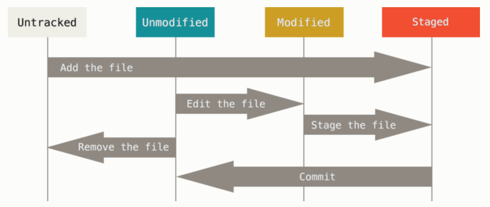

##### 작성자: 김민채

##### 날짜: 07-15-2021

##### 주제: Git, Github 활용

---

#### 1. Git이란?

(분산) 버전 관리 시스템(DVCS: Distributed Version Control System)

- 코드의 History를 관리하는 도구로서, 개발된 과정과 역사를 보고, 프로젝트의 이전 버전을 복원하고 변경 사항의 비교, 분석, 병합을 가능하게 한다.

- 분산형 (<--> 중앙집중형)

  : 모두가 들고 있기 때문에 데이터 상실의 문제 방지

  : 변화된 부분만 저장하도록 함으로써 효율 저하의 문제 방지

##### (1) 개념

- Repository
  - 저장소
  - 버전별 모습, 버전별 변경사항에 대한 설명(커밋 메시지)이 들어있음
  - (예) TIL 폴더의 .git
- Commit
  - 일명 "사진 찍기" 혹은 "스냅샷"

##### (2) 작업흐름

i) Working directory에서 파일을 수정

ii) `git add 파일`: staging area로 올림

​		(*참고: 현 폴더 전체 add 하려면, `git add .`)

iii) `git commit -m "메시지"`: 모습을 '사진 찍음'

iv) 깃허브 등 저장소에 올림: push

##### (3) 파일 라이프사이클

: 파일의 상태를 의미함

- Working directory의 모든 파일은 특정 상태를 가지며, 이는 git 명령어를 통해 변경된다.

  - Untracked: 한 번도 staging area 에 오르지 않은 파일

  - Tracked: 한 번 이상 staging area에 올랐던 파일 - Git은 해당 파일에 대해 관리를 수행함

    - Unmodified: 수정 안 된.
    - Modified: 수정된.
    - Staged: staging area에 오른.

  - 참고: 

    (출처: https://seonkyukim.github.io/git-tutorial/git-status/)

- 자주 쓰는 명령어

  - `git status`: Working directory, Staging area 공간의 파일 상태를 확인

  - `git log`: 커밋 기록 확인

  - `git reflog`: 이전 로그 모두 보기 (checkout에서 특정 버전으로 이동하고 나면 그 시점 이후의 로그는 안 보이게 되므로, 미래 시점으로 돌아오려면 이것 쓸 것)

    or

    `git checkout master` 입력 후, `git log`

  - `git checkout 커밋ID 앞부분 몇 글자`: 해당 버전으로 돌아감 

  - `git pull`: remote(깃허브)에서 local(내 컴퓨터)로 내려받기

  - `git push`: local에서 remote로 올리기

  - `vi 파일명`: vi editor로 파일을 CLI로 수정할 수 있다.

    (편집: `i` -> 일반모드: `Esc키` -> 저장: `:wq`)

 

#### 2. Git  Bash

디렉토리에서 Git Bash를 열면 나오는 환경을 'CLI환경'이라고 한다 (Command Line Interface).

이는 그래픽의 GUI와 대비되는 개념이다.

- 명령어

  1. cd

     - Change Directory
     - working directory를 변경할 때 사용
     - `cd (name-of-directory)`로 이동
     - `cd ..`: 상위 디렉토리(부모 디렉토리)로 이동

  2. date

     : 날짜 출력

  3. ls

     : 현재 working directory의 폴더/파일 확인하기

     - `ls -al`: 숨김 폴더와 자세한 정보까지 확인

  4. touch

     : 파일 만들기

     - `touch a.txt`: a.txt 파일 생성

  5. mkdir

     : 디렉토리 만들기

     - `mkdir 'happy hacking'`: happy hacking 이라는 이름의 폴더 생성
     - 단, 띄어쓰기가 들어간 이름을 만들 때는 언더바(_)로 이어주거나, 따옴표로 묶어주어야 한다. 그렇지 않으면 각 단어를 이름으로 하는 여러 개의 디렉토리가 생성된다.

  6. pwd

     : 현재 작업중인 디렉토리(폴더)

  7. rm

     - Remove
     - 파일 삭제
     - `rm -r`: 폴더 삭제 시, -r 을 추가로 붙여줘야 함

  8. clear

     : CLI 창 비우기

  9. 기타 - 단축키

     - 과거 명령어 불러오기: 위, 아래 방향키

     - 자동 완성: Tab키

     - 커서를 명령어 맨 앞으로 이동: `ctrl + a`

     - 커서를 명령어 맨 뒤로 이동: `ctrl + e`

     - 커서 앞쪽 단어를 지우기: `ctrl + w`

     - '>'에 갇혔을 때: `ctrl + c`

       

- 경로

  > 정의: 파일이나 폴더의 고유한 위치를 나타내는 주소

  > Windows 운영체제에서는 '트리 구조'로 되어 있다. (최종 상위 폴더를 상징적으로 "root"라고 표현함: 윈도우의 경우, 보통 C드라이브를 의미함.)

  - 절대경로

    - 일명 "full 주소"
    - 현재 디렉토리 입력 시, 오류 나지 않고 이동함

  - 상대경로

    : 현재 working directory를 기준으로 계산된 경로

    - 현주소를 뺀 부분만 적는 것
    - 현재 디렉토리 입력 시, 오류 발생

  - ~ (틸드, Tilde)

    : home directory를 의미함

    - /c/Users/Minchae Kim

  - TIP) 경로 복사, 붙여넣기: `ctrl + Insert`와 `shift + Insert`

    